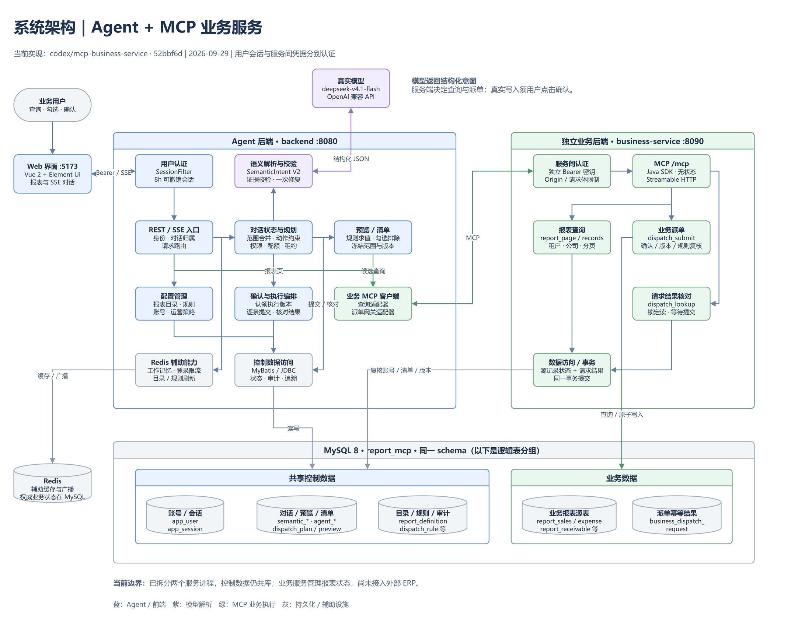

# 报表派单 Agent · MCP 双服务版

当前分支：`mcp-business-service`。

本文及仓库文档以真实模型 `real,mcp` 链路为基线，编写规则见 [AGENTS.md](AGENTS.md)。文档与图表变更后运行 `node tools/check-docs-real-model.cjs`。

系统通过自然语言查询可派单记录、调整选择并生成待确认清单。用户确认后，Agent 经 MCP 调用独立业务服务执行派单，保留逐条结果、幂等请求号、审计与追溯记录。

本分支已实现用户登录、服务间认证、MCP 报表查询与派单。默认使用新演示库 `report_mcp`；业务服务管理本库的报表派单状态，尚未接入外部 ERP。

本阶段暂缓处理 Demo 自带账号实现的问题，后续接入正式认证系统时统一处理；前端保留当前框架和依赖版本。业务权限、服务认证、确认、幂等和执行版本保护继续有效，具体范围见 [AGENTS.md](AGENTS.md)。2026-10-03 的其他问题修复与证据见 [修复说明](docs/非账号问题修复与验收_2026-10-03.md)。

## 架构与完整流程

当前包含持久异步派单的流程见 [八页 HTML 流程图](docs/diagrams/semantic-v2-2026-10-03/index.html) / [Mermaid](docs/diagrams/semantic-v2-2026-10-03/流程图.md)。下方整体架构图片保留 2026-09-29 的历史版本，具体实现以最新流程与修复说明为准。



- [可编辑 draw.io 文档（架构、完整请求流程两页）](docs/diagrams/mcp-system.drawio)
- [完整请求流程长图](docs/diagrams/mcp-task-flow.png) · [两页 PDF](docs/diagrams/mcp-system.pdf)
- [图表说明与源码依据](docs/diagrams/README.md) · [MCP 实施与验收说明](docs/MCP业务服务实施与验收.md)

| 部分 | 职责 |
| --- | --- |
| 前端 `frontend` | 登录、报表分页、SSE 对话、预览勾选、派单确认、历史与管理页面 |
| Agent 后端 `backend` | 模型意图解析、对话状态、规则/目录管理、预览与清单编排、确认、重试和核对 |
| 业务后端 `business-service` | MCP 工具、当前账号权限复核、报表数据查询、业务派单事务与持久化幂等结果 |
| MySQL 8 | 账号/会话、目录/规则、对话、预览/清单、配额租约、审计、报表源数据及派单结果 |
| Redis | 工作记忆、频率限制、规则/目录刷新广播等辅助能力 |

**模型只输出结构化意图，Agent 服务负责调用 MCP。** 生成清单和实际派单是不同操作；真实写入由用户点击确认后发起的 REST 请求触发。MCP 调用失败会记录错误或待核对状态。

两个后端是独立进程，但当前共用一个 MySQL schema。业务服务读取共享账号、确认清单、目录和规则完成再次复核；图中的控制表与业务表是逻辑分组，尚未拆成独立数据库。

## 快速启动

### 前后端一键启动与停止（Windows）

配置完成后，双击 [`tools/start-app.cmd`](tools/start-app.cmd) 启动，双击 [`tools/stop-app.cmd`](tools/stop-app.cmd) 停止。需要 PowerShell 7.2+、JDK 17+、Node.js 22，以及已运行的 MySQL 8、Redis。

首次使用将 `tools/env.local.example.cmd` 复制为已被 Git 忽略的 `tools/env.local.cmd`，填写数据库、Redis 连接和真实模型的 `LLM_BASE_URL`、`LLM_MODEL`、`LLM_API_KEY`。已有私有配置请保留。也可通过进程环境变量或已忽略的 `.runtime/llm-credentials.json` 提供模型的 `apiKey`、`baseUrl`、`model`；配置优先级依次为进程环境、本机 CMD 配置、JSON 文件。私有文件应仅允许当前 Windows 用户访问，切勿提交凭据。

一键脚本只读取允许的 `set NAME=value` 赋值，不执行私有 CMD 文件，不展开 `%变量%`。可读取 `JAVA_HOME`、`DB_*`、`REDIS_*`、`LLM_*`、`SEMANTIC_*` 和代理/CORS 配置；目标数据库由 `-Database` 指定，默认 `report_mcp`。

```powershell
# 只检查配置、工具、服务端口及 MySQL/Redis TCP 连接
pwsh -File tools/start-app.ps1 -CheckOnly

# 自动构建两个后端，缺少 Vite 时安装锁定的前端依赖，然后启动三个服务
pwsh -File tools/start-app.ps1

# 使用已构建的 JAR；自定义三个端口与目标库
pwsh -File tools/start-app.ps1 -SkipBuild -AgentPort 8082 -BusinessPort 8092 -FrontendPort 5174 -Database report_mcp_test
pwsh -File tools/stop-app.ps1
```

启动固定使用 `real,mcp`、`agent.semantic.mode=active` 和真实认证，依次等待 HTTP MCP 业务服务、Agent、Vite 就绪，前端代理自动指向本次 Agent 端口。默认前端地址为 `http://127.0.0.1:5173`。`SEMANTIC_NATIVE_SCHEMA` 默认 false，仅在真实端点已验证支持 JSON Schema 时配置为 true；thinking 配置须与实际模型能力一致。

缺少模型配置、依赖无法连接或应用端口被占用时，启动脚本报错并退出；应用启动失败会回收本次创建的进程。日志和 PID 在 `.runtime/`，初始管理员凭据在 `.runtime/mcp-credentials.json`。停止脚本核验 PID 与本工作区程序路径并清理 PID，保留数据库、Redis及业务数据。启动就绪仅证明服务和依赖可用，真实模型认证与输出需通过页面实际对话验证；失败时检查真实端点、密钥和模型配置后重试。

推荐使用 Windows PowerShell 7.2+，并安装 JDK 17+、Node.js 22、MySQL 8 和 Redis。确保 `java`、`node`、`npm` 可从 PATH 调用；Maven 使用仓库内 Wrapper。

### 1. 准备依赖与连接配置

在仓库根目录执行：

```powershell
npm.cmd --prefix ./frontend ci

# 已有本机配置时保留原文件
if (-not (Test-Path ./tools/env.local.cmd)) {
    Copy-Item ./tools/env.local.example.cmd ./tools/env.local.cmd
}
```

在 `tools/env.local.cmd` 填写 `DB_HOST`、`DB_PORT`、`DB_USERNAME`、`DB_PASSWORD`、`REDIS_HOST`、`REDIS_PORT`、`REDIS_PASSWORD`，也可以直接设置这些环境变量。MySQL 账号需能创建目标库并执行迁移，或由部署方预先准备所需权限。

MCP 启动脚本只把该文件中的 `DB_*`、`REDIS_*` 当作数据读取，不执行 CMD 文件，也不读取其中的 `JAVA_HOME`、`LLM_MODE` 或 `LLM_*`。启动目标库由 `-Database` 参数决定，默认 `report_mcp`，会覆盖继承的 `DB_NAME`。

### 2. 配置真实模型并启动

真实模型模式：

```powershell
$env:LLM_BASE_URL = Read-Host 'OpenAI 兼容端点的 base URL'
$env:LLM_MODEL = 'deepseek-v4.1-flash'
$env:LLM_API_KEY = Read-Host '模型 API Key' -MaskInput

./tools/start-mcp.ps1 -Build -Frontend
```

端点必须支持配置的模型与请求选项。脚本会去掉 base URL 末尾的 `/v1`，并开启原生 JSON Schema。

模型密钥缺失或端点不可用时，应先修复配置与连接，再验证真实模型调用。本文所有操作均基于 `real,mcp` 场景。

### 3. 登录与访问

| 默认地址 | 用途 |
| --- | --- |
| [http://127.0.0.1:5173](http://127.0.0.1:5173) | 登录、报表与派单助手 |
| `http://127.0.0.1:8080` | 面向前端的 Agent REST / SSE 服务 |
| `http://127.0.0.1:8090/mcp` | 业务 MCP 入口，需要独立服务凭据 |
| `http://127.0.0.1:8090/health` | 业务服务的数据库健康检查 |
| `http://127.0.0.1:8080/api/health/readiness` | Agent 的 MySQL、Redis、业务服务连通性检查 |

首次启动使用账号 `admin`。随机初始密码保存在本机 `.runtime/mcp-credentials.json` 的 `adminPassword` 字段；同文件的 `serviceToken` 用于两个后端之间的调用。文件记录的是初始凭据，后续修改账号密码不会由重启恢复。

启动脚本先启动业务服务并等待 Flyway 迁移与健康检查，再启动 Agent；Agent 侧关闭 Flyway，不装配演示数据初始化器。两个后端默认仅监听回环地址。

### 4. 创建演示账号并查看密码、权限

一键启动不会自动创建普通业务员账号。首次启动且目标租户没有账号时，只初始化 `admin` 管理员，其公司范围为 A、B、C，功能权限为 `*`。已有账号时保留数据库中的账号和权限；修改管理员密码后，`.runtime/mcp-credentials.json` 中的初始密码不会自动更新。

等待服务启动成功后，在仓库根目录执行：

```powershell
pwsh -File tools/prepare-demo-accounts.ps1

# Agent 使用自定义端口时，传入后端地址（不是前端或 MCP 地址）
pwsh -File tools/prepare-demo-accounts.ps1 -BaseUrl http://127.0.0.1:8082

# 成功后查看本机生成的账号、密码与权限清单
Get-Content .runtime/demo-accounts.md
```

脚本通过真实登录接口使用 `.runtime/mcp-credentials.json` 的 `adminUser`、`adminPassword` 创建或更新以下账号。该凭据必须能登录目标 Agent 且具有管理员权限；管理员密码已经修改时，先在本机私有文件中更新对应凭据再运行。

| 用户名 | 显示名称 | 公司范围 | 权限 |
| --- | --- | --- | --- |
| `demo_admin` | 演示管理员 | A、B、C | 全部报表、目录、规则及运营管理 |
| `demo_a` | A公司业务员 | A | 销售、应收、费用报表，在授权范围内派单 |
| `demo_b` | B公司业务员 | B | 销售、应收、费用报表，在授权范围内派单 |
| `demo_sales` | A公司销售业务员 | A | 仅销售报表，在授权范围内派单 |

首次生成随机密码并保存到 `.runtime/demo-accounts.json`；重复执行复用该文件中的密码，将上述账号设为启用、恢复脚本定义的权限并撤销其旧会话。若账号密码已在其他途径修改，重复执行会重新设置为该文件保存的密码。账号创建属于独立操作，不必每次启动都执行。

成功后在 `.runtime/demo-accounts.md` 查看用户名、密码、公司范围和权限；`.runtime/demo-account-checks.json` 保存登录、报表目录权限及销售记录公司范围的检查结果。这些检查不调用真实模型、不执行派单，不代表真实模型或外部 ERP 验收。脚本报错时先检查目标地址、管理员凭据及报表目录，再修复并重跑；失败时可能已有部分账号更新，不能依据之前生成的清单宣称本次全部成功。

以上文件均在 Git 忽略且限制访问的 `.runtime/` 下，密码不写入 README 或版本库。新机器克隆仓库后需要先配置真实模型、数据库和 Redis，启动服务，再运行此脚本；旧机器账号和业务数据不会自动迁移。

### 停止、重启与可选参数

```powershell
./tools/stop-mcp.ps1
./tools/start-mcp.ps1 -Build -Frontend

# 自定义端口或目标演示库
./tools/stop-mcp.ps1
./tools/start-mcp.ps1 -AgentPort 8082 -BusinessPort 8092 -Database report_mcp_test -Frontend
```

重启前保留或重新设置真实模型环境变量，也可使用本机 `.runtime/llm-credentials.json`。打包前先停止旧进程，避免 Windows 锁定运行中的 JAR。

| 参数 | 默认值 / 行为 |
| --- | --- |
| `-Build` | 从根 `pom.xml` 构建两个模块；省略时使用已有 JAR |
| `-Frontend` | 启动 Vite 并等待就绪；端口被占用时报错，代理指向本次 Agent 端口 |
| `-FrontendPort` | 5173 |
| `-NativeSchema` | `start-mcp.ps1` 默认 true，可显式传入 `'false'`；一键脚本读取 `SEMANTIC_NATIVE_SCHEMA`，默认 false |
| Agent profiles | 上述命令启动 `real,mcp` |
| `-AgentPort` / `-BusinessPort` | 8080 / 8090 |
| `-Database` | `report_mcp` |
| 日志与 PID | `.runtime/agent.*`、`.runtime/business.*`、`.runtime/frontend.*` |

启动前先停止本工作区旧进程；手动启动前端或切换 Agent 端口时，设置 `AGENT_API_URL` 后重启 Vite。停止脚本会核验 PID 和本工作区程序路径，避免误停其他进程。

`.runtime/` 已被 Git 和 Docker 忽略，Windows 脚本会限制其目录访问权限。模型密钥只注入 Agent 进程，不写入该凭据文件，也不传给前端和业务服务。

## 配置、存储与技术栈

| 配置 | 当前双服务模式 |
| --- | --- |
| 数据库 / Redis | 使用 `DB_*`、`REDIS_*`；本机脚本默认新库 `report_mcp` |
| `BUSINESS_MCP_URL` | 业务服务 base URL；本机脚本按 `-BusinessPort` 设置，路径由客户端追加 `/mcp` |
| `BUSINESS_SERVICE_TOKEN` | 至少 32 字符，两个后端一致；本机脚本使用随机生成的服务凭据 |
| `AUTH_TENANT_ID` | 应用默认 `T001`；本机脚本固定使用 `T001` |
| `AUTH_BOOTSTRAP_PASSWORD` | 首次创建管理员使用，至少 12 位；本机脚本使用随机初始密码 |
| `security.enabled` | `mcp` profile 启用；关闭认证却启用远端 MCP 时拒绝启动 |
| `LLM_BASE_URL` / `LLM_MODEL` / `LLM_API_KEY` | 真实模型连接；本分支已联调 `deepseek-v4.1-flash` |
| `SEMANTIC_MODE` | 应用默认 `active`，使用语义 V2；`legacy` 为显式兼容模式 |
| `SEMANTIC_NATIVE_SCHEMA` | 应用默认 false，`start-mcp.ps1` 会设为 true |
| `SEMANTIC_MODEL` | 留空沿用 `LLM_MODEL`，可为语义解析单独指定模型 |
| `SEMANTIC_THINKING_ENABLED` | 默认 false；需与端点支持的 thinking 参数匹配 |

真实语义解析温度为 0，默认最多输出 2400 tokens；格式、原文证据或报表覆盖校验失败时最多追加一次解析修复。端点不支持原生 Schema 时，使用一键脚本默认配置，或向 `start-mcp.ps1` 传入 `-NativeSchema 'false'`。

手动启动需先设置相同的 `DB_NAME`、数据库/Redis 连接、`AUTH_TENANT_ID` 和服务凭据。业务服务先完成迁移；Agent 使用 `real,mcp` profiles，加 `--spring.flyway.enabled=false --server.port=8080`。直接使用 `mcp` profile 而不指定端口时，Agent 默认监听 **8081**，与一键脚本的 **8080** 不同。

| 部分 | 版本 / 存储说明 |
| --- | --- |
| Agent | Java 17+、Spring Boot 3.5.16、Spring AI 1.1.8 |
| 业务服务 | Spring Boot 3.5.16、MCP Java SDK 0.18.3；独立实现业务查询和派单事务 |
| 数据访问 / 规则 | MyBatis-Plus 3.5.17、JdbcTemplate、Aviator 5.4.4 |
| 前端 | Vue 2.7、Element UI、Vite 6.4.3 |
| 数据结构 | Flyway V1–V21，包含 Java 迁移 V7、V21；V20 增加持久派单任务，V21 为仓库维护的表与字段补齐元数据注释 |

默认启动不会重置已有数据；新空库由业务服务初始化示例报表、目录与规则，后续启动只迁移结构。使用默认库名不会迁移或修改原 `report_demo` 数据。应用保留演示重置开关，但一键 MCP 启动明确将其设为 false。

## 用户认证与账号管理

用户密码采用随机盐和 600000 轮 PBKDF2-HMAC-SHA256。登录返回 256 bit 随机 Bearer token，数据库只存 token 的 SHA-256 摘要，8 小时过期；前端使用 `sessionStorage`，退出登录立即撤销服务端会话。登录按账号和来源地址限流。

MCP 模式不接受 `X-User-Id` 作为身份凭据，过滤器用真实会话身份覆盖该头。除登录、认证模式查询和健康探针外，业务 API 都要求登录，包括用户信息及模型名称查询。旧的 `user1/user2/user3` 身份不会作为本分支的真实登录账号自动创建。

管理员通过 `PUT /api/auth/users` 创建或更新账号，分配公司、报表权限以及管理员标记。更新账号会撤销其已有会话；`enabled=false` 禁用账号，更新时不提供新密码可保留原密码。请求格式见 [账号接口说明](docs/MCP业务服务实施与验收.md#账号接口)。

服务间使用独立 Bearer 密钥，当前绑定配置租户。工具中的 `tenantId/operatorId` 由可信 Agent 代码填入；业务服务重新读取数据库中的账号状态、公司及报表权限。该凭据不下发浏览器、不放入模型提示，仅供可信服务调用。跨主机 MCP 连接要求 HTTPS；客户端只允许回环地址使用 HTTP。

前后端分域时，将 `CORS_ALLOWED_ORIGINS` 设置为准确的前端来源，例如 `https://reports.example.com`。合法预检在认证前处理，真实业务请求仍要求会话，401 响应也会附带允许来源的 CORS 头。

反向代理部署须为 Agent 设置 `TRUSTED_PROXY_CIDRS`，仅列出实际代理的 IP/CIDR；例如同机代理可使用 `127.0.0.1/32,::1/128`，容器代理则使用实际代理地址或专用网段。默认留空忽略转发头。登录限流从可信代理的 `X-Forwarded-For` 链右侧识别客户端，不接受直接访问者伪造地址；代理应追加或重写该头。不要把所有公网地址配置为可信代理。

运营管理员可在自身公司/报表权限范围内核对、读取和关闭禁用账号的遗留清单，审计记录实际管理员；不会重新启用原账号或重新发送派单。失败重试仍要求原账号有效并重新校验其当前权限。MCP `dispatch_lookup` 新增可选 `requestOperatorId`，仅管理员可用于指定原请求操作者，业务服务重新检查清单租户及公司/报表范围。

三张报表分页响应的业务 `id` 统一为 JSON 字符串，避免大整数在浏览器中失真；调用手工派单接口时也应保持字符串。

演示账号的创建命令、权限和凭据查看位置见上文“创建演示账号并查看密码、权限”。真实模型启动优先使用进程环境变量；未提供 `LLM_API_KEY` 时，`tools/start-mcp.ps1` 可读取本机 `.runtime/llm-credentials.json` 中的 `apiKey/baseUrl/model`，该文件不提交仓库。

## 业务操作与执行保障

1. 登录后查询，例如“查询 A 公司销售报表中可以派单的记录”。Agent 解析意图、验证范围，并经 MCP 查询业务数据。
2. 查看预览，在表格勾选记录或表达排除要求。服务端把选择绑定到对应预览，防止刷新或切换会话后误用旧选择。
3. 要求“把当前勾选的记录生成派单清单”，生成持久化的 `PENDING` 清单。
4. 点击“确认派单”。REST 服务复核归属、有效期、权限和版本，认领执行权，再逐条调用 `dispatch_submit`。
5. 查看成功、明确失败和未知结果。明确失败可显式重试；未知结果先通过 `dispatch_lookup` 核对，不盲目重发。

一次完整任务可以包含多轮 SSE 请求和一次单独的确认 REST 请求。报表页手工派单由用户操作触发，内部同样建立持久化清单并走确认与 MCP 执行路径。

派单时先记录稳定请求号和意图证据。业务服务在事务内检查幂等负载、已确认清单、执行版本、当前规则及源记录状态，再原子提交报表状态与请求结果。同一请求号且负载一致时，已成功的调用直接返回原结果；不同负载被拒绝。结果查询使用锁定读，避免把尚未提交的执行误报为“未受理”。

语义 V2 支持公司、报表与记录排除；不支持的日期、金额、排序等条件会要求澄清。当前“仅选一条”可通过表格勾选完成，不能将所有自然语言表达视为已支持。详细边界见 [语义 V2 说明](docs/语义V2实施与验收.md)。

## MCP 工具

业务入口为 `/mcp`，使用无状态 Streamable HTTP，支持标准 `initialize`、`tools/list`、`tools/call`。无状态指 MCP 连接不承载业务状态；清单、请求号和结果仍持久化。

| 工具 | 能力与限制 |
| --- | --- |
| `report_catalog` | 列出操作者有权访问的报表及字段 |
| `report_page` | 销售、应收、费用报表分页，包含派单状态；每页最多 200 条 |
| `report_records` | 游标/分页查询、按 ID 读取或复核、管理员试算；每批最多 500 条 |
| `report_probe` | 发布报表配置前检查数据源表和字段，供可信服务内部调用 |
| `dispatch_submit` | 提交已确认条目，校验请求号、负载、权限、确认状态及执行版本 |
| `dispatch_lookup` | 按原请求号返回 SUCCESS / FAILED / NOT_FOUND / UNKNOWN |

工具的 text 与 structuredContent 返回 `{data: ...}`；工具错误使用 `isError=true` 及 `{code,message}`。协议调用成功不等于业务派单成功。参数 Schema 通过 `tools/list` 获取，完整约定见 [MCP 工具契约](docs/MCP业务服务实施与验收.md#mcp-工具契约)。

## 主要 REST 接口

下表位于 Agent 后端，需要用户会话的请求使用 `Authorization: Bearer <token>`。

| 接口 | 行为 |
| --- | --- |
| `GET /api/auth/mode`、`POST /api/auth/login` | 查询是否要求登录、执行登录；免登录访问 |
| `GET /api/auth/me`、`POST /api/auth/logout` | 当前身份、退出会话 |
| `GET /api/auth/users` | MCP 模式仅返回当前用户，供前端兼容展示 |
| `PUT /api/auth/users` | 管理员创建/更新账号及权限 |
| `GET /api/health/readiness` | MySQL、Redis、业务服务数据库及认证 MCP 初始化/工具发现；HTTP 200/503，MCP 探测缓存 10 秒；不证明模型解析成功 |
| `GET /api/report/{sales,receivable,expense}/page?page=1&size=50` | 通过 MCP 查询分页报表，返回 records/total/page/size |
| `POST /api/agent/chat` | 自然语言对话，SSE 返回文字、预览、清单、选择状态及结束事件 |
| `GET /api/agent/model` | 当前模型名称 |
| `GET /api/agent/conversations`、`GET .../{id}/messages`、`GET .../{id}/card-states`、`GET .../{id}/selection` | 会话、历史、卡片状态及选择恢复 |
| `POST /api/dispatch/previews`、`POST /api/dispatch/previews/jobs` | 同步预览与可恢复异步任务 |
| `GET /api/dispatch/previews/{id}`、`GET .../{id}/items` | 预览状态与分页明细 |
| `POST /api/dispatch/plans` | 从预览建单，支持 `Idempotency-Key` |
| `POST /api/dispatch/jobs` | 前端确认、明确失败重试、核对及手工派单的持久任务入口；必需稳定 `Idempotency-Key`，快速返回任务标识 |
| `GET /api/dispatch/jobs/{id}`、`GET /api/dispatch/jobs?planId={id}` | 读取本人的任务状态/结果或清单最新任务；读取不重新派单 |
| `GET /api/dispatch/plans/{id}`、`GET .../{id}/items` | 清单状态与逐条结果 |
| `POST /api/dispatch/plans/{id}/{confirm,retry-failed,reconcile,cancel}` | 确认、失败重试、核对与取消 |
| `GET /api/dispatch/plans/{id}/trace`、`POST /api/dispatch/direct` | 追溯查询、报表页手工派单 |
| `/api/report-catalog`、`/api/rules`、`/api/operations` | 目录、规则和运营管理 |

普通 REST 返回 `{code,message,data}`，`code=0` 表示成功；部分业务错误仍以 HTTP 200 携带业务码，认证过滤失败与健康探针使用实际 HTTP 状态。SSE 建流前可能返回 JSON 错误，建流后以事件报告；通过历史、卡片状态及任务接口恢复，不保证原始文本流续传。未分页的旧报表接口保留，但最多返回前 200 条。

## 测试与验收

两模块聚合回归与前端逻辑/构建、注释和文档检查的统一入口：`pwsh -File ./tools/test-regression.ps1`。它只使用隔离验收库，包含 HTTP MCP 测试及新库/V20升级的数据库注释与结构保持验证；真实模型回放仍单独执行，跳过项不计通过。

表与字段语义见 [表结构字典](docs/db/表结构字典.md)，维护规范见 [AGENTS.md](AGENTS.md)。提交前运行 `node tools/check-comments.cjs`；字典内容修改后运行 `node tools/generate-schema-dictionary.cjs` 并检查产物一致性。V21 清单随历史迁移冻结，后续结构或注释变更另建迁移。

在仓库根目录依次执行：

```powershell
pwsh -File ./tools/test-p2.ps1 -BackendOnly
pwsh -File ./tools/test-mcp.ps1
npm.cmd --prefix ./frontend test
npm.cmd --prefix ./frontend run build
```

| 入口 | 范围 |
| --- | --- |
| `tools/test-p2.ps1` | 启用 TRACE/P2 隔离库回归，关闭 DEMO_IT/P2_UI；支持 `-BackendOnly`、`-Tests` |
| `tools/test-mcp.ps1` | 启用 MCP_IT，测试真实 HTTP MCP、事务、权限、并发幂等和服务重启；创建并清理 `mcp_it_<UUID>` 数据库 |
| `tools/test-mcp-http.py` | 当前 MCP 双服务的登录、真实模型与业务链路验收，需要运行中的服务和本机管理员凭据 |
| `tools/test-semantic-live.ps1 -NativeSchema -Corpus all` | 纯真实模型语义回放；使用合成数据，不查业务库、不执行派单 |

集成测试需要能创建/删除临时数据库的账号及 Redis。配置来自进程环境或 `tools/env.local.cmd`；业务测试不可将跳过项视为已通过。

使用 Python 3 验收运行中的 MCP 服务：

```powershell
# 默认会创建测试账号、会话和清单，取消清单并禁用测试账号；不确认派单
python ./tools/test-mcp-http.py

# 仅用于专门的 report_mcp 演示/测试库：实际确认其中一条候选记录
python ./tools/test-mcp-http.py --confirm-dispatch
```

HTTP 验收脚本默认连接 Agent 8080、MCP 8090，读取 `.runtime/mcp-credentials.json`，输出 `.runtime/mcp-http-acceptance.json`；可用 `--base-url`、`--mcp-url`、`--credentials` 覆盖。它依赖样例销售报表与管理员账号，应在专用演示环境运行。

2026-09-29 的本分支验收记录：

| 验证项 | 已记录结果 |
| --- | --- |
| 后端回归与认证测试 | 624 项：609 通过、15 跳过、0 失败 |
| 独立业务服务 MCP 集成测试 | 16/16 通过 |
| 前端测试与构建 | 53/53 通过，构建成功 |
| 真实模型 MCP 完整链路 | 16/16 通过，新演示库实际派单 1 条；重复确认与请求号核对通过 |

结果与范围见 [本分支验收说明](docs/MCP业务服务实施与验收.md#验证) 和 [HTTP 证据](docs/review/mcp-service-http-2026-09-29.json)。这些是已记录的回归与链路验证，不是任意自然语言输入的准确率承诺；之前固定语料 75/75 的结果见 [历史模型联调报告](docs/真实模型联调与缺陷修复_2026-09-29.md)。

当前 [CI](.github/workflows/regression.yml) 运行两模块聚合回归（包含独立业务服务 HTTP MCP 集成测试）、前端逻辑及构建、注释与真实模型文档检查；真实模型语义回放和浏览器验收仍需单独执行。

## 代码结构与类职责

以下以 `real,mcp`、`agent.semantic.mode=active` 的真实模型链路为基线，按包说明生产代码中的类、接口、record 和枚举；内部类型随所属类说明。测试目录、测试类和评审探针不列入结构清单。前端使用 Vue 组件和 JavaScript 模块，按文件说明职责。

```text
demo/
├─ pom.xml                         Maven 聚合入口
├─ backend/
│  ├─ src/main/java/com/example/report/
│  │  ├─ ReportApplication.java     Agent 应用入口
│  │  ├─ web/                      REST / SSE 控制器
│  │  ├─ security/                 登录、账号、会话认证与密码处理
│  │  ├─ permission/               当前身份与权限校验
│  │  ├─ agent/                    对话入口、工具封装与卡片协议
│  │  ├─ semantic/                 真实模型意图解析、对话状态与业务编排
│  │  ├─ conversation/             持久会话与历史消息
│  │  ├─ memory/                   Redis 模型工作记忆
│  │  ├─ catalog/query/            报表查询与状态写入适配器
│  │  ├─ catalog/                  报表目录、别名与名称匹配
│  │  ├─ rule/                     规则维护、求值与候选记录筛选
│  │  ├─ dispatch/store/           预览和清单持久化
│  │  ├─ dispatch/                 预览、建单、确认、重试与核对
│  │  ├─ mcp/                      HTTP MCP 客户端与远端业务适配
│  │  ├─ trace/                    可靠证据、投影与追溯读取
│  │  ├─ operations/               运营治理、指标、脱敏与保留策略
│  │  ├─ entity/                   数据库实体
│  │  ├─ mapper/                   MyBatis-Plus 数据访问接口
│  │  ├─ config/                   配置、资源配额与基础设施装配
│  │  └─ common/                   响应、异常、JSON、摘要与链路号
│  ├─ src/main/java/db/migration/   Flyway Java 迁移
│  └─ src/main/resources/          应用配置、SQL 迁移、语义 Schema 与评估资源
├─ business-service/
│  ├─ src/main/java/com/example/business/
│  │                               独立业务进程、MCP 工具、业务查询与派单事务
│  └─ src/main/resources/          业务服务配置
├─ frontend/
│  ├─ src/components/agent/        对话、预览、确认、结果与追溯组件
│  ├─ src/components/              通用报表表格
│  ├─ src/views/                   报表、目录、规则与运营页面
│  ├─ src/api/                     REST / SSE 请求封装
│  ├─ src/router/                  页面路由
│  ├─ src/utils/                   分页逻辑与 Markdown 渲染
│  ├─ src/styles/                  全局样式
│  ├─ src/auth.js                  浏览器会话管理
│  ├─ src/App.vue                  登录与主工作区
│  └─ src/main.js                  Vue 启动入口
├─ tools/                          启停、账号准备、文档检查与验收脚本
└─ docs/                           操作说明、历史评审与图表及生成器
```

阅读主链路时可按以下顺序定位代码：

1. **自然语言查询与建单**：`AgentController` → `AgentChatService` → `SemanticConversationService` → `SemanticIntentParser` / `ModelIntentParser` → `IntentCodec` / `SemanticPlanner` → `PreviewService` / `PlanService`。模型解析来源为 `MODEL`，模型只产出结构化意图。
2. **报表数据读取**：`DispatchCandidateService` → `McpReportQueryAdapter` → `BusinessMcpClient` → 业务服务的 `McpConfiguration` → `BusinessQueries` → `StandardReportAdapter` / `ReportService`。报表页由 `ReportController` 经 MCP 的 `report_page` 查询。
3. **用户确认后实际派单**：前端 → `DispatchJobController` → `DispatchJobService` 持久任务 → `DispatchService` → `McpDispatchGateway` → `BusinessMcpClient` → `McpConfiguration` → `BusinessDispatch`。业务服务复核确认、冻结的执行版本、当前权限与规则后，在事务中更新源记录并保存幂等结果；前端通过任务查询恢复结果。
4. **历史与追溯**：`ConversationService` / `AuditService` → `TraceJournal` → `TraceProjector`；页面通过 `ConversationController` / `DispatchTraceService` / `TraceReader` 读取持久记录。可靠事件与展示表同步状态分别保存。

### Agent 后端：入口与 Web 接口

Java 包根目录为 [`backend/src/main/java/com/example/report`](backend/src/main/java/com/example/report)。下面的包名均相对此目录；同名类以所在模块和包区分。

| 包 / 类 | 作用 |
| --- | --- |
| `ReportApplication` | Spring Boot 启动入口，启动 Agent 后端并启用定时任务。 |
| `web.AgentController` | 提供对话 SSE、预览读取和模型名称接口；`ChatRequest` 承载会话、原话及前端排除记录。 |
| `web.AuthController` | 提供认证模式、当前身份和用户展示接口；真实认证链路的用户列表只返回当前登录用户。 |
| `web.ConversationController` | 按会话归属提供历史列表、消息分页、改名、删除与卡片状态恢复。 |
| `web.SemanticController` | 返回会话中服务端保存的当前预览及排除选择，供刷新页面后恢复。 |
| `web.ReportController` | 校验报表目录权限后，经 HTTP MCP 查询销售、应收、费用报表；保留有上限的列表读取接口。 |
| `web.DispatchController` | 提供同步/异步预览、建单、确认、失败重试、核对、取消、追溯及手工派单接口；`PreviewRequest`、`PlanRequest`、`DirectRequest` 分别承载预览、建单、手工派单请求，`PreviewResponse` 封装预览或报表选择结果。 |
| `web.CatalogController` | 提供可见目录搜索与管理员定义、发布、停用、别名维护接口；`CatalogView` 为用户视图，`CatalogAdminView` 为管理视图，`SearchResult` 为名称匹配结果。 |
| `web.RuleAdminController` | 提供规则查询、字段说明、表达式校验、试算、草稿、发布、停用和回滚；`ExpressionRequest` 承载试算与校验输入。 |
| `web.OperationsController` | 提供指标、审计、策略和目录历史/回滚、异常清单工作台、擦除请求及名称匹配评估接口；`Rollback` 承载版本和原因，`Reason` 承载操作原因。 |
| `web.HealthController` | 检查 Agent 所依赖的 MySQL、Redis、业务服务数据库与认证 MCP 协议，返回 readiness 状态。 |
| `web.DispatchJobController` | 接受具有稳定幂等键的派单任务，读取任务或清单最新任务；状态读取重新校验归属和数据权限。 |

### 认证与权限：`security`、`permission`

| 类 / 类型 | 作用 |
| --- | --- |
| `security.IdentityStore` | 管理数据库账号和会话，初始化首次管理员，执行登录限流、密码验证、token 摘要校验、过期/撤销及权限更新；`LoginResult` 为登录结果，`UserForm` 为管理员账号维护输入。 |
| `security.LoginController` | 提供真实登录、退出及管理员账号保存接口；`Login` 承载用户名和密码。 |
| `security.SessionFilter` | 校验业务 API 的 Bearer 会话，将已认证身份传给后续控制器，处理免登录入口和认证失败。 |
| `security.Passwords` | 生成随机盐的 PBKDF2-HMAC-SHA256 密码摘要，并校验输入密码。 |
| `security.ClientAddressResolver` | 仅接受经过已配置可信代理的转发地址，确定登录限流使用的客户端 IP；`Network` 表示可信 IP/CIDR 网段。 |
| `permission.CurrentUser` | 不可变当前身份，包含租户、用户、公司范围、报表权限及管理员标记；提供权限判断和权限版本指纹。 |
| `permission.PermissionService` | 在真实认证链路中通过 `IdentityStore` 读取当前账号权限，统一管理员判断和租户/用户归属校验。 |

### 对话入口与卡片：`agent`

| 类 / 类型 | 作用 |
| --- | --- |
| `AgentChatService` | 统一对话入口和模型名称查询；`active` 时将对话交给 `SemanticConversationService`。 |
| `AgentConfig` | 装配 Spring AI `ChatClient`、系统提示、工作记忆和日志 Advisor，以及预览/建单工具。 |
| `AgentEvent` | 定义 SSE 事件的类型和载荷，包括文字、会话、预览、异步任务、报表选择、清单、结果、错误与结束。 |
| `AgentEventChannel` | 单次请求的结构化事件通道，记录已发事件、真实预览编号和已调用工具，再供 SSE 消费。 |
| `ConversationLogAdvisor` | 为 `ChatClient` 调用记录用户消息并聚合流式助手回复后落库；`active` 对话由语义服务直接调用同一会话日志服务。 |
| `ConversationCards` | 将界面直接产生的预览和清单写入会话卡片日志，并补充工作记忆，保证历史可以恢复这些操作。 |
| `DispatchTools` | 封装预览和生成待确认清单工具，可信身份取自上下文，权限与范围由服务端校验；工具本身不执行实际派单。 |
| `ToolContextKeys` | 集中定义工具上下文中的身份、会话、事件通道、预览、排除选择和链路号键及读取方法。 |
| `PreviewPayload` | 预览卡片载荷，包含快照状态、候选记录、按报表汇总与规则说明；`ReportCount` 表示条数/金额汇总，`Resolution` 表示报表名称匹配信息。 |
| `PlanPayload` | 待确认清单卡片载荷，从 `PlanSnapshot` 构造；后续执行状态通过服务端状态接口读取。 |
| `ReportChoicePayload` | 报表选择卡片载荷，包含可见候选、默认选择及原请求范围，选定后仍需重新校验权限。 |
| `PreviewIdMask` | 工具层文本流的内部预览编号掩码，避免将内部 ID 或模型生成的编号展示为业务结果。 |
| `PreviewIntentDetector` | 保留在工具层对话代码中的查询范围辅助器；内部 `PreviewIntent` 承载报表、公司及范围变更。`active` 路径不调用它，真实模型解析失败不会由它接管。 |

### 真实模型语义与对话状态：`semantic`

| 类 / 类型 | 作用 |
| --- | --- |
| `IntentParser` | 定义意图解析接口；`Context` 提供权威状态及可见报表候选，`Interpretation` 返回意图及来源，真实链路的 `Source` 为 `MODEL`。 |
| `SemanticIntentParser` | 默认解析实现，统一将自由文本交给 `ModelIntentParser` 处理。 |
| `ModelIntentParser` | 调用真实模型输出语义 V2 JSON，按实际配置设置 Schema、模型和 thinking 参数；格式、原文证据或报表覆盖校验失败时最多修复一次，不直接执行业务工具。 |
| `IntentCodec` | 读取语义 Schema，解码并验证结构、原文证据和业务约束，兼容读取历史 V1 意图；`InvalidOutput` 表示不可接受的模型输出。 |
| `SemanticIntent` | 结构化业务意图协议；`Action` 表示请求动作，`Target` 表示公司/报表/记录对象，`Operation` 表示保留、替换、增删或清空，`Clarify` 表示待澄清对象；`Change` 和 `ScopeChange` 承载修改及原文证据，`Restriction` 和 `RestrictionScope` 表示本轮禁止的动作及作用范围。 |
| `DialogueState` | 分开保存用户期望范围、最近成功范围、未解决条件、预览、清单和排除记录；`Scope` 表示公司/报表范围，`Phase` 表示对话阶段。 |
| `DialogueStore` | 持久化对话状态，使用租约和版本条件更新防止并发覆盖；`Session` 管理本轮执行权、状态保存及语义请求记录，模型调用期间不保持数据库长事务。 |
| `SemanticPlanner` | 将模型提取的实体关联到权限内目录，按顺序合并范围变更，并检查报表覆盖、动作限制和可执行范围；不承担整句语义解析。 |
| `SelectionResolver` | 将用户的记录排除描述映射为稳定的 `RecordKey`，支持增删排除选择并检查选择属于当前预览。 |
| `SemanticConversationService` | 编排模型解析、权威状态更新、预览/建单/取消/结果查询、事实回复和 SSE；记录失败或澄清状态，提供选择恢复。 |

### 持久会话与工作记忆：`conversation`、`memory`

| 类 / 类型 | 作用 |
| --- | --- |
| `conversation.ConversationService` | 创建、查询、改名和删除会话，分页读取历史，记录用户/助手/工具/卡片消息；写入先经过可靠事件日志。 |
| `conversation.MessageView` | 返回给前端的历史文本和卡片 DTO，并附上服务端当前卡片状态。 |
| `conversation.TraceMessage` | 追溯使用的消息 DTO，包含用户原话、工具调用和工具结果。 |
| `memory.RedisChatMemoryRepository` | 实现 Spring AI 工作记忆仓库，保存有 TTL 的上下文；Redis 未命中时从 MySQL 历史补充最近文本消息；`StoredMessage` 为 Redis 中的消息序列化结构。 |

### 报表目录与名称匹配：`catalog`

| 类 / 类型 | 作用 |
| --- | --- |
| `ReportCatalog` | 缓存目录定义、别名、编码映射、查询适配器和说法索引，处理定时校准及 Redis 刷新广播；内部 `State` 将一批目录缓存作为一致快照替换。 |
| `ReportCatalogService` | 在目录访问、名称匹配和适配器使用前，按租户、权限、生效期及派单开关过滤，生成目录版本指纹。 |
| `ReportCatalogAdminService` | 管理定义创建/修改、发布/停用、别名及目录回滚，更新目录版本并保存修订；`DefinitionForm` 是定义维护表单，`AliasForm` 是别名维护表单。 |
| `CatalogEntry` | 一张报表的不可变目录快照，组合定义、查询适配器和配置错误；`AliasView` 表示别名及启用状态，可绑定当前用户的查询适配器。 |
| `ReportRef` | 面向用户和模型的可见报表摘要，包含稳定 ID、名称、业务域和说明。 |
| `ReportResolver` | 在已过滤的目录中匹配模型提取的报表原话或目录搜索输入，处理精确、别名、模糊和歧义结果；只做实体匹配，不替代模型意图解析。 |
| `ResolveResult` | 名称匹配结果，保存已确定报表、歧义候选、默认选择、命中词及未识别片段。 |
| `MatchType` | 定义精确、别名、模糊、全部、歧义和未找到等名称匹配状态。 |
| `TermIndex` | 从名称、编码、ID 和别名构建权限过滤的词典；`Kind` 为词条种类，`Term` 为词条，`Mention` 为原文命中位置，`ReportTerms` 和 `AliasTerm` 为建索引输入。 |
| `TextNormalizer` | 归一化报表名称文本，处理通用查询词和字符边界，供名称匹配使用。 |

### 查询适配与报表读取：`catalog.query`、`report`

| 类 / 类型 | 作用 |
| --- | --- |
| `catalog.query.ReportQueryAdapter` | 定义报表事实查询协议：字段说明、分页/游标待派单读取、按 ID 复核和试算读取；调用方传入租户及公司范围。 |
| `catalog.query.CustomReportAdapter` | 复杂报表的扩展接口，以已注册 Spring Bean 和适配器键接入目录。 |
| `catalog.query.QueryAdapterFactory` | 按目录配置创建标准或专用适配器，支持发布前配置探测；远端业务启用时为报表生成 MCP 查询适配器。 |
| `catalog.query.StandardQueryConfig` | 标准报表的表/列、租户与公司条件、派单状态及事实字段配置，验证标识符与值类型；`FieldSpec` 描述事实字段，`DerivedSpec` 描述派生字段。 |
| `catalog.query.StandardReportAdapter` | 用校验后的配置和参数绑定生成 SQL，执行范围内查询、游标扫描、ID 复核、字段探测及事务中的派单状态更新。 |
| `catalog.query.DispatchStatusWriter` | 定义源记录派单状态写入能力；当前业务服务通过它在事务内锁定并复核记录后更新状态。 |
| `catalog.query.RuleSqlPredicate` | 将支持的白名单字段比较和 AND 条件转换为参数化 SQL；不支持的表达式仍由规则引擎求值；`Fragment` 保存 SQL 和绑定值。 |
| `catalog.query.FactRow` | 查询适配器返回的统一事实行，包含字符串记录 ID、展示字段及规则可用的 facts。 |
| `catalog.query.FieldInfo` | 字段名、类型和说明，供规则编辑器及表达式校验使用。 |
| `report.ReportService` | 读取销售、应收、费用三类报表，查询中强制限制当前租户与公司范围；双服务链路中由业务服务使用。 |
| `report.ReportPage` | 通用分页响应，包含记录、总数、页码和每页条数。 |

### 规则与候选记录：`rule`

| 类 / 类型 | 作用 |
| --- | --- |
| `RuleEngine` | 封装 Aviator 纯表达式编译、变量提取和事实求值，限制可用语言能力并缓存编译结果。 |
| `RuleCache` | 按租户、报表和公司缓存生效规则，处理生效时间边界、定时校准、刷新广播及规则版本指纹。 |
| `RuleService` | 管理规则草稿、表达式/字段校验、试算、发布、停用、删除和回滚，保存变更历史；`RuleForm` 为规则维护表单。 |
| `DispatchCandidateService` | 使用查询适配器扫描待派单事实，按生效规则筛选候选，支持执行前复核及管理员试算；`DryRunResult` 保存命中、样本和错误统计，`EvalErrors` 累计求值错误。 |
| `Candidate` | 命中规则的候选记录，携带报表/记录身份、目录版本、规则版本和展示字段，供预览、清单和审计共享。 |

### 预览、清单与派单：`dispatch`

| 类 / 类型 | 作用 |
| --- | --- |
| `PreviewCommand` | 统一预览请求协议，保存报表原话或 ID、范围变更和排除项；`Filters` 承载公司筛选条件。 |
| `PreviewService` | 解析报表范围、检查权限、扫描规则候选、记录版本并保存预览，作废同会话旧预览和待确认清单；支持大预览分批持久化、分页及过期校验。内部 `Scope` 表示报表范围，`Summary` 累计报表条数和金额。 |
| `PreviewSnapshot` | 组合预览主记录与明细，并转换为候选记录及查询范围。 |
| `PreviewOutcome` | 表示生成预览、报表歧义或未找到的结果，以及被作废的预览/清单；`Status` 定义这些结果状态。 |
| `PreviewJobService` | 保存并运行异步预览任务，提供进度、取消、超时、会话恢复及孤儿任务回收；`Job` 为任务状态 DTO。 |
| `PlanService` | 从有效预览构建待确认清单，校验排除选择、归属、版本和幂等键，处理旧清单失效、取消及执行认领。 |
| `PlanSnapshot` | 组合清单与条目，保存旧清单失效信息和建单幂等回放标记，提供候选/排除记录转换。 |
| `RecordKey` | 使用 `reportId + recordId` 标识一条记录，避免不同报表的相同单据号或大整数 ID 混淆。 |
| `DispatchVersionService` | 生成并比较权限、目录、规则版本戳，支持预览/清单失效及失败重试前复核。 |
| `VersionStamp` | 保存目录总体指纹、逐报表目录版本、规则和权限版本。 |
| `DispatchService` | 在用户确认后认领执行权，复核当前记录和规则，逐条调用业务网关并记录结果；处理重复确认、失败重试、未知结果核对、取消及手工派单。`ManualPlan` 为手工清单摘要，`ManualResult` 为手工派单响应。 |
| `DispatchJobService` | 在 MySQL 保存明确用户操作，冻结清单版本，以跨实例认领和租约执行任务；排队超过 10 分钟不启动，运行中断不自动重发。结果按保留策略清理。 |
| `DispatchGateway` | 派单及稳定请求号核对接口；`DispatchRequest` 是提交负载，`Outcome` 是提交结果，`Lookup` 是核对结果，`LookupStatus` 区分成功、失败、未找到和未知。当前双服务实现为 `McpDispatchGateway`。 |
| `AuthenticatedDispatchGateway` | 在网关协议上增加显式可信操作者身份，适用于异步执行及管理员代核对。 |
| `DispatchRecoveryService` | 定时恢复长期未完成的执行，将外部结果不确定的清单转为待核对，避免恢复时重新发送。 |
| `DispatchResultPayload` | 派单结果卡片，保存成功/失败统计与重复确认回放标记；`FailedRecord` 描述逐条失败信息。 |
| `CardStateService` | 查询并校验预览/清单当前状态，供会话及卡片恢复；`CardState` 为单卡状态，`ConversationStates` 汇总会话卡片状态。 |
| `StateReason` | 将预览/清单状态原因码转换为用户可理解的提示。 |
| `AuditService` | 记录逐条派单审计，先写可靠证据再投影展示表；`Context` 关联会话、预览、清单、执行版本和请求链路。 |
| `DispatchTraceService` | 在归属及权限校验后，聚合清单、原话、工具记录、预览、结果、审计和规则证据，提供分段分页和展示同步重试。 |

### 持久化接口：`dispatch.store`

| 类 / 接口 | 作用 |
| --- | --- |
| `PreviewRepository` | 定义预览创建、分批写入、分页、会话请求顺序及带原状态条件的状态迁移协议。 |
| `MybatisPreviewRepository` | 实现预览持久化、会话/预览锁、请求版本比较、BUILDING 预览清理及可靠预览证据写入。 |
| `PlanRepository` | 定义清单/条目持久化、幂等查询、执行认领、执行版本校验、结果保存和过期执行读取协议。 |
| `MybatisPlanRepository` | 实现清单状态条件更新、执行版本锁定、逐条结果保存、重试认领及未知结果解决，阻止旧执行者覆盖新状态。 |

### HTTP MCP 客户端：`mcp`

| 类 | 作用 |
| --- | --- |
| `BusinessMcpClient` | 使用服务凭据初始化 HTTP MCP 客户端，由可信代码加入租户/操作者参数，调用业务工具并解码结果；使用独立短超时连接做认证协议探测。默认非回环地址要求 HTTPS；Compose 专网通过显式配置允许内部 HTTP。 |
| `McpDeploymentGuard` | 在启用远端业务时检查真实认证是否启用，拒绝使用可伪造身份的部署组合。 |
| `McpReportQueryAdapter` | 将报表事实查询转换为 `report_records` MCP 调用，每个适配器绑定不可变用户身份，避免异步查询依赖线程局部身份。 |
| `McpDispatchGateway` | 从持久清单读取执行版本，以显式操作者调用 `dispatch_submit`；通过 `dispatch_lookup` 核对稳定请求号，支持管理员代核对。 |

### 可靠证据与追溯：`trace`

| 类 / 类型 | 作用 |
| --- | --- |
| `RuleEvidence` | 建单时冻结对应租户、报表、规则 ID 和版本的规则内容，供历史追溯。 |
| `TraceEvent` | 可靠事件数据类型，保存发生时的证据载荷及展示表投递状态。 |
| `TraceJournal` | 同步写入消息、清单和审计可靠事件；证据写入失败向业务调用方传播。 |
| `TraceProjector` | 将可靠事件幂等投影到消息/审计展示表，事务内同步会话计数及投递确认，定时补写未完成事件。 |
| `TraceReader` | 在已授权清单/会话范围内按租户读取证据，检查完整性并重试展示同步；`Page` 为证据分页结果。 |

### 运营治理：`operations`

| 类 / 类型 | 作用 |
| --- | --- |
| `AccessAuditConfig` | 注册接口访问拦截器，记录已认证用户对会话、派单、目录和规则接口的访问尝试。 |
| `OperationsAudit` | 保存并查询运营操作审计，包括操作对象、结果和原因。 |
| `BusinessMetrics` | 记录业务请求耗时与结果，提供样本数、平均/P95 耗时及当前派单结果汇总；指标写入失败不改变已提交的业务结果。 |
| `OperationsPolicy` | 读取已提交的运营策略，使用期望版本更新和递增版本回滚，校验管理员、原因及策略值；`Policy` 为策略快照，`Change` 为更新请求。 |
| `CatalogRevisions` | 按租户和目录版本冻结定义与别名，读取历史供目录回滚；`Snapshot` 组合定义与别名快照。 |
| `OperationsWorkbench` | 在管理员当前授权范围内展示异常清单，提供明细、核对、失败重试、取消和关闭；`Page` 保存列表及下一游标。 |
| `DataRetentionService` | 管理持久擦除请求，按批次清理达到保留条件的会话数据，有未解决任务时延后擦除，擦除中的会话禁止新写入。 |
| `ResolverEvaluation` | 评估目录名称匹配，比较可见范围内的匹配类型和报表集合；`Sample` 为输入样本，`CaseResult` 为逐例结果，`Evaluation` 为汇总。它不调用真实模型，也不验证外部业务系统。 |
| `ResolverEvaluationMonitor` | 按目录、策略、评估语料及模型配置指纹自动触发名称匹配回归，持久化结果并避免重复评估；其结果范围仍是目录名称匹配。 |
| `SensitiveData` | 在展示和模型输入边界保护敏感文本，保留业务执行使用的原始身份；`ModelText` 保存受保护文本与本地实体映射，支持还原模型中的实体引用。 |
| `SensitiveResponseAdvice` | 统一处理 Web 接口普通响应中的敏感展示内容，保留业务执行和状态读取所需的标识字段。 |
| `SensitiveTextStream` | 跨 SSE 分片缓存可能的邮箱/号码片段后脱敏，限制缓存长度。 |

### 数据实体与 Mapper：`entity`、`mapper`

实体映射表字段和持久状态；同名 `Mapper` 继承 MyBatis-Plus `BaseMapper` 提供增删改查，下表注明额外能力。账号、语义状态、任务、配额和可靠事件等表还由对应服务通过 `JdbcTemplate` 访问。

| 实体类 | 对应表与数据职责 | Mapper 接口与职责 |
| --- | --- | --- |
| `AgentConversation` | `agent_conversation`：会话归属、标题、模型及消息统计。 | `AgentConversationMapper`：会话记录 CRUD。 |
| `AgentMessage` | `agent_message`：用户/助手文本、工具记录和卡片展示消息。 | `AgentMessageMapper`：历史消息 CRUD。 |
| `DispatchAudit` | `dispatch_audit`：逐条派单操作、版本、请求和结果的审计展示记录。 | `DispatchAuditMapper`：审计记录 CRUD。 |
| `DispatchPreview` | `dispatch_preview`：预览范围、版本、汇总、有效期和状态。 | `DispatchPreviewMapper`：预览 CRUD 及按 ID 锁定主记录/状态。 |
| `DispatchPreviewItem` | `dispatch_preview_item`：预览中的事实、展示字段和规则依据。 | `DispatchPreviewItemMapper`：预览明细 CRUD 及多行批量插入。 |
| `DispatchPlan` | `dispatch_plan`：清单归属、确认、幂等键、执行版本、统计及状态。 | `DispatchPlanMapper`：清单 CRUD 及锁定执行版本。 |
| `DispatchPlanItem` | `dispatch_plan_item`：逐条候选快照、规则证据、稳定请求号、尝试次数和结果。 | `DispatchPlanItemMapper`：清单条目 CRUD 及多行批量插入。 |
| `DispatchRule` | `dispatch_rule`：报表/公司维度的规则表达式、状态和生效版本。 | `DispatchRuleMapper`：规则 CRUD，锁定目录/规则/已发布规则和最新版本。 |
| `DispatchRuleHistory` | `dispatch_rule_history`：规则发布、停用和回滚历史。 | `DispatchRuleHistoryMapper`：规则历史 CRUD。 |
| `ReportDefinition` | `report_definition`：目录标识、查询配置、权限、生效期和版本。 | `ReportDefinitionMapper`：目录定义 CRUD 及定义行锁。 |
| `ReportAlias` | `report_alias`：目录别名、类别、优先级和状态。 | `ReportAliasMapper`：别名 CRUD。 |
| `ReportCodeMapping` | `report_code_mapping`：销售/应收/费用等旧编码到稳定报表 ID 的映射。 | `ReportCodeMappingMapper`：编码映射 CRUD。 |
| `SalesReport` | `report_sales`：销售报表源记录和派单状态，业务 ID 按字符串序列化。 | `SalesReportMapper`：销售记录 CRUD。 |
| `ReceivableReport` | `report_receivable`：应收报表源记录和派单状态，业务 ID 按字符串序列化。 | `ReceivableReportMapper`：应收记录 CRUD。 |
| `ExpenseReport` | `report_expense`：费用报表源记录和派单状态，业务 ID 按字符串序列化。 | `ExpenseReportMapper`：费用记录 CRUD。 |

### 配置与公共工具：`config`、`common`

| 类 / 类型 | 作用 |
| --- | --- |
| `config.AgentProperties` | 绑定 `agent.*` 配置；内部 `Semantic` 保存语义模型选项和本轮超时，`Llm` 为模型链路配置分组，`Dispatch` 保存确认要求，`Preview` 保存预览有效期和条数阈值，`Plan` 保存清单有效期，`Resolver` 保存名称匹配阈值，`Memory` 保存工作记忆窗口/TTL，`Conversation` 保存会话保留期、卡片行数及标题限制。实际启动使用真实模型配置。 |
| `config.MybatisPlusConfig` | 声明 Mapper 扫描包，将 MyBatis-Plus 数据访问接口注册为 Spring Bean。 |
| `config.RedisConfig` | 装配 Redis pub/sub 监听容器，供目录和规则刷新使用。 |
| `config.WebConfig` | 配置允许来源的 CORS、认证前预检处理及 MVC/SSE 异步执行线程池。 |
| `config.TraceIdFilter` | 为 HTTP 请求接受或生成链路号，放入 MDC 并回写响应头。 |
| `config.QuotaLeaseStore` | 在 MySQL 中独立提交并发租约的获取、续期和释放，按租户/操作串行准入，防止 Redis 重置扩大并发容量。 |
| `config.ResourceQuotaService` | 结合 Redis 频率限制与 MySQL 并发租约控制资源使用；`Permit` 管理续租、有效性检查、失效信号和释放。 |
| `config.DemoDataResetCallback` | Flyway 回调，判断首次空库并在迁移后初始化示例业务数据；当前链路由业务服务装配，常规启动保留已有数据。 |
| `common.Result` | 统一普通 REST 响应为 `code/message/data`，提供成功和失败构造方法。 |
| `common.ApiException` | 携带业务错误码及提示，提供无权限、不存在等异常工厂。 |
| `common.GlobalExceptionHandler` | 统一转换业务异常、缺失请求头和其他异常为响应。 |
| `common.JsonUtil` | 共享 JSON 序列化/反序列化、Map 转换和随机 ID 生成。 |
| `common.Digests` | 生成 SHA-256 摘要，用于目录、规则和配置版本指纹。 |
| `common.TraceIds` | 校验外部链路号并读取当前请求的 MDC 链路号。 |

### 独立业务服务

包根目录为 [`business-service/src/main/java/com/example/business`](business-service/src/main/java/com/example/business)。本模块处理当前数据库中的业务查询与派单，外部 ERP 接入仍待完成。

| 类 | 作用 |
| --- | --- |
| `BusinessApplication` | 独立 Spring Boot 启动入口；仅导入业务所需的 Mapper、查询适配器、报表服务、规则引擎、账号服务和数据初始化回调。 |
| `ServiceAuthenticationFilter` | 校验独立服务 Bearer 凭据、允许的 Origin 和请求体大小，设置安全响应头；`/health` 作为健康入口。 |
| `McpConfiguration` | 注册 `/mcp` HTTP 无状态传输和工具 Schema：`report_catalog`、`report_page`、`report_records`、`dispatch_submit`、`dispatch_lookup`、`report_probe`；从可信参数重新解析当前数据库身份并分发工具。 |
| `BusinessQueries` | 按当前账号校验目录、租户、报表权限和公司范围，提供报表分页、游标/ID 事实查询、管理员试算读取及配置探测。 |
| `BusinessDispatch` | 在单个事务中校验当前身份、持久确认、执行版本、目录/规则和源记录，更新派单状态并保存幂等结果；支持按原操作者核对历史请求。 |
| `HealthController` | 提供 `/health`，通过数据库 `SELECT 1` 检查业务服务健康。 |

### 数据库迁移与运行资源

| 路径 / 类 | 作用 |
| --- | --- |
| `backend/src/main/java/db/migration/V7__Demo_report_tenants.java` 中的 `V7__Demo_report_tenants` | Flyway Java 迁移，为已存在且缺少租户列的报表源表补充 `tenant_id` 和查询索引。 |
| `backend/src/main/java/db/migration/V21__Schema_comments.java` 中的 `V21__Schema_comments` | 读取冻结注释清单，从数据库原定义提取字段，只替换 COMMENT；存在的演示业务表同步升级，外部业务表保持所属系统维护。 |
| `backend/src/main/resources/db/migration` | V1–V20 的 SQL 迁移及 V21 冻结注释清单；建立目录、规则、会话、任务、幂等、可靠事件、配额、运营和认证结构。V7、V21 使用 Java 迁移，V21 只更新表及字段注释。 |
| `backend/src/main/resources/db/demo/demo-data.sql` | 首次空库的示例报表、目录和规则数据，由业务服务迁移回调初始化。 |
| `backend/src/main/resources/application.yml`、`application-mcp.yml` | Agent 基础配置及 HTTP MCP/真实认证配置，秘密值由环境变量提供。 |
| `backend/src/main/resources/semantic/intent-v2.schema.json`、`intent-v1.schema.json` | 当前语义 V2 结构校验及历史 V1 协议兼容资源。 |
| `backend/src/main/resources/evaluation/resolver-cases.json` | 目录名称匹配评估语料，其结果不代表真实模型语义或外部业务验收。 |
| `business-service/src/main/resources/application.yml` | 业务服务的数据库、迁移、监听和服务认证配置。 |

### 前端组件与模块

以下路径相对 [`frontend/src`](frontend/src)。

| 文件 | 作用 |
| --- | --- |
| `main.js` | 注册 Vue/Element UI 组件、路由和全局样式，挂载应用。 |
| `App.vue` | 登录表单、会话恢复/退出、权限内导航和主工作区，承载派单助手并响应派单后刷新。 |
| `auth.js` | 管理 `sessionStorage` 中的会话、认证请求头和会话失效事件。 |
| `router/index.js` | 注册销售、应收、费用、规则、目录及运营页面路由。 |
| `views/SalesReport.vue` | 销售报表列定义与分页页面，复用 `ReportTable`。 |
| `views/ReceivableReport.vue` | 应收报表列定义与分页页面，复用 `ReportTable`。 |
| `views/ExpenseReport.vue` | 费用报表列定义与分页页面，复用 `ReportTable`。 |
| `views/RuleAdmin.vue` | 规则列表、字段编辑、校验、试算、草稿及发布/停用/回滚历史，编辑变化后使旧试算结果失效。 |
| `views/CatalogAdmin.vue` | 目录搜索、定义编辑、别名维护、发布/停用及版本历史/回滚。 |
| `views/OperationsAdmin.vue` | 指标、异常清单处理、运营策略及历史、审计、擦除请求和目录名称匹配评估。 |
| `components/ReportTable.vue` | 通用分页表格、选择和金额汇总，发起手工派单并恢复手工清单的核对/重试状态。 |
| `components/agent/AgentChat.vue` | 对话主组件，消费 SSE、管理会话/历史、渲染卡片、恢复服务端选择与异步任务，并发起预览、建单、确认和结果核对。 |
| `components/agent/PreviewCard.vue` | 展示预览汇总与分页明细，按复合记录身份维护排除选择，依据服务端状态决定是否可建单。 |
| `components/agent/ReportChoiceCard.vue` | 展示歧义报表候选和默认选择，提交用户明确选择的报表集合。 |
| `components/agent/PlanCard.vue` | 展示待确认清单及条目，提供确认/取消入口，依据持久状态显示执行或待核对情况。 |
| `components/agent/ResultCard.vue` | 展示派单成功/失败与回放结果，并提供失败重试和追溯入口。 |
| `components/agent/DispatchTrace.vue` | 分段展示原话、预览、清单、审计和规则证据，支持游标加载、完整性提示及展示同步重试。 |
| `api/http.js` | Axios 公共客户端，加入会话认证头、解包 REST 响应并处理错误和认证失效。 |
| `api/agent.js` | 封装会话、卡片、选择、预览任务、清单、追溯 REST 请求，以及可取消的对话 SSE 读取和事件解析。 |
| `api/dispatchJob.js` | 在提交前保存任务幂等键，轮询任务并恢复丢失响应；读取结果不重复提交，清单卡片提供执行结果刷新。 |
| `api/report.js` | 封装三类报表分页、手工派单及手工清单查询请求。 |
| `api/catalog.js` | 封装目录查询、搜索、定义保存、发布/停用和别名维护请求。 |
| `api/rule.js` | 封装规则字段、校验、试算、草稿、发布/停用/回滚及历史请求。 |
| `api/operations.js` | 封装指标、工作台、运营策略、审计、擦除、评估和目录版本接口。 |
| `utils/pagedReport.js` | 报表分页 mixin，统一加载、切页、页大小及过期响应丢弃，避免旧页数据覆盖新页。 |
| `utils/markdown.js` | 渲染对话使用的 Markdown 子集，先转义原始 HTML，再生成允许的格式和链接。 |
| `styles/global.css` | 全局布局、排版及 Element UI 共用样式。 |

## 构建产物与部署入口

业务服务复用 `backend` 的 `lib` 分类 JAR 中的公共类型与数据访问代码，但应用只装配业务所需组件。两个可执行产物分别是 `backend/target/report-demo-2.0.0.jar` 和 `business-service/target/business-service-2.0.0.jar`。

`deploy.sh` 和 `docker-compose.yml` 已提供真实模型双服务编排，配置与验收边界见 [Docker 部署指南](docs/Docker部署指南.md)。Windows 当前启停使用 `tools/start-app.cmd` / `tools/stop-app.cmd`，或 `tools/start-mcp.ps1` / `tools/stop-mcp.ps1`；运行服务验收使用支持真实会话认证的 `tools/test-mcp-http.py`。旧的单服务入口尚未改造成双服务入口。

本分支提供业务服务 Dockerfile，可在仓库根目录构建：

```bash
docker build -f business-service/Dockerfile -t report-business-service:1.0.0 .
```

双服务 Compose、监听和代理配置已提供；本机未执行 Docker 镜像构建或完整容器部署。容器部署需配置真实模型、数据库、Redis、服务凭据和 HTTPS 入口，不能将配置回归通过表述为生产部署验收。

后续生产接入包括外部 ERP、企业统一登录、按 MCP 客户端授权、独立数据库边界，以及数据库最小权限、密钥轮换、备份和监控。外部业务系统应继续遵守 [MCP 派单接入约定](docs/MCP派单接入契约.md)。
