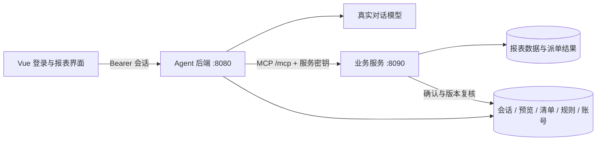

# MCP 业务服务

分支：`codex/mcp-business-service`，从已提交的 `fc3003e` 创建。

该分支增加独立 Spring Boot 应用 `business-service`。Agent 的报表页查询、候选记录查询、派单提交和结果核对通过标准 MCP Streamable HTTP 调用业务服务。模型继续负责结构化意图解析，服务端决定何时调用工具；模型没有绕过确认的执行入口。

## 运行边界



- `backend` 保留语义理解、会话、规则/目录管理、预览和确认清单的编排。
- `business-service` 独立启动，不装配模型或对话控制器；它查询报表业务表，并在事务内更新派单状态、持久化请求结果。
- `business.remote.enabled=true` 时，Agent 通过 `McpReportQueryAdapter`、`McpDispatchGateway` 和 `report_page` 访问业务数据。远端失败按错误和未知结果核对契约处理。
- 当前两个进程共用 MySQL schema 中的控制数据；业务服务读取已经确认的清单作为执行凭证。此版本完成进程与调用边界拆分，尚未把控制数据拆到独立数据库。后续拆库应将确认凭证改为带签名、绑定执行版本的独立协议。
- 默认启动脚本使用新库 `report_mcp`。首次空库初始化样例报表，普通重启保留数据；不会修改原 `report_demo` 库。业务派单目前是本服务管理的数据库状态变更，尚未对接外部 ERP 工单系统。

## 本机启动

需要 JDK 17+、Node.js、MySQL 8 和 Redis。Maven 使用仓库内 wrapper。

1. 将 `LLM_API_KEY`、`LLM_BASE_URL`、`LLM_MODEL` 注入当前 PowerShell 进程。base URL 可带末尾 `/v1`，脚本会规范化。
2. 数据库与 Redis 的 `DB_*`、`REDIS_*` 可从环境提供；本机脚本也会把 `tools/env.local.cmd` 作为数据读取，不执行其中命令。
3. 在仓库根目录执行：

```powershell
./tools/start-mcp.ps1 -Build -Frontend
# 停止时核验 PID 与本工作区 JAR/前端路径，避免误杀其他进程
./tools/stop-mcp.ps1
```

| 地址 | 用途 |
|---|---|
| `http://127.0.0.1:5173` | 登录界面、报表、派单助手 |
| `http://127.0.0.1:8080` | Agent 和面向浏览器的 REST 接口 |
| `http://127.0.0.1:8090/mcp` | MCP 工具入口，需要服务密钥 |
| `http://127.0.0.1:8090/health` | 业务服务数据库健康检查 |
| `http://127.0.0.1:8080/api/health/readiness` | Agent 的 MySQL、Redis、业务服务连通性检查 |

初始账号为 `admin`；随机初始密码和独立服务密钥位于 `.runtime/mcp-credentials.json`。目录已加入 Git、Docker 忽略列表，Windows 脚本将 ACL 限制为当前用户。该文件不是模型配置，不含模型密钥。后台进程日志和 PID 同样在 `.runtime/`。

真实模型启动可使用 `-AgentPort`、`-BusinessPort`、`-Database` 指定服务地址和数据库。当前启动默认开启原生 JSON Schema；如接入不支持该能力的端点，可直接通过应用参数覆盖 `agent.semantic.native-schema=false`。

先启动业务服务完成 Flyway 迁移，再启动 Agent。脚本为 Agent 关闭 Flyway，避免 Agent 负责样例业务表初始化。手动启动 Agent 时需激活 `mcp` profile，设置 `BUSINESS_MCP_URL`、`BUSINESS_SERVICE_TOKEN` 和 `security.enabled=true`。

业务服务可单独构建镜像：`docker build -f business-service/Dockerfile -t report-business-service:1.0.0 .`。镜像构建文件已提供，本次环境未执行 Docker 构建。跨主机 MCP URL 必须使用 HTTPS；客户端仅允许回环地址使用 HTTP。TLS 证书及反向代理由部署环境提供。现有 `docker-compose.yml` 仍启动原单体演示，不会自动启用本分支的双服务模式。

## 认证与授权

用户登录采用服务端会话：密码使用随机盐、600000 轮 PBKDF2-HMAC-SHA256；登录返回 256 bit 随机 Bearer token，数据库仅存其 SHA-256 摘要，8 小时过期。浏览器将 token 放在 `sessionStorage`，退出登录立即删除服务端会话。请求不依赖 Cookie，登录按账号和来源地址限流。

MCP 模式中所有业务 API 都要求会话；`X-User-Id` 不能作为认证凭据，过滤器用真实会话身份覆盖它。仅认证模式查询、登录与健康探针免登录。关闭真实认证却启用远端 MCP 时，应用拒绝启动；远端模式也不装配 Agent 侧的演示数据初始化器。密码、会话 token、服务密钥都不进入模型上下文。

服务间采用单独的高熵 Bearer 密钥，通过环境变量配置。当前部署的服务凭据绑定 `AUTH_TENANT_ID`（默认 `T001`）；MCP 工具的 `operatorId` 由可信 Agent 传递。业务服务按该租户重新读取账号的启用状态、公司及报表权限，不信任调用参数内的角色、管理员标记或权限列表。此入口供可信服务调用，不能把服务密钥下发浏览器或开放给不受信任的通用 Agent。

`Origin` 默认不允许浏览器跨站调用 MCP；请求体限制 128 KiB，分页上限为报表页 200 行、事实查询 500 行。服务密钥不是 OAuth 身份提供方；若后续接第三方 MCP 客户端，应增加标准 OAuth/OIDC 接入及按客户端授权，而不是共享内部密钥。

### 账号接口

| 方法与路径 | 行为 |
|---|---|
| `GET /api/auth/mode` | 返回是否要求登录 |
| `POST /api/auth/login` | `{ "userId": "...", "password": "..." }`，返回 token、到期时间及用户 |
| `GET /api/auth/me` | 返回当前真实身份 |
| `POST /api/auth/logout` | 撤销当前 token |
| `PUT /api/auth/users` | 管理员创建/更新账号及权限；更新后撤销该用户现有会话 |

管理账号的请求例子（使用管理员会话 Authorization 头）：

```json
{
  "userId": "operator_a",
  "displayName": "A 公司操作员",
  "password": "<至少 12 位的独立密码>",
  "companies": ["A"],
  "permissions": ["report:sales", "report:receivable"],
  "admin": false,
  "enabled": true
}
```

更新时 `password` 为 null/空串可保留现有密码。`enabled=false` 禁用账号。权限存储在 `app_user` 中，派单事务内再次锁定并复核用户，权限撤销不能被先前的内存快照绕过。

## MCP 工具契约

使用 MCP Java SDK 0.18.3 的无状态 Streamable HTTP 传输，支持标准 `initialize`、`tools/list`、`tools/call`。JSON Schema 随 `tools/list` 返回。无状态表示不依赖 MCP 连接保存业务状态；预览、确认、幂等和结果仍持久化在数据库中。

| 工具 | 核心参数 | 返回 |
|---|---|---|
| `report_catalog` | tenantId、operatorId | 权限内报表及字段 |
| `report_page` | 身份、reportCode、page、size | records、total、page、size，含派单状态 |
| `report_records` | 身份、reportId、mode、offset、size；可选 companies、afterId、recordIds | 事实记录；mode 为 page/cursor/ids/pendingIds/dryRun |
| `report_probe` | queryMode、queryConfig | 发布前检查数据源表和字段，只供可信服务内部配置流程 |
| `dispatch_submit` | 身份、requestId、reportId、record、enforceRules、executionVersion | success、errorCode、message |
| `dispatch_lookup` | 身份、requestId；可选 requestOperatorId 仅用于管理员代核对 | SUCCESS / FAILED / NOT_FOUND / UNKNOWN |

工具成功的 text 与 structuredContent 均包含 `{ "data": ... }`；工具错误返回 `isError=true` 及 `{ "code": ..., "message": ... }`。MCP 调用成功与派单业务成功分别判断；网络异常、超时和不能解析的响应不会被当成明确失败自动重发。

`requestOperatorId` 指定既有请求的原操作者，`operatorId` 仍是实际登录的管理员。代核对要求存在同租户的持久化清单，并验证管理员对预览中全部公司和报表的当前权限；原账号可已禁用。不传该参数时仍仅查询当前操作者的请求。代核对不调用 `dispatch_submit`，禁用账号仍不能重试派单。报表分页返回的业务 `id` 为字符串。

### 派单保障

1. 模型提出派单意图后，只生成待确认清单。用户点击确认才进入 REST 执行路径。
2. Agent 在发送前持久化请求号和 UNKNOWN 意图证据，传入执行版本；业务服务锁定清单，验证确认人、确认时间、EXECUTING 状态及执行版本。
3. 服务核对记录、公司、目录版本、规则 ID/版本与清单一致，按当前权限、当前生效规则及源记录状态复核。手工派单是否绕过金额规则由持久化的预览来源决定，不能由调用者自行关闭。
4. 源记录状态更新与 `business_dispatch_request` 的结果写入处于同一事务。并发相同请求号只执行一次；相同号不同负载返回冲突。
5. 结果查询采用锁定读，等待进行中的提交完成。已成功重复提交返回原成功；只有明确失败允许沿用同一请求号重试。超时优先按原请求号核对。
6. Agent 不在网络调用期间抢占业务服务需要的清单行锁；执行版本复核与行锁由业务服务事务持有，避免跨进程自锁。

## 验证

```powershell
./tools/test-p2.ps1 -BackendOnly
./tools/test-mcp.ps1
cd frontend
npm test
npm run build
```

MCP 集成测试创建 `mcp_it_<UUID>` 临时 MySQL 库，完成后核对库名并清理；测试真实 HTTP MCP、数据库事务及服务重启，不依赖实际模型。

2026-09-29 验收结果：

- 后端原有回归及新认证测试合计 624 项：609 通过、15 跳过、0 失败（认证测试 3 项已包含）。
- 新业务服务 MCP 集成测试 16/16：包括协议发现、认证、越权、分页、未确认拦截、执行版本、并发重复提交、负载冲突、规则/权限变更、失败重试、重启核对、会话撤销、金额精度和未提交事务的结果查询。
- 前端 53/53，包含新增的认证头、退出会话及多标签页身份隔离测试；生产构建通过。浏览器自动验收工具当前无法取得 Codex 鉴权 token，因此未完成截图验收。
- 真实 `deepseek-v4.1-flash` HTTP 验收 16/16：登录 → 自然语言查询 → 表格排除 → 自然语言生成单条清单 → REST 确认 → MCP 派单 → 重复确认 → 请求号查回 → 报表状态更新 → 退出登录。新演示库实际派单 1 条，未修改原演示库。

真实模型验收脚本：`tools/test-mcp-http.py`；默认只生成并取消清单，只有显式指定 `--confirm-dispatch` 才确认新演示库中的一条记录。脱敏结果保存于 `.runtime/mcp-http-acceptance.json`，本次证据快照见 [HTTP 验收记录](review/mcp-service-http-2026-09-29.json)。这是双服务链路验收，不是重新进行盲测的模型准确率报告。

当前意图协议通过排除集合调整记录；验收中的“仅选一条”使用真实表格勾选参数。单独说“只派某单据、其他不要派”可能要求澄清，系统不会猜测剩余记录或直接执行。完整自然语言能力边界仍以语义 V2 文档为准。

上线前还需按实际业务更换样例数据、落实数据库最小权限/迁移账号、HTTPS、密钥轮换、备份与监控。现有账号管理是本地账号体系；企业统一登录、跨租户客户端注册和外部 ERP 派单属于后续接入范围。
