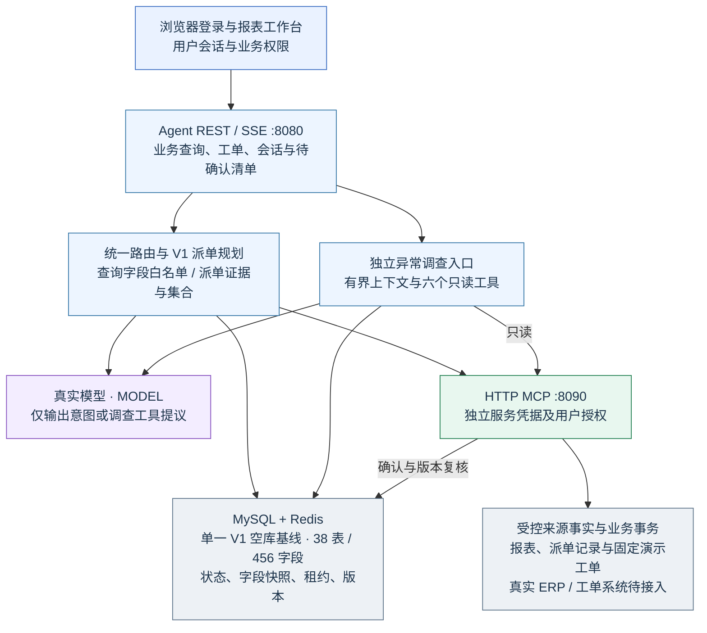
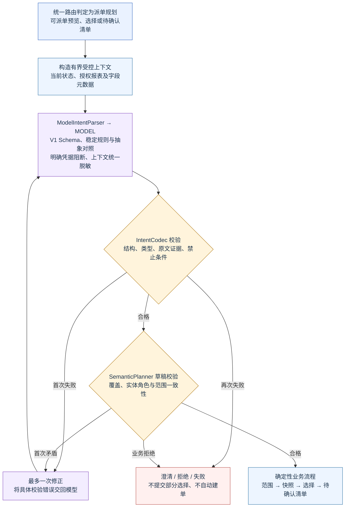
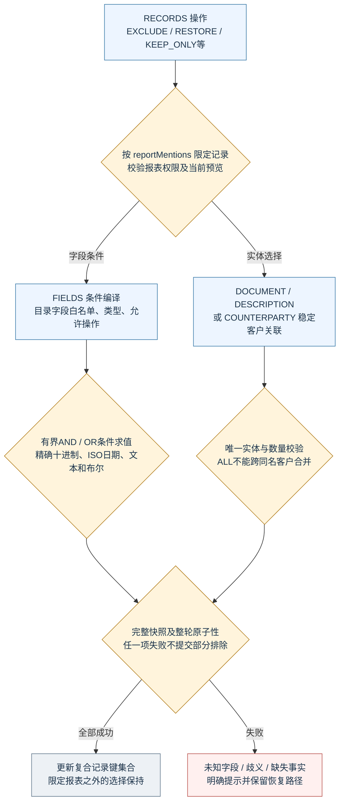
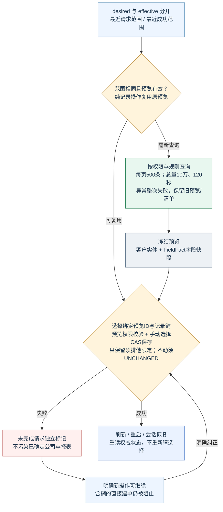
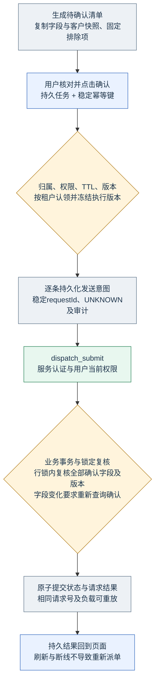
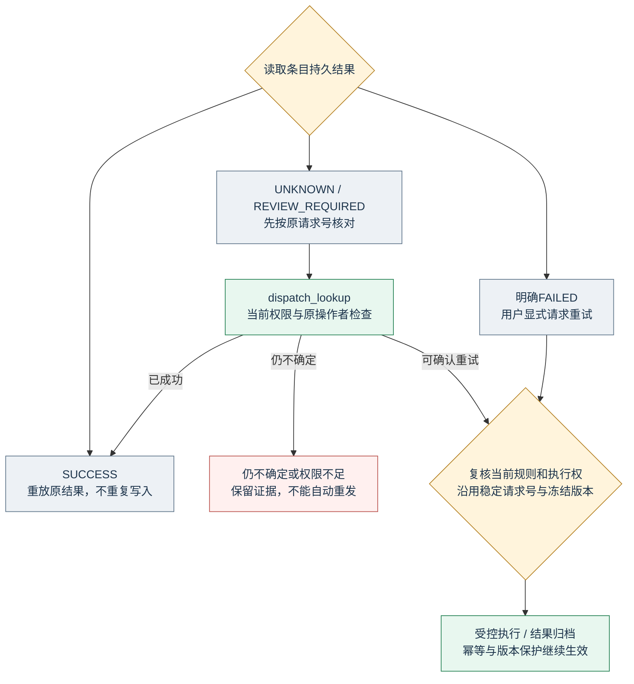
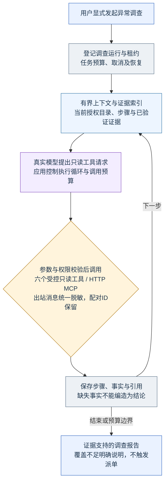
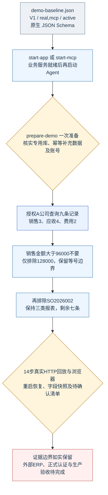
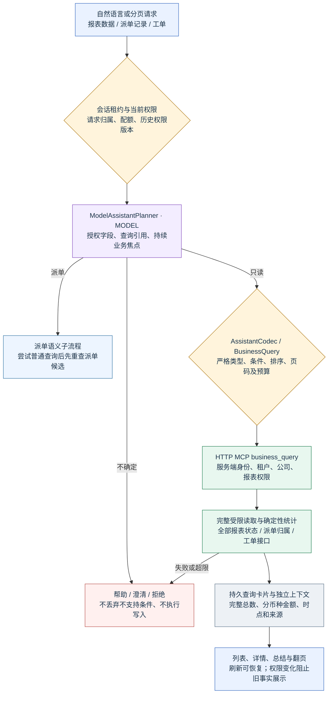
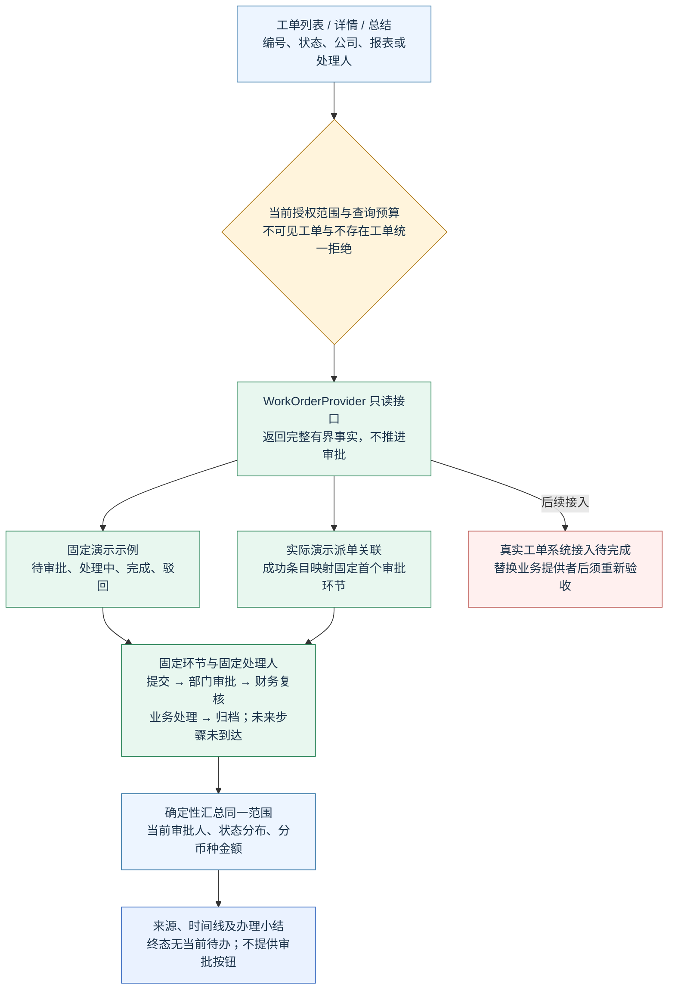

# 当前用户输入和语义 V1 的完整流程图

2026-10-06，按当前工作区代码绘制。配合 [详细说明](../../语义V1配置字段筛选.md) 阅读。

## 01 系统与信任边界

统一业务助手：real,mcp · active · V1；业务查询与派单共享会话，执行边界分离。

## 02 派单子流程解析与校验

模型不生成SQL或执行请求；脱敏草稿加汇总诊断辅助唯一一次结构修正。

## 03 配置字段与实体选择

筛选只在完整授权快照内执行；报表限定不等于替换查询范围。

## 04 预览、字段快照与恢复

当前版本运行期状态可恢复；旧版本数据不转换。

## 05 确认与持久执行任务

自然语言只生成PENDING清单；用户确认通过独立REST任务入口。

## 06 未知结果、核对与重试

超时不等于失败；不得换新请求号绕过不确定结果。

## 07 异常调查与证据

调查为独立只读流程，不修改派单选择、清单或来源数据。

## 08 最终演示与验收路径

固定功能基线与真实证据范围；最终演示版不等于生产验收。

## 09 通用查询与连续上下文

真实模型只生成受控查询；业务数据查询不替代派单候选，也不改变已有勾选。

## 10 工单进度与总结

本机固定业务流程与审批人通过真实 HTTP MCP 返回；不代表外部工单系统已接入。

