# 当前业务助手、手工派单与运营治理流程图

2026-10-10，按当前工作区代码绘制。配合 [详细说明](../../语义V1配置字段筛选.md) 阅读。

## 01 系统与信任边界

统一业务助手：real,mcp · active · V1；业务查询与派单共享会话，执行边界分离。

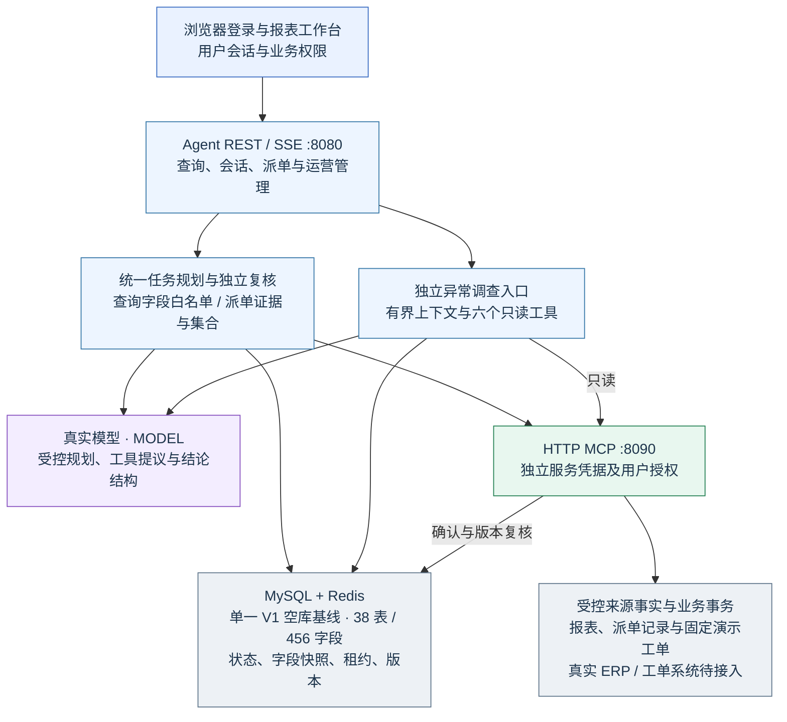

## 02 统一任务规划与语义复核

先校验当前焦点、目标、数据域与最终总数，再分别规划和复核；最多三次规划、三次独立判断（含目标重试）。

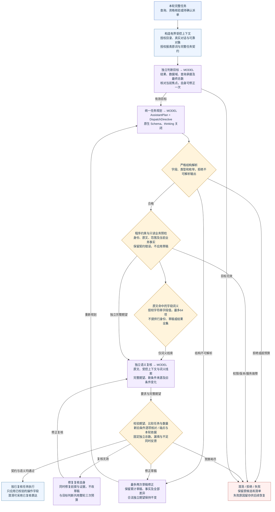

## 03 配置字段与实体选择

筛选只在完整授权快照内执行；报表限定不等于替换查询范围。

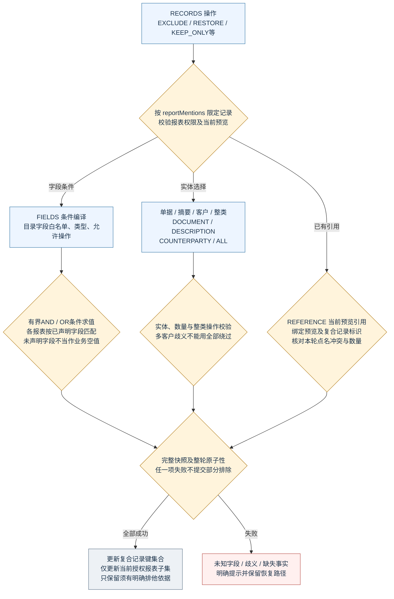

## 04 预览、字段快照与恢复

当前版本运行期状态可恢复；旧版本数据不转换。

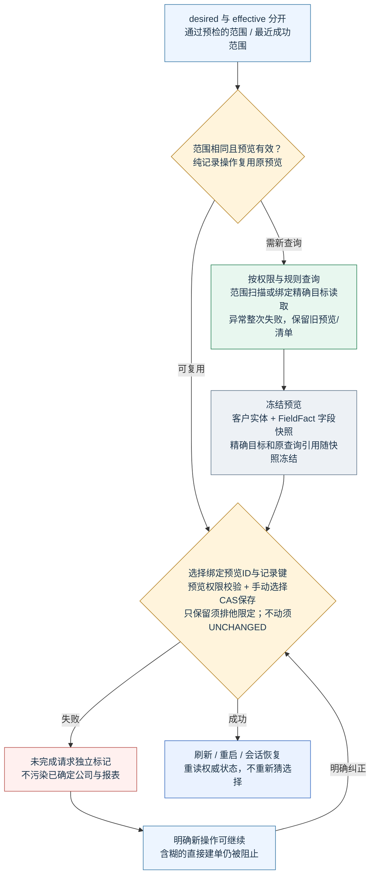

## 05 确认与持久执行任务

自然语言只生成PENDING清单；用户确认通过独立REST任务入口。

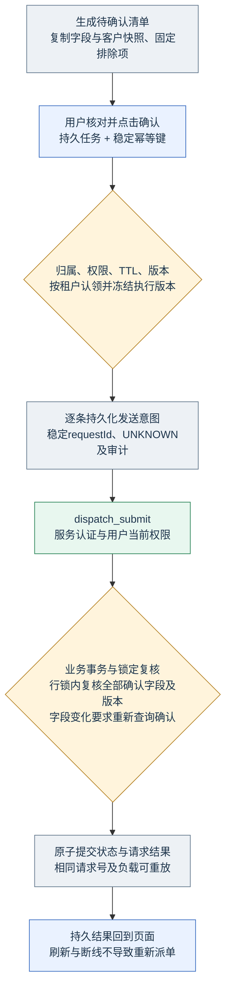

## 06 未知结果、核对与重试

超时不等于失败；不得换新请求号绕过不确定结果。

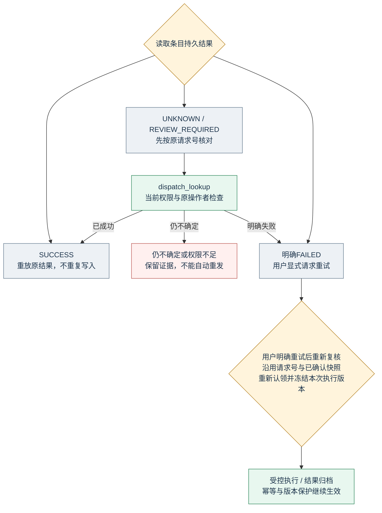

## 07 异常调查与证据

调查为独立只读流程，不修改派单选择、清单或来源数据。

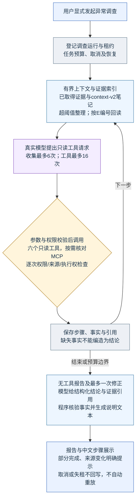

## 08 最终演示与验收路径

九条路径仅适用于授权准备的完整未派单基线；使用中的库以当前事实为准，不能直接套用数量。

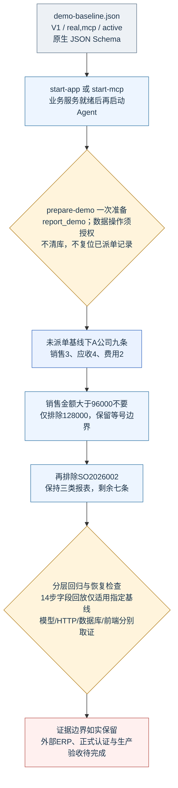

## 09 通用查询与连续上下文

完整规划及复核见02；发布前复核权限；汇总无记录引用，旧候选在话题切换后须重新展示。

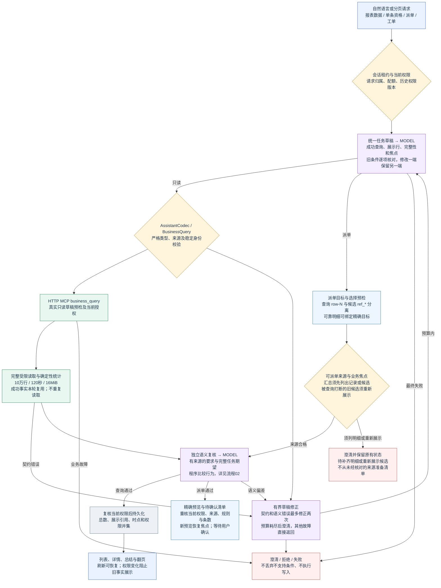

## 10 工单进度与总结

本机固定业务流程与审批人通过真实 HTTP MCP 返回；不代表外部工单系统已接入。

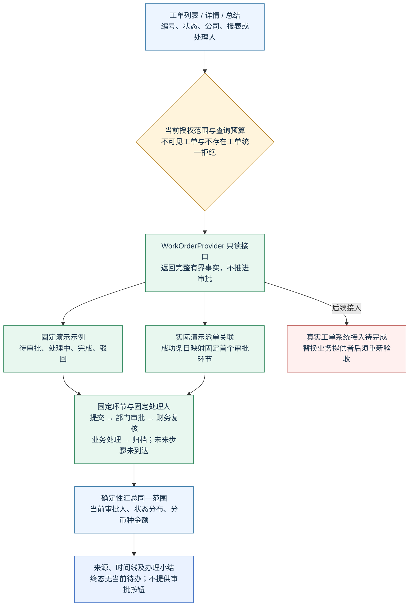

## 11 手工派单与记录详情

报表页选择、确认和持久任务不经过模型；记录抽屉与对话查询入口各自保留范围。

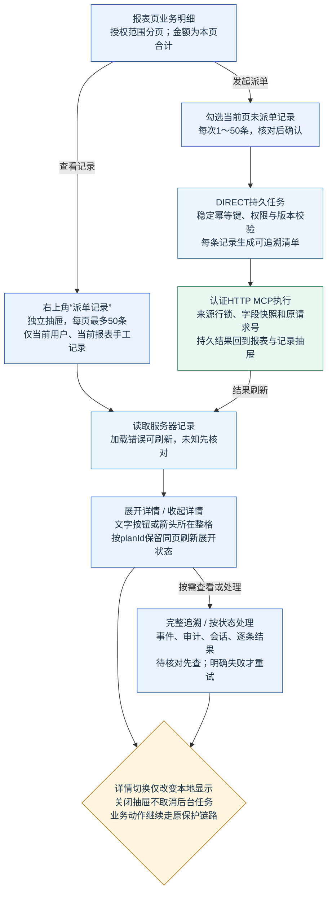

## 12 运营治理与展示口径

页面中文化只影响展示；指标、业务授权、策略版本和审计事实以服务端为准。

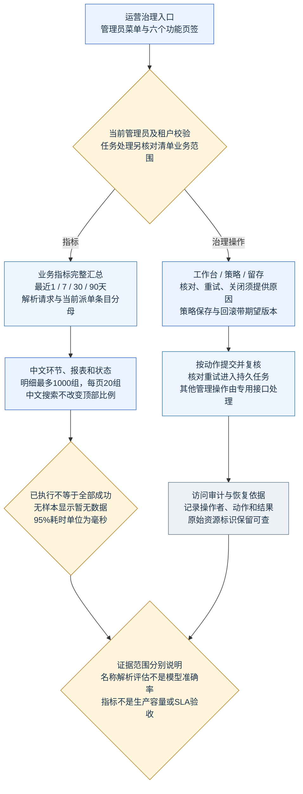
