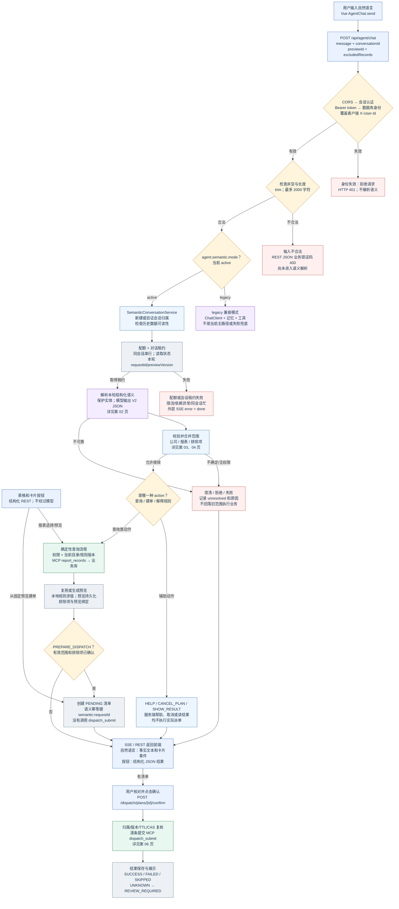
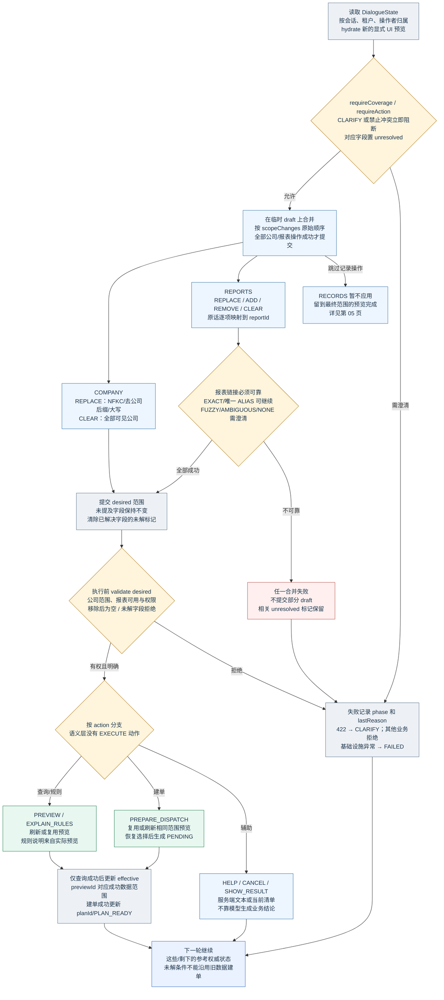
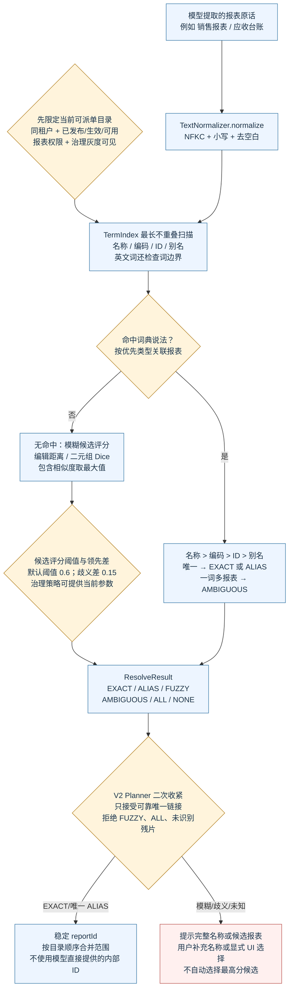
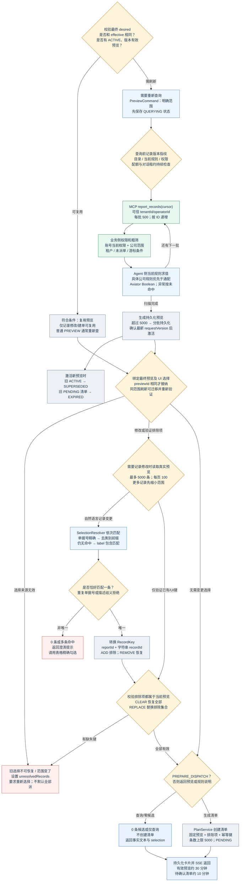
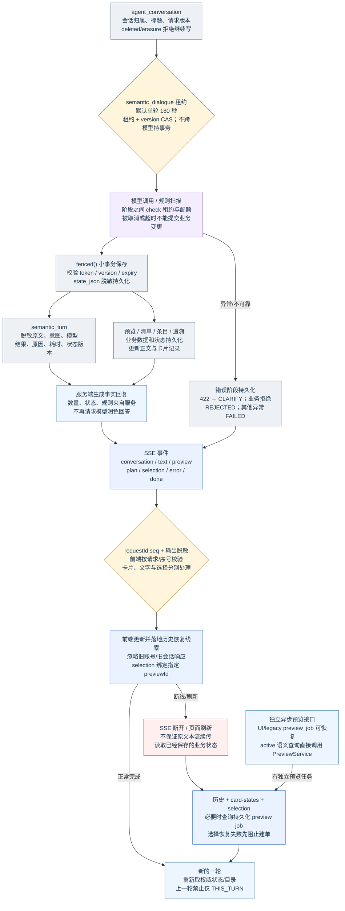

# 当前用户输入和语义 V2 的完整流程图

> 历史归档：保留原日期、版本与验收范围。当前运行说明以仓库根目录 README 和 demo-baseline.json 为准。


2026-09-30，按当前工作区代码绘制。配合 [详细说明](说明.md) 阅读。

## 01 输入到业务的总流程

当前 active V2 主路径；自然语言生成清单与用户确认执行是两次独立交互。



## 02 模型语义解析与校验

模型只负责 action / scopeChanges / restrictions；服务端校验原文证据。应用层最多追加一次解析修复。

```mermaid
flowchart TD
  message["本轮原始 message<br/>原文进入受信任服务边界"]:::agent
  context["权威上下文<br/>desired / effective / phase<br/>未解状态、排除数、上次 action"]:::store
  terms["权限过滤后的报表候选<br/>ReportRef + mentionedReportTerms<br/>词典命中只提供实体线索"]:::agent
  protect{"SensitiveData.modelText<br/>手机号 / 证件号 / 邮箱<br/>替换为本轮随机 REF 占位符"}:::guard
  payload["构造 JSON 输入<br/>currentMessage + context<br/>不带完整助手历史或业务明细"]:::agent
  options["构造真实模型调用<br/>temperature 0；maxTokens 2400<br/>禁用内部工具执行和回调"]:::model
  schema["规则提示 + V2 JSON Schema<br/>当前启用 native-schema<br/>模型 deepseek-v4.1-flash"]:::model
  call["同步 call().content()<br/>只取完整 JSON 内容<br/>模型不能实际派单或编写 SQL"]:::model
  decode{"IntentCodec 严格解码<br/>version=2；必填/类型/枚举<br/>未知字段和尾随内容拒绝"}:::guard
  ground{"验证原文证据和协议不变量<br/>evidence 归一化后属于原文<br/>mentions 属于 evidence"}:::guard
  invariants{"检查动作、顺序和限制<br/>公司仅一次 REPLACE/CLEAR<br/>记录修改在后；动作禁止不冲突"}:::guard
  coverage{"报表实体覆盖检查<br/>查询类输出必须覆盖<br/>本轮所有已命中的报表候选"}:::guard
  valid{"所有检查通过？<br/>JSON / 原文 / 报表覆盖"}:::guard
  repair["第一次失败：独立重解析<br/>同一本轮输入 + 修复指令<br/>不采用模型猜测或关键词兜底"]:::model
  failed["第二次失败 / 调用异常<br/>返回友好原因与未解状态<br/>传输异常不走格式修复循环"]:::error
  restore["恢复 REF 到本地原实体<br/>恢复 mentions / evidence<br/>在原 message 上再次校验"]:::agent
  intent["交付 SemanticIntent<br/>Source=MODEL<br/>交给 Planner，不调用业务工具"]:::agent
  message --> protect
  context --> payload
  terms --> payload
  protect --> payload
  payload --> options
  options --> schema
  schema --> call
  call --> decode
  decode --> ground
  ground --> invariants
  invariants --> coverage
  coverage --> valid
  valid -->|"通过"| restore
  valid -->|"首次失败"| repair
  repair -->|"最多一次"| call
  valid -->|"再次失败"| failed
  call -->|"传输/模型异常"| failed
  restore -->|"再校验通过"| intent
  restore -->|"再校验失败"| failed
  classDef ui fill:#eaf2ff,stroke:#386bc1,color:#1e354c
  classDef agent fill:#edf5ff,stroke:#3778a8,color:#1e354c
  classDef model fill:#f3edff,stroke:#8751bf,color:#1e354c
  classDef business fill:#e8f7ef,stroke:#268255,color:#1e354c
  classDef guard fill:#fff4dc,stroke:#b58022,color:#1e354c
  classDef error fill:#fff0ef,stroke:#ba534e,color:#1e354c
  classDef store fill:#edf1f5,stroke:#60768b,color:#1e354c
```

## 03 多轮范围与动作规划

desired 是请求范围，effective 是最近成功范围；拒绝的新输入不会被悄悄替换为旧的成功查询。



## 04 报表实体解析

词典和模糊算法解决“这段原话对应哪张报表”，不负责整句的否定、动作或追加/排除语义。



## 05 预览、规则与记录选择

模型不读取全部业务明细或自行判断规则命中；记录描述只有在服务器真实预览中唯一定位后才转为 RecordKey。



## 06 确认、执行与结果核对

本页从用户点击确认开始；与本轮模型解析分离。未知结果必须先查询原请求号，不能盲目重发。

```mermaid
flowchart TD
  confirm["用户点击确认卡片<br/>REST confirm；没有模型参与"]:::ui
  gate{"归属、权限、TTL、版本复核<br/>已 EXECUTED → 返回原结果<br/>不是有效 PENDING 则拒绝"}:::guard
  invalid["清单不可确认<br/>返回当前状态或错误<br/>无权限/失效/正在执行等"]:::error
  replay["重放已有清单结果<br/>原状态已 EXECUTED<br/>直接返回，不再调用网关"]:::store
  claim["CAS 认领执行权<br/>确认 PENDING / 重试 EXECUTED<br/>→ EXECUTING + executionVersion"]:::store
  check{"按清单 ID 重读和规则复核<br/>当前记录仍待派单且有权<br/>复核失败且未发送可恢复 PENDING"}:::guard
  item{"逐条是否仍符合？<br/>取消/过期/失权不能继续"}:::guard
  skip["SKIPPED<br/>记录已变化；未调用网关"]:::store
  intent["先持久化发送意图<br/>requestId=planId-itemId<br/>条目 UNKNOWN + 审计 INTENT"]:::store
  call["MCP dispatch_submit<br/>操作者 / 记录 / 规则模式<br/>执行版本来自服务器清单"]:::business
  business{"业务服务重新读取有效身份<br/>公司、报表权限<br/>锁用户、幂等请求和清单"}:::guard
  duplicate{"稳定请求号和负载是否一致？<br/>同号不同负载 → 拒绝<br/>已 SUCCESS → 重放成功"}:::guard
  fence{"验证已确认清单和条目<br/>EXECUTING / confirmedBy<br/>executionVersion / UNKNOWN 意图"}:::guard
  source["原子业务事务复核<br/>锁目录、规则和源记录<br/>版本、规则、当前待派单状态"]:::business
  commit["事务提交业务状态与结果<br/>业务表状态 + 请求结果同事务<br/>当前是本地业务库，非外部 ERP"]:::store
  persist["Agent 保存逐条结果及审计<br/>SUCCESS / FAILED / SKIPPED<br/>超时/不确定 → UNKNOWN"]:::store
  uncertain{"有未知/保存失败/执行中断？<br/>所有条目遍历并聚合"}:::guard
  finish["EXECUTED<br/>保存实际成功和失败数<br/>返回结果卡片"]:::store
  review["REVIEW_REQUIRED<br/>不能认为全部失败<br/>不允许盲目自动重发"]:::store
  lookup["用户或管理员显式核对<br/>MCP dispatch_lookup<br/>锁定读等待在途结果"]:::business
  known{"核对结果明确？<br/>SUCCESS / FAILED / NOT_FOUND<br/>UNKNOWN 则继续等待"}:::guard
  resolved["更新未知条目<br/>NOT_FOUND → 未发送的明确失败<br/>全部明确后解除待核对状态"]:::store
  retry{"用户显式 retry-failed<br/>仅 FAILED；原操作者必须有效<br/>重新复核，沿用原请求号"}:::guard
  close["管理员安全关闭明确失败<br/>权限 + 原清单范围检查<br/>未知/在途状态不能强行关闭"]:::agent
  confirm --> gate
  gate -->|"不可确认"| invalid
  gate -->|"已执行"| replay
  gate -->|"允许确认"| claim
  claim --> check
  check --> item
  item -->|"不符合"| skip
  item -->|"符合"| intent
  intent --> call
  call --> business
  business --> duplicate
  duplicate -->|"新请求/失败重试"| fence
  duplicate -->|"已成功：重放"| persist
  duplicate -->|"协议错误：保守核对"| persist
  fence --> source
  source --> commit
  commit --> persist
  skip --> persist
  persist -->|"还有下一条"| item
  persist -->|"全部处理完成"| uncertain
  call -->|"调用异常：UNKNOWN"| persist
  uncertain -->|"否"| finish
  uncertain -->|"是"| review
  review --> lookup
  lookup --> known
  known -->|"UNKNOWN"| review
  known -->|"明确"| resolved
  resolved -->|"全部明确"| finish
  finish -->|"有明确失败且用户要求"| retry
  retry -->|"重新认领并复核"| claim
  finish -->|"无需重试"| close
  classDef ui fill:#eaf2ff,stroke:#386bc1,color:#1e354c
  classDef agent fill:#edf5ff,stroke:#3778a8,color:#1e354c
  classDef model fill:#f3edff,stroke:#8751bf,color:#1e354c
  classDef business fill:#e8f7ef,stroke:#268255,color:#1e354c
  classDef guard fill:#fff4dc,stroke:#b58022,color:#1e354c
  classDef error fill:#fff0ef,stroke:#ba534e,color:#1e354c
  classDef store fill:#edf1f5,stroke:#60768b,color:#1e354c
```

## 07 状态、SSE 与异常恢复

V2 多轮依据持久化状态，不依赖模型助手历史。SSE 是业务事件流，不是当前主路径的模型 token 流。


