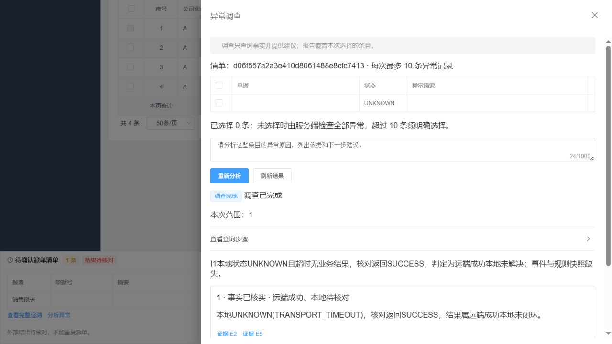
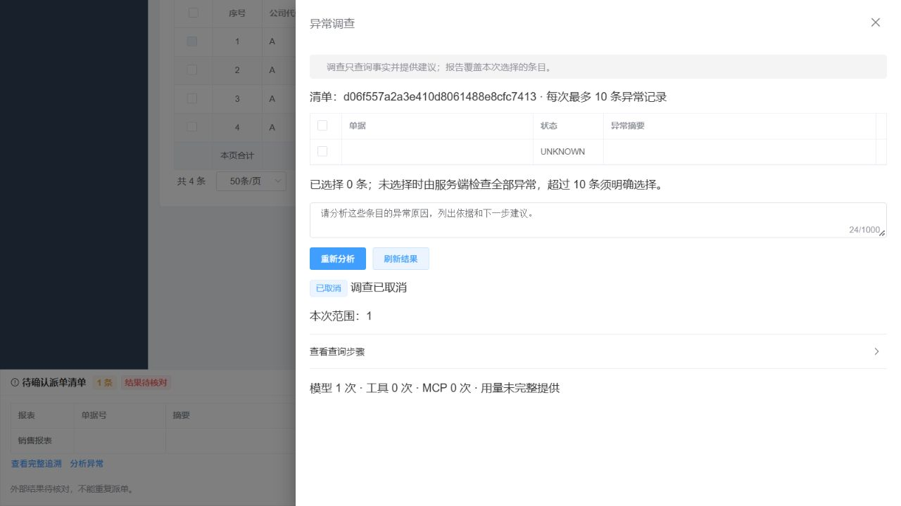

# 异常调查 Agent 实施与验收

> 历史归档：保留原日期、版本与验收范围。当前运行说明以仓库根目录 README 和 demo-baseline.json 为准。


日期：2026-10-05，Asia/Shanghai。按[详细设计](../异常调查Agent与评估体系详细设计_2026-10-05.md)实现，使用当前工作区源码。真实运行基线为 `real,mcp`、`agent.semantic.mode=active`、应用会话认证和 HTTP MCP；模型解析来源为 `MODEL`。

本页“实测记录与证据范围”保留首次交付的历史结果。后续整体评审 F1～F5 的修复与新增验证独立记录在[问题修复记录](../review/异常调查Agent问题修复_2026-10-05.md)，不能将原 47/48 结果视为修复后版本的验收。

再次整体复评的新增发现及修复见[修复后复评](../review/异常调查Agent修复后复评_2026-10-05.md)。当前实现还校验排队与执行时的模型配置；配置变化后旧任务以 `CONFIG_CHANGED` 结束，用户重新分析才采用新配置。

2026-10-06 最新真实模型复验见[真实模型复验报告](../review/异常调查Agent真实模型复验_2026-10-06.md)：修正本地与远端证据的引用提示后，保留集 48/48、真实模型与 HTTP MCP 联合验收 3/3 通过。首轮 47/48 和此前网络阻断记录分别保留，不能与修复版结果混合。

## 使用入口

打开已执行或待核对清单，点击“分析异常”。默认调查该清单的异常条目；超过 10 条时明确选择子集。输入问题后提交，页面展示查询步骤、逐条结论、证据和建议。结论区分事实已核实、待验证推测、证据不足。来源变化时提示报告描述调查时点。

调查独立于派单执行。报告建议可引导用户返回已有清单入口核对，报告本身不能确认、重试、派单或发布规则。清单、公司、报表与会话权限仍须通过当前身份重新验证。

关闭抽屉不会取消服务端任务。重新打开或刷新读取已创建任务；未收到提交响应时按原幂等键和原负载恢复。得到任务 ID 后只使用 GET。用户显式点击“重新分析”才产生新的任务。已明确拒绝的请求允许修改范围；网络错误和服务端不确定错误保留原键。页面连续轮询最多 5 分钟，停止轮询后可手动刷新结果。取消撤销执行权，迟到的模型或 MCP 响应不能追加证据或覆盖终态。

## 实现位置与约束

| 位置 | 已实现职责 |
| --- | --- |
| `backend/.../investigation/InvestigationAgent.java` | 显式控制模型循环、保持原 toolCallId、整批工具白名单、参数错误反馈、结果复用和无进展终止 |
| `InvestigationOpenAiModel.java` | 独立 Spring AI 客户端，关闭内部工具执行和自动重试；实际序列化请求限流量，按剩余时间设置 HTTP 时限 |
| `InvestigationTools.java` | 五个只读工具；模型只传运行内条目引用，服务端绑定清单、操作者和原请求号 |
| `InvestigationReportValidator.java` | 严格 JSON、逐条覆盖、枚举事实、同运行证据引用和建议类型校验；最终报告阶段无工具，最多修复一次 |
| `InvestigationService` / `InvestigationAccessPolicy` | 准入、幂等、任务归属、当前权限和只读查询；账号禁用或范围撤销后禁止继续读取 |
| `InvestigationRepository` / `InvestigationWorker` | MySQL 持久队列、短事务认领、执行令牌、续租、取消、终态保护和保留期清理；独立线程池 |
| `InvestigationFacts.java` | 当前条目、规则和每条最多 20 个执行事件的有界快照；源状态、版本及内容指纹检查 |
| `BusinessMcpClient.readOnlyCall` | 只允许 `dispatch_lookup`，可信身份注入，独立有时限连接，鉴权拒绝与查询不可用分开处理 |
| `frontend/.../InvestigationPanel.vue` / `api/investigation.js` | 清单和结果卡片入口、候选条目分页、步骤增量读取、证据文本显示、账号隔离、迟到响应保护和提交恢复 |

五个工具为 `investigation_plan_summary`、`investigation_plan_items`、`investigation_rule_snapshots`、`investigation_execution_events`、`investigation_dispatch_lookup`。工具结构和返回字段详见详细设计及源码；模型不能传租户、用户、管理员标记、任意请求号、网络地址或 SQL。

当前报告模型协议只接受 `findings` 和 `unresolved`：模型选择原因、核实程度、证据、建议和待查事项枚举，程序在校验后生成 `summary`、`explanation` 和待查 `message`。不接收模型自由文本因果解释或已执行操作声明；具体业务错误仍从引用证据查看。规则文本（包括表达式的展示副本）不论长度均先脱敏，再限制长度；业务执行快照保持原值。

调查运行表归 Agent 业务域维护。V22 创建 `agent_investigation_run`、`agent_investigation_step`、`agent_investigation_evidence`、`agent_investigation_queue` 四表，共 60 个字段，均有数据库元数据注释。当前完整结构为 39 表、458 字段，见[表结构字典](../db/表结构字典.md)。只验证最新空库结构，不实现历史任务或浏览器状态转换。

默认预算：每次最多 10 条、6 轮收集、8 次模型请求（含报告和修复）、16 次工具请求、20 次 MCP 查询；单条最多核对两次。总运行时限 180 秒、模型单次 40 秒、MCP 单次 8 秒；排队 120 秒。2 个专用工作线程，租约 45 秒、每 10 秒续期。每用户最多 3 个在途任务、每租户 12 个；运行配额另限制每用户 2 个、每租户 4 个并发，速率每用户 6 次/分钟、每租户 60 次/分钟。终态保留 7 天，会话删除同步清理所属调查数据。

输入请求体上限 98304 UTF-8 字节，单次工具结果上限 8192 字节；证据累计上限 512 KiB，冻结快照上限 2 MiB。收集输出默认 2400 tokens，报告 4096 tokens。失败请求、参数错误和复用工具结果均占用相应预算，不进行隐藏的模型重试。

## HTTP 接口

所有接口使用当前应用 Bearer 会话。业务错误使用对应 HTTP 状态，响应数据仍包在现有 `Result` 中。

| 方法与路径 | 说明 |
| --- | --- |
| `POST /api/investigations` | 头 `Idempotency-Key`；体为 `planId`、`question`、可空 `itemIds` 字符串数组。新建返回 202；同键同负载回放或无异常返回 200 |
| `GET /api/investigations?planId=...&size=20&cursor=...` | 只列当前创建人的指定清单任务；`cursor` 为空为第一页，后续使用 `nextCursor` 的任务 ID 锚点 |
| `GET /api/investigations/candidates?planId=...&afterId=0&size=20` | 当前有权清单的异常条目候选；条目 ID 返回字符串，避免大整数精度损失 |
| `GET /api/investigations/{id}` | 状态、绑定范围、合法报告、用量、活动步骤及来源变化标记 |
| `GET /api/investigations/{id}/steps?afterSeq=0&size=20` | 按序返回已完成的连续步骤；未完成步骤通过 `activeStep` 展示，不推进增量游标 |
| `GET /api/investigations/{id}/evidence/{ref}` | 读取实际已取得的证据；每次重新验证任务归属和当前清单权限 |
| `POST /api/investigations/{id}/cancel` | 幂等取消；已处于终态的任务保持终态 |

同键不同负载返回 409，同用户同清单已有在途任务返回 409，队列满返回 429。超出选择范围、请求格式错误和未知字段明确拒绝；无权任务按不存在处理。

## 配置与真实模型失败恢复

一键启动继续使用 `tools/start-app.cmd`，按 README 配置已忽略的本机私有文件。调查默认沿用 `LLM_BASE_URL`、`LLM_MODEL`、`LLM_API_KEY`，可用 `INVESTIGATION_MODEL` 覆盖模型。`INVESTIGATION_NATIVE_SCHEMA` 与 `INVESTIGATION_THINKING_ENABLED` 默认 false；开启前必须单独验证实际端点能力，不能据无工具语义解析结果推断工具链路同样支持。

其余预算配置位于 `agent.investigation.*`，启动时校验合法范围。业务表时间按 `agent.investigation.business-timezone=Asia/Shanghai` 转为 UTC；调查任务自身写入 UTC。

用量优先取模型返回 metadata，缺失记录为 null，不能用字符数补齐。费用只有 `input-price-per-million`、`cached-input-price-per-million`、`output-price-per-million`、`currency` 与实际计量满足计算条件时才有值；价格单位为每百万 tokens、币种为三位大写代码。任务保存价格配置哈希及完整性。未配置价格时费用为空。

配置缺失时提交返回 `503/MODEL_UNAVAILABLE`，不创建新任务；真实模型鉴权或端点调用失败时任务为 `FAILED/MODEL_UNAVAILABLE`，不会换用其他解析来源。修复本机配置后重新启动进程，再由用户显式发起新调查。供应商错误正文与凭据不进入调查日志，只记录受控错误类别或 HTTP 状态。

## 评估与复现

语料为 40 个独立场景：24 个开发场景、16 个保留场景。确定性评分器按目标条目、原因枚举、核实程度及必要远端证据判定，不固定工具查询顺序。重复单据、大整数、注入文本、缺失规则/事件/请求号、截断和多条目场景都有覆盖。取消、撤权、版本、租约、调用预算等交错另由可控回归验证。

```powershell
# 当前结构、状态机、真实会话与HTTP MCP、前端逻辑和构建
pwsh -NoProfile -File tools/test-regression.ps1

# 真实模型与合成只读事实，开发集用于定位问题
pwsh -NoProfile -File tools/test-investigation-live.ps1 -Split development -Repeats 1

# 独立保留集，每题三次
pwsh -NoProfile -File tools/test-investigation-live.ps1 -Split holdout -Repeats 3

# 中断后仅补跑尚未执行的题次，目录替换为原批次真实归档路径
pwsh -NoProfile -File tools/test-investigation-live.ps1 -Split holdout -Repeats 3 -ResumeFrom '<原批次归档目录>'

# 真实模型、当前应用会话、HTTP调查入口、HTTP MCP和隔离业务库
pwsh -NoProfile -File tools/test-investigation-live.ps1 -Joint

# 控制变量及同题运行对比，目录使用真实产生的归档路径
node tools/compare-investigation-evaluations.cjs <基线归档目录> <候选归档目录>

node tools/check-comments.cjs
node tools/check-docs-real-model.cjs
```

真实模型评估输出到 `backend/target/investigation-evaluation/`。每批在第一次模型调用前创建并打印独立 `run-*` 归档路径，先保存 `manifest.json` 和 `checkpoint.json`；每题开始与结束均原子更新检查点，不等待同批另一题。结束后生成 `runs.jsonl`、`summary.json`、`report.md`，按运行 ID 保存步骤和证据，顶层同名文件是最新归档的便捷副本。清单含真实模型与端点的非敏感标识、预算、代码与工作区哈希、后端源码和实际编译产物哈希、语料/提示词/工具 Schema/报告 Schema 哈希、开始结束时间和判定器版本。JSON 对象键确定性排序，避免进程差异改变来源指纹和契约哈希。

评估最多 2 个并行运行，双任务批次起点至少相隔 21 秒，使任务速率低于单账号每分钟 6 次；可用 `-Parallelism 1` 顺序运行。合成事实评估不访问真实业务数据库，实际运行配额和队列边界另由数据库及 HTTP 联合测试验证。

联合验收分别记录远端成功、本地待核对，业务明确失败，以及远端结果仍未知；产物位于 `business-service/target/investigation-joint/`。准备异常事实仅在 UUID 隔离测试库进行，验收后删除该专用库。调查前后比较清单、条目、预览、规则、源报表、业务幂等账本和报表目录，调查自己的运行、步骤、证据与配额表允许写入。

对比工具与续跑校验共用 `backend/src/test/resources/investigation/evaluation-controls.json`。固定控制变量包括模型、端点基础地址、实际请求路径 `completionsPath`、业务时区、语料、评分器、thinking、原生 Schema、预算、价格、并发数和批次间隔。输入批次配置阻断、题次重复或为空、运行集合不同、控制变量缺失或改变时，输出不可直接比较的标记，仍保留实际差值；不据此宣称提示词改善了质量。提示词、工具和报告契约、后端及评估编译产物哈希列为对比实验变量，同一次续跑则要求这些变量也完全一致。

续跑还校验提示词、工具与报告契约、事实版本、评分器、后端与评估代码的实际编译产物哈希，以及并发数和批次最小间隔。控制变量缺失或不同即拒绝，不能将旧结果重标为新配置。已经执行的失败保留原结果，不被重新执行或成功结果覆盖。当前评分器为第 3 版，旧版归档仅作历史证据，不与新版续跑合并。当前格式保存报告的复核只运行独立评分器，不调用模型，也不构成新一轮真实模型评估；可设置 `INVESTIGATION_ARCHIVE` 为归档绝对路径，再运行 `backend/mvnw.cmd -f backend/pom.xml test -q -Dtest=InvestigationEvaluationTest`。

新评估轨迹按运行和步骤序号合并 `startStep` 与 `endStep`，保存种类、工具名、原 `toolCallId`、脱敏有界参数、结果和时间；中断步骤保留 `STARTED`。评分器独立检查受控正文、语料预期及实际引用事实，输出条目、关键事实和引用的分子/分母。正文指标仅覆盖当前受控报告展示断言，不代表任意自然语言解释的正确率。

自 2026-10-06 修复版起，续跑要求相同的完整题次计划和 `journalVersion=2` 检查点。读取父归档前取得独占锁，并持有到整个续跑结束；第一次调用前在父目录写入 `continuation.json`，登记唯一后继归档。再次使用已登记的父归档会拒绝并提示后继路径，需要继续时将 `ResumeFrom` 指向该后继；父批次原始清单和检查点保留。某题已开始但没有保存结束结果时，调用结果与费用未知，明确拒绝自动重放。需要独立检查该归档，再选择尚未开始的题次创建新批次，不覆盖未知尝试。旧归档保持历史证据，不转换或补造新检查点。“全部重复通过”只计入计划内全部题次都实际完成且通过的场景。

批量远端核对在任何查询前检查整批条目的剩余资格，参数错误不会消耗其他合法条目的机会；每条返回事实立即保存。后续条目因预算或来源变化停止时，报告阶段仍取得已保存证据。响应体积受限时裁剪补充文本或返回证据回执，保留状态、条目身份和证据引用；这些只读查询不会改变派单业务状态。

## 实测记录与证据范围

以下为 2026-10-05 的实际结果，结构化摘要见 [验收证据摘要](../review/investigation-acceptance_2026-10-05.json)。本阶段按最新结构新建专用测试库验证，没有对日常运行库执行数据清空或历史数据转换。

| 验证范围 | 实际结果与限制 |
| --- | --- |
| 后端与业务服务回归 | `tools/test-regression.ps1` 返回 0；覆盖当前结构、权限、幂等、版本、租约、取消、配额与 HTTP MCP。最新校验器、Agent 与评分器另有 25 项定向回归通过；最终后端打包通过 |
| 数据库结构与注释 | 空库初始化与注释覆盖通过，共 39 张表、458 个字段；新增调查模块为 4 张表、60 个字段 |
| 前端逻辑与构建 | 最终 79/79 项通过，生产构建通过；包含提交响应丢失后的同键恢复、账号切换隔离及超量全选恢复 |
| 真实模型保留集 | 16 题各 3 次，共 48 次，47 次通过、1 次模型请求超时；15 题三次全通过。运行 P50 17.342 秒、P95 21.253 秒、最大 43.727 秒；没有非法工具运行或不合法报告运行 |
| 模型用量 | 47 次完整提供用量；累计模型调用 208 次、工具调用 234 次、合成事实远端查询 54 次。价格未配置，费用与币种为空 |
| 最终报告校验器复核 | 对已保存的 47 份成功真实模型报告重新校验，47/47 通过；新增模型调用 0 次，保留原有 1 次超时失败 |
| 真实模型与 HTTP MCP 联合 | 远端成功、明确失败、仍未知三个最终场景均通过；七类业务表前后哈希一致，同键回放不增加模型调用，无权访问与多余身份字段被拒绝 |
| 浏览器组件集成 | 在隔离测试库、真实会话、真实模型及 HTTP MCP 上验证分析入口、报告/步骤/证据、刷新恢复、显式重新分析、运行中取消和取消后刷新。临时页面挂载实际组件，未覆盖自然语言建单与确认派单的完整聊天流程 |
| 静态规范 | 中文注释检查、真实模型文档检查与差异空白检查通过 |

保留集归档为 `backend/target/investigation-evaluation/run-2026-10-05T08-21-41.508170900Z-fd040af3`。真实模型为 `deepseek-v4.1-flash`，原生 Schema 与 thinking 均为 false；开启这两项后的端点能力未验收。初始批次执行 46 次后停止，45 次通过、1 次超时、2 次未执行；续跑只补齐后两次，失败没有被覆盖。失败为 `holdout_empty_trace_skip` 第三次，终止原因 `MODEL_UNAVAILABLE`。

保留集是在后续联合验收反馈修正之前生成的，确切编译产物哈希保存在原始清单中；最终校验器对保存报告的复核不改变其原始模型调用证据。开发集曾有 13/24、21/24、22/24 的定位批次，其间事实与评分器版本有调整；它们属于调试历史，不能作为控制变量一致的质量提升结论。

联合验收初次三个场景有一个失败：模型将真实远端 `FAILED/RECORD_CHANGED` 描述为结果未知，再次运行仍失败。随后补充精确校验反馈及本地待核对、远端明确失败的核对建议约束，该场景通过。早期失败诊断保留在本机 `.runtime/investigation-joint-failure-before-feedback.json`；最终三个场景产物在 `business-service/target/investigation-joint/`。此处的“三个最终场景通过”不表示所有历史尝试均成功。

浏览器取消场景在运行中完成取消，之后刷新仍为 `CANCELLED`，模型调用 1 次、工具与 MCP 调用均为 0。临时页面、辅助进程和专用测试库已清理。截图为当前组件在该验收页面的实际显示：





前端逻辑测试与构建只证明对应代码行为；HTTP 模型传输测试替身只证明 Spring AI 请求和工具消息协议。真实模型保留集使用合成只读事实，不能证明真实外部业务正确性；HTTP MCP 联合验收提供本仓库业务服务上的独立证据。

程序能拒绝不支持的枚举事实和非法引用，但引用合法仍不能证明自由文本因果解释全部正确；自然语言说明仍需任务评估与人工抽查。真实 HTTP MCP 面向本仓库业务服务及专用 Demo 数据，外部 ERP、正式企业认证、生产容量、灾备及完整聊天流程端到端验收仍待完成，不能由上述结果代替。
