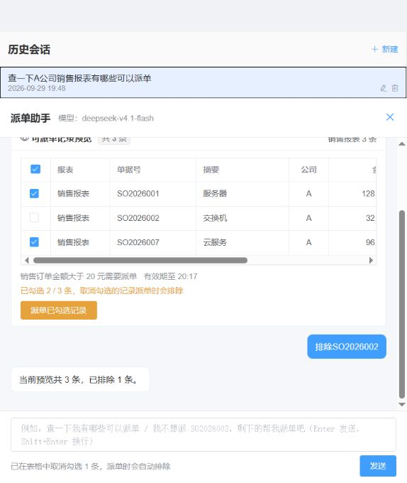

# 真实模型联调与缺陷修复

> 历史归档：保留原日期、版本与验收范围。当前运行说明以仓库根目录 README 和 demo-baseline.json 为准。


日期：2026-09-29。基于当前工作区（包含先前未提交的语义 V2 改动）完成修复、真实模型评估、本地启动和业务验收；没有提交 Git，也没有接入或调用真实业务派单网关。

## 运行状态

- 前端：[http://127.0.0.1:5173](http://127.0.0.1:5173)
- 后端：[http://127.0.0.1:8080/api/health/readiness](http://127.0.0.1:8080/api/health/readiness)，就绪状态 UP。
- 模型：`deepseek-v4.1-flash`，使用本轮提供的兼容端点。真实模式、语义 V2 active、温度 0、原生 JSON Schema 开启、thinking 关闭。
- 密钥仅通过进程环境传递，未写入源码、启动脚本或验收报告。前端进程不继承模型密钥。
- 后端启动明确关闭数据重置。测试创建了验收会话；HTTP 测试清单已取消，未确认派单。

## 模型准确率

| 评估 | 结果 | 说明 |
| --- | --- | --- |
| 修复前原有语料 | 46/51，90.20% | 全部走真实模型；包含格式、范围、禁止继承和澄清恢复失败 |
| 补充语料首次测试 | 20/24，83.33% | 暴露遗漏保留报表、单据类别前缀等问题 |
| 最终合并验收 | **75/75，100%** | 原有 51 轮 + 补充 24 轮；75 次模型调用，0 次校验修复调用 |

最终运行的解析延迟中位数 **1,983 ms**，P95 **2,820 ms**，不含真实数据库查询、建单和前端渲染。所有解析来源均为 MODEL，均实际调用模型接口。

校验标准包括：动作、公司、最终报表集合、排除记录、禁止动作、拒绝/澄清结果；原有语料还检查具体范围操作。中间的失败与后续修复均保留在 `backend/target/semantic-*.json` 和日志中，不能只用一次成功运行证明模型始终可靠。

**100% 仅指本次 75 轮固定语料。** 这些样本参与了问题定位和修复，属于迭代回归集，不是独立盲测，也不代表任意自然语言或所有真实业务数据的准确率。

最终提示词 SHA-256：`b052884c3b099b6ba5d05791b16f1082cbb6c256db795fc0750456582546505b`。

完整逐轮证据：[模型验收 JSON](../review/semantic-model-acceptance-2026-09-29.json)。

## 已修复内容

1. **选择恢复失败被当作全选。** 前端明确保存恢复失败状态，禁止发送新查询或生成清单，并提供重试恢复入口；失败不能提交空排除集合。
2. **预览过期后丢失排除项。** 新预览保留并校验原有稳定记录键；同范围的 UI 选择可在验证原、新预览后迁移；不能完整恢复时阻止建单，要求明确恢复全部或重新指定排除项。
3. **数字单据号被误脱敏。** 原始指令仅在本地用于实体校验；发给模型前将敏感模式替换为每次请求独立的占位符，返回后在本地恢复，再通过原文和预览记录校验。日志继续脱敏，legacy 路径继续使用脱敏文本。
4. **真实模型解析边界。** 明确全部报表、替换与追加、省略公司、记录指代、禁止条件的本轮作用域、未支持的日期/金额过滤；不把历史禁止条件和助手错误文本带入新请求。JSON、原文或报表覆盖校验不通过时最多修复一次，仍失败则停止，不进入业务执行。
5. **记录实体类别前缀。** 精确匹配单据号失败时允许去掉“单据/订单号/发票号”等类别前缀再精确匹配；仍要求唯一命中，不在实体解析器里推断动作或否定语义。
6. **普通报表全量读取。** 三张报表新增服务端分页，前端使用分页接口，单页最大 200 条；保留租户、公司、报表权限检查和稳定主键排序，页面明确显示本页条数/合计。旧数组接口最多返回前 200 条，调用方应迁移分页接口。
7. **开发依赖与监听。** Vite 升至 6.4.3，Vue 2 插件升至 2.3.4，开发服务仅监听回环地址；前端审计高危/中危均为 0，剩余 3 个低危条目来自 Vue 2 依赖链。没有通过降级 Element UI 或强制升级破坏兼容性来消除报告。
8. **页面可用性。** 历史会话支持键盘打开；窄窗口中聊天抽屉和历史列表改为上下布局，避免选择提示被挤成单字竖排。

## 验证结果

| 检查 | 结果 |
| --- | --- |
| 后端全量隔离回归（含当时真实模型评估） | 620 项：606 通过、14 跳过、0 失败、0 错误；随后提示词调整再次完成最终 75 轮真实评估 |
| 最后定向回归 | 32/32，通过语义集成、协议及模型传输检查；包含大预览在全选状态下刷新；与全量回归有重叠，不能相加 |
| 最终真实模型语料 | 75/75；75 次实际模型调用，0 次修复请求 |
| 运行服务 HTTP 业务验收 | 27/27；公司拒绝/纠正、报表增减、选择、清单及取消；确认派单 0 次 |
| 分页 HTTP 检查 | 两页边界、总数、公司过滤、无重复记录、权限拒绝与非法页码拒绝通过 |
| 前端逻辑回归 | 50/50 |
| 前端生产构建 | 通过 |
| 后端可运行 JAR | 构建通过，真实模型模式启动成功 |
| 原缺陷独立探针 | UI 恢复失败阻断、过期排除项保留、数字实体占位往返验证通过 |
| 实际页面 | 模型名正确；查询 A 公司销售报表返回 3 条；排除 SO2026002 后为 2/3；刷新后重开历史仍为 2/3；未发现浏览器 error 日志 |

14 个跳过项仍是按环境开关停用的共享演示集成测试 13 项，以及可选浏览器驻留测试 1 项。实际页面检查是本轮另外执行的有限场景验证，不等同于完整跨浏览器 E2E 套件。

HTTP 逐轮证据：[服务验收 JSON](../review/semantic-http-acceptance-2026-09-29.json)。



## 复跑入口

```powershell
# 预先通过进程环境注入 LLM_BASE_URL / LLM_MODEL / LLM_API_KEY。
# 脚本不打印或保存密钥。
./tools/test-semantic-live.ps1 -NativeSchema -Corpus all
./tools/test-p2.ps1 -BackendOnly

# 打包后隐藏启动进程；端口已占用时明确报错，不擅自结束其他进程。
cd backend
./mvnw.cmd package -DskipTests
cd ..
./tools/start-real.ps1 -NativeSchema -Frontend

# 运行服务验收会创建测试会话和待确认清单，结束时取消清单，不确认派单。
python tools/test-semantic-http.py
```

当前运行日志和 PID 位于 `backend/target/real-server.*`、`backend/target/frontend.*`。构建清理会删除 target，长期证据另保存在本报告关联的 `docs/review` 文件中。

## 下一阶段边界

真实认证仍未对接；真实派单等业务能力后续按 **MCP** 接入，见 [MCP 派单接入契约](../MCP派单接入契约.md)。模型接通不等于真实业务网关接通。

TLS、最小权限数据库账号、真实多实例/容量和故障演练、备份恢复及 Vue 2 长期升级仍属于生产上线工作。本轮没有把它们标记为已完成，也没有执行真实业务派单。
