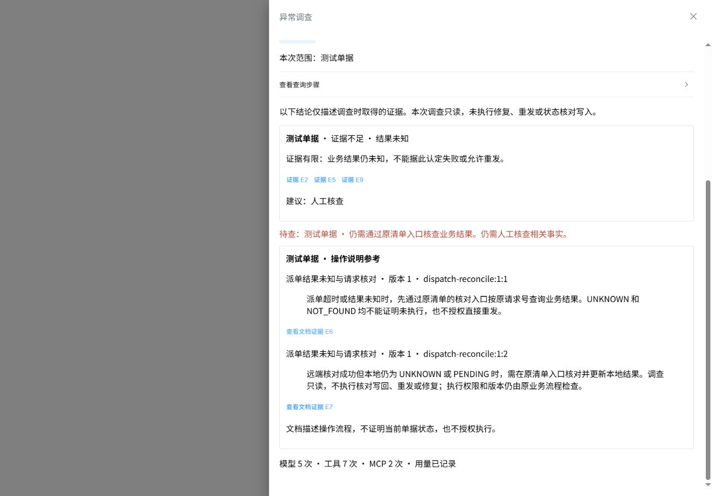
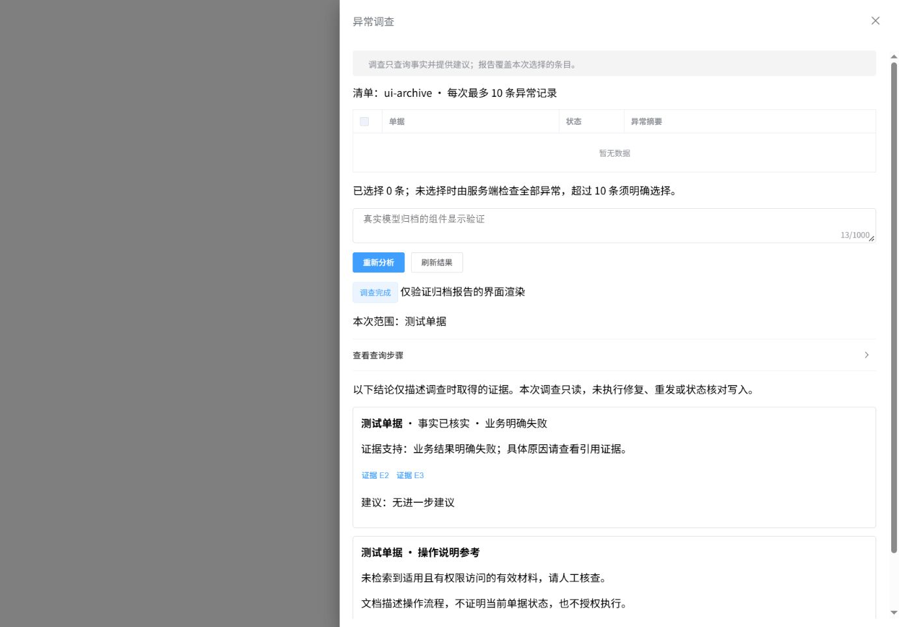

> 历史归档：本文记录 2026-10-06 移除前的设计和验收范围。RAG 运行实现及当前操作说明已按后续要求移除；文中功能、命令和结果不代表当前能力。当前说明见 [上下文工程](../上下文工程设计与验收_2026-10-06.md)。

# 上下文工程与 RAG 自评

日期：2026-10-06，Asia/Shanghai。对象为当前工作区第三、第四阶段实现，包含未提交文件。当前运行链路为 `real,mcp`、`agent.semantic.mode=active`、真实模型 `MODEL` 与经过会话及服务认证的 HTTP MCP。

## 结论

实现及本次回归覆盖范围内未发现未解决的功能问题。账号暂缓项、依赖不升级和无历史数据兼容仍遵循仓库规则。本次不是完整浏览器业务端到端、开放式制度问答、外部 ERP 或生产部署验收。

## 自评检查与修正

| 边界 | 修正及验证 |
| --- | --- |
| 长日志影响关键状态 | 程序笔记保留已取得的业务状态、每次远端观测、证据引用和截断/缺失标记；删除历史说明时仍可按 E 编号回读。回归覆盖 UNKNOWN 与 SUCCESS 同时保留 |
| 工具协议配对 | 仅在完整轮次间压缩，保留最近一组调用及全部响应；未配对消息不整理，整理后更大则保留原消息 |
| 重读与无进展判定 | 首次按需回读已有证据视为有效进展；重复相同回读仍受无进展和总工具预算约束 |
| 文档越权 | 先检查租户、公司、报表、权限和有效期，再召回与重排；管理员不绕过数据边界。测试包含更高匹配度的其他租户文档 |
| 过期缓存继续暴露正文 | 模型调用、报告返回和全部含正文的 HTTP 读取出口重验当前发布内容及权限；隔离库回归覆盖旧版本文档的报告、步骤、证据读取全部拒绝 |
| 文档失效阻止取消 | 取消只按任务归属和清单权限授权，不输出文档正文；过期文档不能妨碍停止任务 |
| 无证据与预算失败混淆 | 过大片段返回参数/预算说明，不能登记为 NO_EVIDENCE；真正无匹配才记录无依据 |
| 虚假引用与状态污染 | 引文逐字匹配整段已检索原文，限定本轮同条目、当前版本；文档不能作为业务状态引用。生产校验与独立评分各自覆盖篡改原文的反例 |
| 评估基线失真 | 增加知识库哈希、上下文及检索策略版本；原业务评分同步支持文档引用，并要求题目指定的文档检索预期，不能遗漏检索仍算通过 |

复核了原对话最后列出的批量核对结果丢失、续跑父归档锁、请求路径比较三个问题，当前代码已具备相应修复；本轮全量回归中相关测试继续通过，未改写历史评审记录。

## 证据

最终全量回归：后端 737 项（720 通过、17 条件跳过）、业务服务 29 项（24 通过、5 条件跳过），零失败；前端 88 项测试及构建通过。注释检查覆盖 39 张表、458 个字段。数据库测试使用其各自 UUID 专用库，未重建日常 Demo 库或外部数据库。

新增真实模型题集：开发 2 场景、保留 4 场景，每题 3 次，最终 18/18 通过，均正常结束。场景包括未知结果流程、无材料、远端成功本地未明、规则复核跳过、恶意备注与另一个无材料问题。使用 `deepseek-v4.1-flash`，`nativeSchema=false`、`thinkingEnabled=false`。事实为合成夹具；本批未触发默认上下文压缩，压缩链路由确定性单测和应用循环回归验证。

首批 9 次通过和 1 次报告请求连接失败均保留；剩余 8 次未执行。后续新批次没有覆盖失败结果。原始评估归档位于后端 `target/investigation-evaluation` 下，摘要、配置和逐题报告另存于 [验收 JSON](stage34-acceptance_2026-10-06.json)。后续只补充单测断言，未改变真实模型验收时的生产实现或独立评分逻辑。

RAG 与真实 HTTP MCP 联合场景 1/1 通过：会话及服务认证、真实模型、业务服务和隔离库共同参与；同键重放同一运行，业务前后哈希相同，文档引用与业务结果分别核验。原始结果为业务服务 `target/investigation-joint/SUCCESS-RAG.json`，副本包含在验收 JSON 中。

浏览器仅验证实际组件对真实归档的展示，临时页面、服务和测试文件已清理。引用展示、版本、两个证据弹窗和无证据状态均核验，未见控制台警告或错误；没有把该组件验证算为完整浏览器端到端流程。

## 已知适用边界

知识库是经评审发布的本地材料，按中文双字和英文词项检索，未引入向量索引或外部重排服务。同义表达可能漏检，材料未发布或无权限时需要人工核查。文档引用采用完整片段摘录，无法据此宣称任意自由文本因果解释已可靠。当前模型端点仍可能连接失败，失败会保留并明确返回，不自动改用其他语义来源。

正式外部认证系统、外部 ERP、生产容量与灾备尚未验收；未对这些能力作完成声明。
