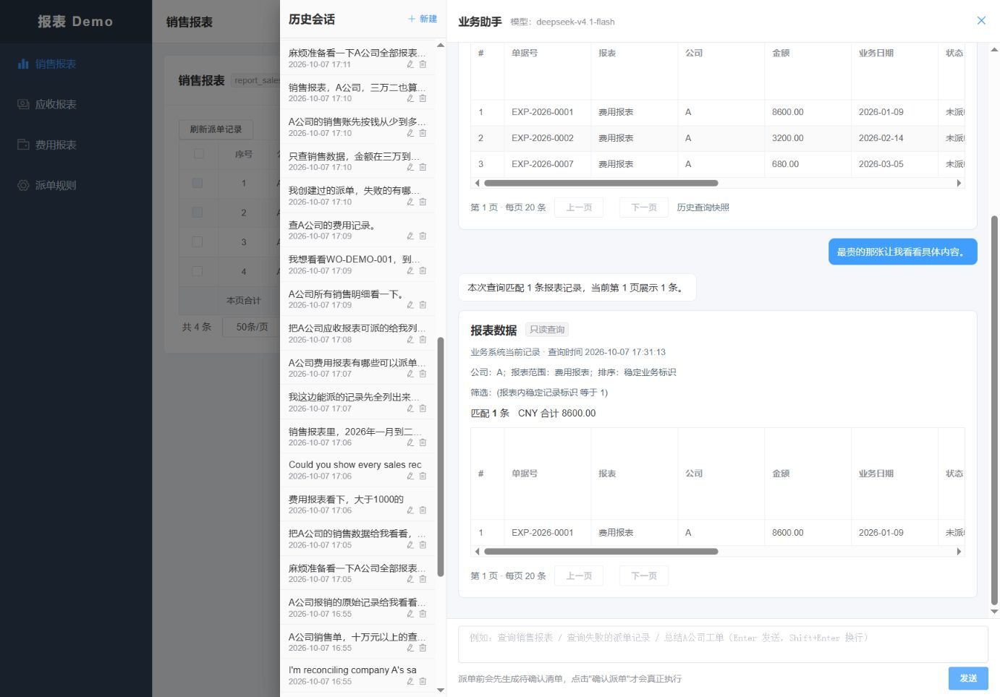

# 整体回归与多轮对话验收

日期：2026-10-07，Asia/Shanghai。状态：本轮约定范围的修复、回归和验收已完成。最终运行版本为 fix21。

最终真实模型回放原自动评分为 179/180（99.44%）；唯一误报是已经定位的工单详情按实际所属授权报表收窄。修正评分器并对原始事实复核后为 180/180，未重新调用模型、未覆盖原始失败、未改变冻结语料和预期。相关边界新增测试通过，已发现的实际运行缺陷均经当前回放关闭。

## 范围与评分

本轮从提交 `ba192da654dd5de6cf67f0f902d97bdfd1dd1742` 后的工作区继续修复与验证，模型为 `deepseek-v4.1-flash`，运行环境为 `real,mcp`、`agent.semantic.mode=active`、认证 HTTP MCP 和本机 `report_demo`。两个规划器均最多两次草稿修正、三次模型调用，thinking 关闭。一次用户请求可以包含这些内部调用，本文不把任务完成率称为第一份模型草稿的准确率。

用例按销售、财务、行政、主管、普通员工与英语使用者的岗位情境编写，先固定问法及预期，再运行实际链路。五组共 180 轮，覆盖跨业务切换、金额/日期、否定、改口、指代、分页、详情、汇总、空结果、候选选择、确认前清单、取消、帮助、越权与恢复。语料是拟真表达，不是真实用户访谈。最终批次中的问法都已用于回归，不再称为首次独立泛化样本；新增 30 轮在 fix13 首次执行时为 29/30，原失败保留。

门槛为明确可完成请求至少 95%，权限、确认及防误执行 100%，已发现实际问题必须关闭。任务评分使用独立报表页、无模型的认证业务读取、确定性预览和持久状态；检查完整记录集合、金额、排序、分页、当前处理人及清单内容。新增条件核验检查完整筛选语义，防止演示数据碰巧相同掩盖条件扩大。日粒度日期边界、十进制金额文本、契约字段别名、IN/OR 和 NOT_IN/AND 可以归一；完整客户名称的 EQ 与 CONTAINS 不等价。单笔详情允许用已展示稳定编号定位，仍检查唯一事实。

## 最终多轮结果

| 组别 | 原自动评分 | 复核后 | 说明 |
| --- | --- | --- | --- |
| 主组 | 72/72 | 72/72 | 跨业务与选择生命周期 |
| 独立问法回归组 | 36/36 | 36/36 | 已使用过的语料，不计首次泛化 |
| 长会话 | 18/18 | 18/18 | 同会话多次切换、范围重置和清单取消 |
| 保留问法回归组 | 23/24 | 24/24 | 一处详情报表范围等价误报，运行结果正确 |
| 新增问法回归组 | 30/30 | 30/30 | 首次成绩另保留为 fix13 的 29/30 |
| 合计 | 179/180 | 180/180 | 原判分及复核记录分别保存 |

最终批次中，明确业务任务 163 轮、帮助与预期澄清 17 轮均符合预期；业务查询 118、预览 15、选择 17、建单 8、取消 4、状态查看 1、帮助 6、预期澄清 11。所有轮次都检查未出现确认前执行结果或任务，五组结束时来源业务数据均未变化。权限及确认保护满足本轮样本门槛。

回放每轮耗时包含独立事实读取和状态核对：中位数 3.140 秒、P95 5.892 秒、最大 10.483 秒；不是纯模型推理延迟，也不是生产容量证明。最终原失败长会话专项另有 18/18 通过，不重复计入上述 180 轮。

唯一复核项的原文是“把这张工单的办理结果写成一个小结给我”。上一轮已完整定位 `WO-DEMO-004`，实际所属报表为销售报表；本轮保留同一工单编号、A 公司和详情视图，仅将报表范围收窄到其实际来源。独立 MCP 事实、上一轮对象和本轮对象一致，未漏记录或扩大权限。评分器现在只对独立事实唯一定位的工单/派单详情允许这种收窄；列表、汇总、显式报表查询、多对象或错误来源仍拒绝。详见 [原评分](whole-project-2026-10-07/multiturn-fix21-summary.json)和[复核及新评分器指纹](whole-project-2026-10-07/final-regrade-fix21.json)。

## 程序与专项验证

| 验证 | 结果 | 证据范围 |
| --- | --- | --- |
| fix21 完整程序回归 | 880 通过、11 条件跳过 | Java 773 通过、11 跳过；前端逻辑 96 通过；评估工具 11 通过 |
| 前端构建、基线及注释检查 | 通过 | 没有升级框架或依赖 |
| 真实模型 + 认证 HTTP MCP 调查联合 | fix15，3/3 通过 | 远端成功、业务拒绝、结果未知；业务快照不变、幂等请求复用；后续未修改调查行为 |
| 真实模型长轨迹 | fix11，3/3 通过 | 每次读取 80 条合成事件，2–3 次上下文压缩，并回读旧证据；后续未修改调查行为 |
| 租户隔离补跑 | 初次 1 通过、1 错误；修复测试调用后 2/2 通过 | 原子派单接口要求事务，测试改用事务而未改变跨租户拒绝、本租户成功的原断言；仅操作专用临时库 |
| 最终评分器专项 | 12/12 通过 | 在完整程序回归后新增一项详情范围边界测试，其余 11 项重叠，不重复累计为全新测试 |

完整程序命令为 `tools/test-regression.ps1 -AllowIsolatedDatabases`，临时库创建和清理已得到用户单独授权。调查联合运行了 `BusinessMcpIntegrationTest#investigationRealModelAndHttpMcpJointAcceptance*`；使用现有脚本相同环境加载和测试方法，将 Maven 生命周期限定为 `test`，以免替换运行中的 JAR。长轨迹使用 `tools/test-investigation-live.ps1 -Context -Repeats 3`。租户测试以独立 `tenant_isolation_it_` 临时库运行，清理前校验连接库名；未在 `report_demo` 执行该测试的写操作。

11 项条件跳过保留原状态，不纳入 880 项通过：

- 长轨迹入口 1 项和调查联合入口 3 项由上述专项实际执行。
- 租户隔离 2 项由专用临时库补跑。
- 旧语义回放入口 1 项由本轮五组 180 轮独立回放器另行取证，不回写其 JUnit 跳过状态。
- 调查独立任务全集、历史报告重新校验两个入口，本轮未额外重跑；联合及长轨迹专项不冒充这两个全集测试。
- 运维、调查两个浏览器会话启动入口本轮未启动；下述手工浏览器验收覆盖业务助手路径，不冒充所有管理页面或调查页面验收。

## 修复与原失败

完整历史过程见[阶段记录](整体多轮对话回归阶段记录_2026-10-07.md)。保留各批原始成绩、失败问法和期望，没有删除失败用例或降低正常请求的要求。

| 发现的问题 | 修复与保护 |
| --- | --- |
| 旧预览指代、客户简称恢复和选择结果丢失 | 预览绑定随机记录引用；服务端验证确切复合标识、报表、数量和有效预览；刷新或手工修改后旧引用失效 |
| 只读结果被当作旧派单候选、字段筛选误路由 | 按持续业务焦点校验；只读查询建立派单边界，明确候选范围后才能继续准备清单 |
| 选择草稿已解析但业务定位失败 | 在当前有效预览做无副作用预检，错误进入有界模型修正，正式执行仍重新校验 |
| 保留指定对象被限制为字段选择 | KEEP_ONLY 支持受控的字段、单据、摘要、客户与记录引用，保留排他原文、数量歧义和权限约束 |
| 准备清单误解当前选择、大预览被强制全量读取 | 提供有界已选事实与完整计数；超预算仅保留计数及不完整标记，原大预览回归保留 |
| 无筛选查询生成空 AND 组 | Schema 要求组内至少一项，无条件必须为空 conditions；解码反馈具体约束 |
| 跨域沿用旧报表、单笔详情任取第一条、追问丢条件 | 保护新域范围、单张报表与详情唯一性；实际只读业务校验参与草稿修正；撤销旧条件须携带本轮原文证据 |
| MySQL 会话与追溯事件反向锁序死锁 | 投影统一先锁会话再锁事件；忙会话不占事件锁，等待后续恢复；新增并发回归，保留原死锁记录 |
| 全名包含匹配碰巧返回与精确查询相同的记录 | 完整名称使用 EQ 的模型指引；评分增加独立条件核验，保留 fix15 原事实评分及严格复核差异 |
| 已完整展示三条记录仍不敢定位唯一最高记录 | 持久化上一成功查询总数；向模型提供当前页是否覆盖全部匹配的可靠信息，未知总数、后续页及失败查询不标为完整 |
| 实体缺失与实体误放反馈相同，模型修正受阻 | 区分必填实体缺失和本应为空却非空，说明目标、操作和选择器，不放宽协议 |
| 明确点名新的候选却复用另一条有效引用 | 草稿和正式选择同时检查本项证据、整轮原文与当前候选的冲突，只拒绝，不替换引用或自动生成选择 |
| 成功空集合被误说成无法汇总 | 明确按上次成功查询范围生成 SUMMARY，业务接口返回零值/空分组 |
| 普通选择调整顺带生成待确认清单 | 同时包含记录修改和建单的组合须有本轮明确建单依据；草稿和正式处理均检查，只拒绝而不自动改写动作 |
| 范围泛称作为记录所属报表，晚校验导致预览半完成 | 记录所属报表角色、具体性和权限前移到规划与范围合并，错误不等到新预览生成后才暴露；未知或无权实体不诱导模型替换 |

fix15 原事实评分为 180/180；追加条件复核发现两轮 EQ 被放宽为 CONTAINS，因此严格口径为 178/180，不能作为最终通过。原始结果没有被覆盖，差异见 [strict-filters-fix15.json](whole-project-2026-10-07/strict-filters-fix15.json)。

## 浏览器与恢复

在实际浏览器验证销售排序与两页连续序号、同会话转工单和当前处理人、费用候选手工勾选、确认前清单、取消、刷新以及停止/重启三个服务后的状态恢复。

费用清单只保留 `EXP-2026-0001` 差旅费 8600 元，排除 `EXP-2026-0002` 业务招待费。服务重启后清单和 1/2 的勾选保持一致；取消后刷新仍为已取消，确认按钮不存在。没有点击确认派单。

fix16 又在该已取消会话中转回客户全名查询，页面显示“客户名称 等于 天津某某贸易有限公司”，结果为 1 条、CNY 12.50。fix7 曾发生的浏览器首轮查询失败截图仍保留，不能把后续通过覆盖成原本无失败。

在 fix18 保存包含全部三条费用的成功查询后停止服务，fix19 重启并从历史会话恢复三条记录，继续问最高金额的单笔详情，正确定位 `EXP-2026-0001`、8600 元。这个检查同时覆盖新增查询总数信息的持久化恢复。

## 数据保护与交付边界

18:21 最终只读审计为 38 张业务表、456 个字段，注释完整；销售已派 2 条，应收/费用已派 0 条；网关执行请求 0、业务执行请求 2、已确认清单 2，与原基线一致。日志中明确识别的 266 个专用临时库均无残留。见[最终数据库审计](whole-project-2026-10-07/database-final-fix21.json)。

五组回放开始时的源码、测试代码及两个 JAR 指纹一致，归档时再次核对运行代码与构建没有变化。原始回放记录原评分器哈希；最后的详情范围误报修正只改变评分工具，另行记录新工具哈希和零新增模型调用的复核结果。服务最终健康检查均为 UP。

本轮未清空、重建或更名 `report_demo`，未重置既有派单数据；没有升级前端依赖或扩修账号生命周期的暂缓问题。正式外部认证系统、真实 ERP/工单服务、生产容量和灾备仍未验收。有限样本的通过不能保证任意自然语言永远正确，也不能把合成业务事实的真实模型验证称为真实外部业务验收。

原始事件、诊断日志、指纹和完整截图保留在已忽略的 `.runtime/whole-project-2026-10-07/`；可提交证据位于 [whole-project-2026-10-07](whole-project-2026-10-07/)，排除凭据。

