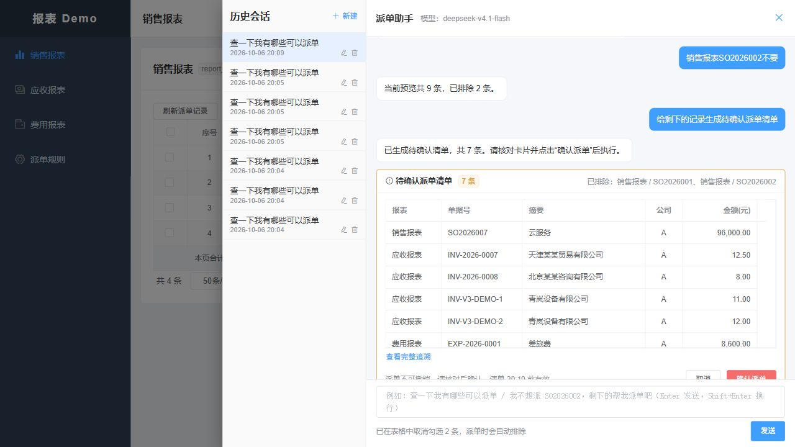

# 旧兼容逻辑清理与验证

> 此为兼容清理阶段的历史证据，保留当时库名及结果。后续用户删除了本机演示库，并明确要求固定为 `report_demo`；当前运行与初始化见 [重建记录](report_demo重建与初始化_2026-10-06.md)。

日期：2026-10-06，Asia/Shanghai。当前仍为 V1 / 1.0.0，语义入口为 `real,mcp`、`agent.semantic.mode=active`，真实模型及认证 HTTP MCP。按独立机制统计，本轮删除或收紧 **13 类**旧兼容与宽松兜底，不以搜索命中行数计数。

## 清理清单

| 类别 | 已实施变更 |
| --- | --- |
| 1. 旧报表编码 | 删除 report_code_mapping、实体/Mapper 和 legacy 查询入口；前后端使用稳定 reportId |
| 2. 单据号排除协议 | 删除 excludeDocNos、字符串/摘要关键词过滤和转换；仅接受绑定预览的 RecordKey |
| 3. 旧执行入口 | 删除 `/plans/{planId}/execute`；保留当前确认与持久任务入口 |
| 4. 隐式最近预览 | 建单必须显式 previewId；已存在的幂等清单仍按身份和请求键重放 |
| 5. 旧审计格式 | 删除 evidence_version、三个 legacy_report_type 字段及 LEGACY 展示分支 |
| 6. 非标准响应 | 前端拒绝未包装为 Result 的接口响应，不再直接接受裸 body |
| 7. 未知请求字段 | Spring Jackson 与共享 JSON 工具拒绝旧字段，不静默忽略 |
| 8. 损坏快照兜底 | 缺失/损坏范围、排除 JSON 和前端选择显式失败，不默认为空范围或全部选中 |
| 9. 退役工具与工作记忆 | 移出旧工具对话、关键词模型、Advisor、Redis 工作记忆回灌与双写；持久会话、语义状态、结果卡片继续使用 |
| 10. 失效配置 | 删除 require-confirm、旧 retention-days、memory 窗口/TTL 配置；确认保护不可关闭 |
| 11. 旧直接回写接口 | 删除不带公司及当前事实复核的 markDispatched；只保留事务内锁定并复核的回写 |
| 12. 历史数据库升级 | V1–V22 重整为一个完整 V1 空库初始化；删除升级回填、Demo 重置回调及非空库自动 baseline |
| 13. 非空计数补零 | 派单尝试次数在创建时初始化，删除读取旧 null 计数时的 Java/SQL 补零 |

目标结构从 **39 表 / 464 字段**变为 **38 表 / 456 字段**：删除一张四字段映射表，以及其他表的四个兼容字段。当前结构包含全部表字段 COMMENT，统一清单为 `backend/src/main/resources/db/schema-comments.json`。

移出运行源码的生产 Java 文件共 14 个，包含两项 Java 迁移；原 22 个迁移版本合并为 1 个。原始源码、迁移及仅服务退役机制的测试存入 [归档目录](../history/source/compatibility-cleanup_2026-10-06)，不参与构建。历史评审、失败记录与截图没有被改写为新结果。

## 保留的当前业务保护

当前版本的租户/公司/报表权限、用户确认、记录复合身份、幂等请求号、租约、执行版本、规则快照、审计缺口检查、迟到响应隔离和重启恢复继续生效。首次发送前 externalRequestId 为空、无规则手工派单的规则快照为空、来源客户或业务字段为空，属于当前合法状态；不按旧数据兼容删除。规则版本发布/回滚属于当前业务功能。

OpenAI 兼容端点描述的是供应商 API 接口，不是旧 Demo 协议。真实模型失败仍失败或澄清，不由关键词接管。程序回归中的测试替身不构成真实模型或外部 ERP 验收。

## 数据与验证

当前专用库为 `report_demo_v1_clean_20261006`。创建前只读检查确认该库不存在；原 `report_demo_v1_20261006` 及更早库未修改。新结构只在新建专用库验证，不执行 Flyway repair，也不带入旧运行数据。

| 验证层 | 最终结果与证据 |
| --- | --- |
| 后端程序/数据库/状态机 | 622 项：615 通过、7 条件跳过、0 失败/错误 |
| HTTP MCP 业务模块 | 31 项：27 通过、4 条件跳过、0 失败/错误；使用程序测试模型传输替身，不计真实模型验收 |
| 前端逻辑与构建 | 89/89 通过，Vite 构建通过；评估比较器另 4/4 通过 |
| 最新空库与结构 | 38 表、456 字段注释完整；保留字段的类型/默认值/可空性/字符集/索引/约束与清理前目标一致，只有一条成功 V1 迁移 |
| 真实模型及认证 HTTP MCP | 字段回放 14/14；六个连续场景，真实 deepseek-v4.1-flash、原生 Schema、thinking 关闭 |
| 当前接口边界 | 6/6：旧请求字段返回 HTTP/code 400，退役执行地址返回 404，旧编码与缺失预览被拒绝，稳定 reportId 成功 |
| 浏览器及重启 | 9 条预览 → 金额排除后 8 条 → 复合记录排除后 7 条 → 7 条 PENDING 清单；服务重启后同一会话恢复两个排除项和同一清单，0 次尝试、0 个网关请求 |
| 静态及打包检查 | 注释、真实模型文档、基线、兼容门禁、字典、8 页生成图表及 diff 空白检查通过；应用 JAR 仅含 V1 迁移且无退役类 |

程序与跳过项明细见 [回归记录](compatibility-cleanup-evidence/regression.json)，其余见 [模型原始回放](compatibility-cleanup-evidence/model-fields.json)、[接口边界](compatibility-cleanup-evidence/http-boundary.json)、[结构核对](compatibility-cleanup-evidence/schema.json)、[重启后状态](compatibility-cleanup-evidence/browser-restart.json) 和 [构建指纹](compatibility-cleanup-evidence/build-and-checks.json)。条件跳过包含单独开启的真实模型/联合验收套件，不把跳过计为通过。最终回归在全部源码修改后执行；14 步模型回放在 HTTP 错误分类收尾前完成，该收尾没有修改模型语义或业务执行逻辑。

中间失败另存 [失败及修复记录](compatibility-cleanup-evidence/initial-failures.json)：合并 DDL 的外键建表顺序、退役测试调用、事务测试 setup、旧请求被映射为 500 均已修正。一次运行中重打包因 Windows 文件占用失败，停止服务后构建成功；该阶段浏览器有一次泛化处理失败，原选择未被覆盖，重启后同句重试成功。这次单独请求的异常根因未另行确定，不写成模型 14 步回放中的通过项。此前 V1 的 13/14 仍保留为原历史证据。

当前服务已恢复运行于 5173 / 8080 / 8090，五个演示账号已在新基线准备，主要账号沿用本机已有密码。旧数据库及原派单事实保留，本次未执行派单。

## 检查入口

`tools/test-regression.ps1` 现在执行 clean verify，避免已删除类或迁移留在构建产物，并包含 `node tools/check-no-legacy-compat.cjs`。该门禁只扫描当前运行目录，防止退役字段、接口、工作记忆和多版本迁移重新出现。注释、文档、数据库字典和生成图表另按仓库规则校验。

外部 ERP、正式外部认证系统、容器实际部署、生产容量和灾备仍待完成；本轮没有升级前端依赖，也没有扩大暂缓账号问题的修复范围。
