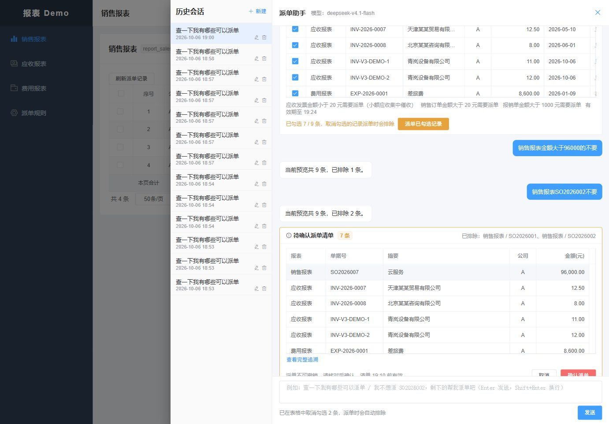

# 最终演示基线整理与验证

日期：2026-10-06。当前源码与脚本统一到 V4 配置字段筛选版，以 [demo-baseline.json](../../demo-baseline.json) 和 [根 README](../../README.md) 为操作入口。真实运行链路为 `real,mcp`、`agent.semantic.mode=active`、`deepseek-v4.1-flash`、原生 JSON Schema、thinking 关闭及带认证的 HTTP MCP。

## 本轮整理

- 统一本机启动、配置模板、Compose、验证入口和默认专用库 `report_semantic_fields_20261006`。
- 新增 `prepare-demo.ps1`，先核对最终专用库及字段快照结构，再幂等补齐演示发票并准备五个账号。主要账号 `semantic_fields_a` 的既有密码保持不变；凭据只保存在已忽略且限制访问的本机文件中。
- 移走 79 个旧设计、图表与退役入口文件，并补存旧 README、旧对话入口和生成器源码。见 [归档映射](final-demo-evidence/archive-map_2026-10-06.json) 和 [历史索引](../history/README.md)。历史评审、失败结果和截图保留日期及原证据范围。
- 当前聊天入口只委托 V4 语义流程，不再注册旧自由工具模型客户端；仍被独立测试使用的辅助类与当前内部编码映射不按历史名称一律删除。
- 重新生成并逐页检查 [八页流程图](../diagrams/README.md)，包含 HTML、SVG、Mermaid、draw.io 和 JSON。生成器支持 `--check`，基线检查已接入完整回归。

## 回归发现与修正

首次全量回归为后端 720 例、1 个失败、64 个错误、18 个跳过。三个测试类的合成目录与实际适配器字段不一致，已对齐；字段快照限制也误拒绝了合法高精度小数，已覆盖 MySQL DECIMAL 的 65 位精度及 30 位小数，并验证精确快照往返。没有通过截断金额、忽略缺失字段或删除失败测试规避问题。

真实模型首轮为 13/14，区间 KEEP_ONLY 请求进入澄清且没有提交错误选择。检查时发现旧规则文本“其他操作 mentions 非空”与 FIELDS 空数组契约冲突，已删除该重复且矛盾的说明，没有增加客户或原始问法专用分支。修正后完整回放为 14/14；保留 [首轮失败](final-demo-evidence/semantic-fields-http-initial_2026-10-06.json) 和 [最终回放](final-demo-evidence/semantic-fields-http_2026-10-06.json)，不由一次通过推断任意表达均可靠。

## 实际验证结果

| 验证层次 | 结果 | 证据范围 |
| --- | --- | --- |
| 完整后端回归 | 721 例：703 通过、18 跳过，0 失败/错误 | 隔离库、规则、状态机、权限、版本和快照等程序回归 |
| MCP 业务服务回归 | 31 例：27 通过、4 跳过，0 失败/错误 | 认证 HTTP MCP 与独立业务事务测试 |
| 前端逻辑与构建 | 88/88；生产构建成功 | 不替代浏览器端到端验收 |
| 评估比较工具 | 4/4 | 本地工具逻辑 |
| 部署就绪判断脚本 | 12/12 | Bash 测试替身覆盖健康、超时、缺失服务及查询失败；不启动 Docker |
| 删除冲突规则后的专项 | 28/28 | 资源契约、协议、模型传输、字段条件与精度；随后双模块打包成功 |
| 真实模型 + HTTP MCP | 最终 14/14 | 六个连续场景，数值边界、区间、日期、文本、AND/OR、布尔零匹配及失败恢复；未确认派单 |
| 浏览器 | 登录、9→8→7、刷新恢复、七条待确认清单通过 | 真实服务；重启后恢复原九条预览并继续筛选；未点击确认派单 |
| 演示初始化 | 五个账号登录、报表权限和公司隔离通过 | 主要密码保持；补充数据重复执行未复位来源状态 |
| 静态与产物 | 基线、中文注释、真实模型文档、数据库字典、图表一致性及 Git 空白检查通过 | 静态门禁与人工图表检查 |

[完整回归明细](final-demo-evidence/regression_2026-10-06.json) 逐类记录跳过项：后端包括独立端到端入口、真实模型专项、部分租户/运营集成入口，业务服务有四个条件性用例。本轮完整回归没有执行这些跳过项，不能计作通过。真实模型结果由独立 HTTP 回放提供；异常调查更广泛的真实模型专项仍以原有报告为准。本轮未执行 Docker 镜像构建或容器部署；Bash 的 12 例只验证部署就绪判断逻辑。外部 ERP、正式外部认证、生产容量与灾备仍待完成。

相关证据：[专项 28 例](final-demo-evidence/protocol-after-cleanup_2026-10-06.json)、[账号检查](final-demo-evidence/accounts_2026-10-06.json)、[包和配置指纹](final-demo-evidence/run-metadata_2026-10-06.json)。

## 数据状态与验收环境

最终库中八条演示记录已在当日 18:27 完成派单，本轮没有复位它们，当前主要账号只剩一条可派单记录。`prepare-demo.ps1` 的幂等补充不等于重新生成九条未派单数据；字段回放脚本遇到已消耗基线会保存 [初始预览不符证据](final-demo-evidence/existing-dispatch-state_2026-10-06.json) 并停止。

为验证完整九条路径，本轮另核实并新建独立库 `report_final_acceptance_20261006_c927`，使用同一版本、真实模型、认证 HTTP MCP 与演示数据执行回放和浏览器验证。取证完成后停止测试服务，只清理本轮新建的该验收库，再通过默认命令恢复最终演示库。旧 `report_mcp`、`report_semantic_v3_20261006` 等库、本机凭据和已有业务结果保留。

### 浏览器证据

以下为独立验收库的七条待确认清单，不代表当前已消耗演示库又恢复了九条未派单记录。

[连续选择截图](assets/final-demo-selection_2026-10-06.png) · [刷新恢复截图](assets/final-demo-reload_2026-10-06.png) · [当前流程图截图](assets/final-demo-flows_2026-10-06.png)
