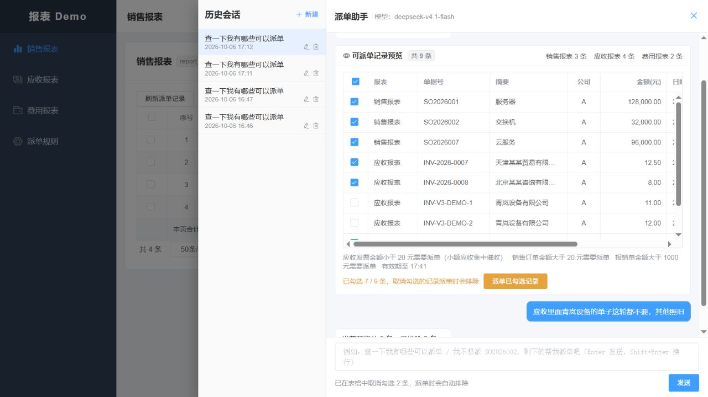
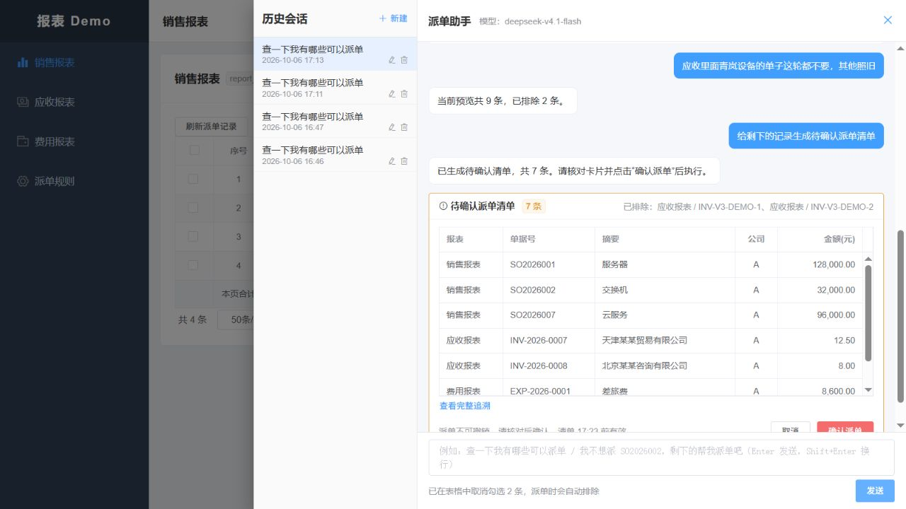

# 语义 V3 通用化与客户实体验收（2026-10-06）

本报告对应本次未提交工作区的 V3 实现。目标是让新增客户由业务数据承载，让不同表达归入稳定语义协议，避免在 `ModelIntentParser` 中逐客户追加提示词。架构改造已落地；真实模型泛化仍有失败，不能宣称生产语义验收全部通过。

## 实现与约束

- 模型只提取动作、作用对象、报表限定、数量和原文证据。`ModelIntentParser` 加载稳定规则、三个抽象操作对照和当前授权能力，不注入全租户客户名单，不检索评估题作为示例。
- V3 区分报表范围与记录选择，直接表达 EXCLUDE、RESTORE、REPLACE_EXCLUSIONS、RESTORE_ALL。Schema、原文证据和无副作用草稿共同校验；最多一次模型修正，失败则澄清，不应用部分选择。
- 客户由来源稳定 ID、全称及维护的别名解析。匹配限于当前租户、授权公司、报表和完整预览；ALL 不能跨同名客户自动合并。实体层允许按类型去掉一次称谓，原词和去称谓结果若指向不同实体则澄清。未维护别名、歧义或客户事实缺失不能猜测。
- 预览和清单持久化客户快照；执行前在来源行锁内核对客户稳定 ID。租户、公司、报表权限、用户确认、幂等和执行版本保护继续生效。
- 删除旧语义 JSON 协议转换，采用最新结构。未修改外部业务系统；未升级依赖，也未将暂缓的账号和会话问题描述为已修复。

设计和字段说明见 [语义 V3 与客户实体解析](../history/语义V3与客户实体解析_2026-10-06.md)。

## 数据基线

本次使用新建的仓库专用数据库 `report_semantic_v3_20261006` 验证最新初始化，旧 `report_mcp` 未清空、未升级、未修复 Flyway 校验和。最新表结构包含 39 张表、462 个字段，快照新增 `counterparty_json`，应收来源新增稳定客户 ID 与别名。

专用 Demo 中增加客户“青岚设备有限公司”（别名“青岚设备”）及两张发票，仅供本轮多记录验证。测试业务员只有 A 公司权限。凭据保存在已忽略且限制访问的本机文件，不记录于本报告。

## 程序与服务验证

| 验证层 | 实际范围与结果 |
| --- | --- |
| 后端协议、目录、客户集合与持久化 | 本轮分批合计 103 个独立用例通过；包括 80 次客户名称替换性质验证、同名/共享别名歧义、称谓冲突、单笔数量、原子性、权限、完整快照、重载及清单快照 |
| 最终协议资源与模型传输检查 | 最后复跑资源、传输、客户选择和报表限定共 21 个用例全部通过；已计入 103 个，不重复累计 |
| 数据库 | 新基线空库初始化、462 个字段的注释与目标结构检查通过；已计入后端用例，不重复计数 |
| 业务 HTTP MCP 集成 | 30 个用例中 26 通过、4 个条件跳过、0 失败；含客户事实、权限隔离、提交快照和来源客户 ID 变化检查 |
| 前端逻辑 | 26 个恢复与清单安全用例通过；不等同于真实模型或浏览器通过率 |
| 静态检查 | `check-comments.cjs`、`check-docs-real-model.cjs`、`git diff --check` 通过 |

## 真实模型结果

模型为 `deepseek-v4.1-flash`，请求原生 JSON Schema，thinking 关闭。以下回放均调用真实模型，但使用合成候选事实，不执行 HTTP MCP 查询或派单。生产业务链路另行采用 `real,mcp`、`agent.semantic.mode=active`、真实模型接口及带身份认证的 HTTP MCP 服务。

最终规则和三个抽象对照拼接后的提示词 SHA-256：`c293bd84dbb33f818647421310c280d46535a5832774aad763974322e463f6b7`。哈希对应实际模型输入中的规则资源，不能只对规则 txt 文件计算。

| 回放 | 结果 | 错误就绪计数 |
| --- | --- | --- |
| 最终全量业务回归 | 76/85；90 次模型调用，5 次修正 | 0 |
| 保留集 B 最终重复 1 | 30/35 | 1 |
| 保留集 B 最终重复 2 | 30/35 | 3 |
| 保留集 B 最终重复 3 | 29/35 | 3 |

最终 B 合计 89/105，错误就绪共 7 轮；各轮存在状态继承，不能将 105 轮当成相互独立样本。全量和重复回放命令均以非零状态结束，验收结论为未全部通过，不以中间较高分数替代最终结果。

最终全量九个失败中七个为澄清、两个为模型输出校验失败，包括省略动作/范围补充未识别、集合与记录作用域解析失败，以及前轮失败导致后续澄清。错误就绪定义为测试期望不符但返回 READY，不能把该指标等同于模型全部正确或业务已执行。

评估过程保留失败记录：全量中间版本分别为 27/85、69/85、82/85、75/85、83/85；保留集 A 三轮 30/35、27/35、30/35，错误就绪均为 0；保留集 B 较早版本三轮 35/35、27/35、31/35，错误就绪分别为 0、1、0；固定抽象对照加入后、称谓处理加入前的 B 三轮为 26/35、28/35、26/35，错误就绪均为 0。查看 A 的结果后修复了单据号中报表简称误命中及草稿矛盾校验；查看后一组 B 的结果后增加了按类型处理称谓的实体精确关联及冲突回归，未增加客户专用提示词。B 已重复使用，因此最终分数不是首次盲测。推理模式专项 7/10，未启用；抽象对照专项 10/10，不能代替全量结果。

最终 B 首轮出现的错误就绪是模型遗漏客户对象，将客户记录排除误解为只查询应收并禁止本轮建单。该输出满足结构约束，却未进入客户解析的歧义检查；这说明现有结构及已提取实体校验无法证明模型没有遗漏原句条件。此次回放没有执行派单，但不能因此将该错误归为安全澄清。后续需要在新评估集上验证语义条件覆盖与模型能力，不能用同名客户解析测试通过来代替此项验证。

第二轮三个错误就绪来自同一场景的范围误改及两次后续继承：模型排除了正确客户的记录，但额外将报表集合缩为应收；“应收记录”这段原文虽然通过当前独立证据检查，却没有表达查询范围修改。实体匹配正确和原文存在均不能证明操作对象正确，此缺口保留为未通过项。

完整回归和各轮保留集结果、语料/Schema/提示词哈希保存在 [本轮证据目录](semantic-v3-evidence)。最终实现源码指纹另存 `implementation-sources.json`，运行包指纹见 `runtime.json`；重复评估脚本也新增源码指纹归档，避免同提示词、不同实体实现被混为一版。保留集客户和完整问法未进入提示词，由资源测试检查。未按失败题单独重试后拼接为全量通过。

## 真实业务链路与浏览器

最终包构建成功，服务已在前端 5173、Agent 8080、业务 MCP 8090 运行，连接上述 V3 专用库。Agent readiness 与业务 health 均为 UP，前端 HTTP 200；包哈希及健康状态见 `semantic-v3-evidence/runtime.json`。

2026-10-06 17:11—17:13 使用真实模型和认证 HTTP MCP 完成：

1. 原句“应收报表不要天津某某贸易有限公司的”保留原预览及三类报表，仅排除对应一张应收单；查询和排除均未建单。三个断言通过，见 [HTTP 证据](semantic-v3-http_2026-10-06.json)。
2. 浏览器查询得到 9 条，输入“应收里面青岚设备的单子这轮都不要，其他照旧”，两张关联发票取消勾选，保留 7/9。停止并重启最终服务、刷新浏览器后打开同一历史会话，仍为 7/9。
3. 浏览器请求生成待确认清单，恰好包含其余 7 条，显示排除的两张单据号。持久化证据四个断言通过：客户稳定标识、完整原预览、清单集合相等、无确认及执行尝试，见 [浏览器及状态证据](semantic-v3-browser_2026-10-06.json)。清单按实际有效期于 17:23 到期，截图是采集时证据，不保证以后仍可确认。

此前的 V3 迭代已验证 9 条预览、排除指定客户两张发票后保留 7 条、后端重启和浏览器刷新后选择恢复、生成恰好 7 条待确认清单。该证据在最终提示词变更前采集，原始文件另存为 `http-before-final-prompt.json` 和 `browser-before-final-prompt.json`，不冒充最终版本验收。

本轮没有点击确认派单。真实模型调用和本地 HTTP MCP 通过不代表已接入外部 ERP、正式外部认证系统，也不代表生产容量、灾备或部署验收完成。

## 后续维护方式

新增客户维护来源 ID、全称和别名；新增报表配置受控事实字段与客户选择能力。新增业务能力才修改协议、编译校验和执行器。真实失败先归类为实体数据缺失、能力不支持、模型误解或状态问题，再建立版本化回归；客户名字或具体失败问法不直接追加到提示词。

现有模型的自然语言泛化仍需独立的新评估集和模型能力对比。当前实现提供可替换的模型边界、可重复评估和失败保护，不能承诺任意客户表达均正确，也不能以 Schema 合法代替语义正确。
