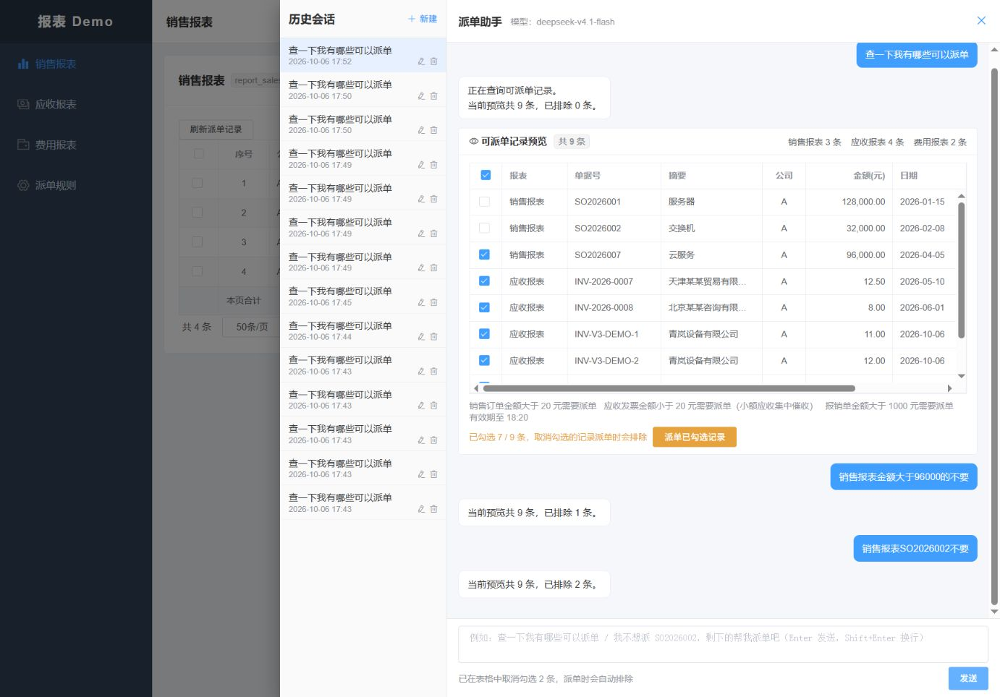
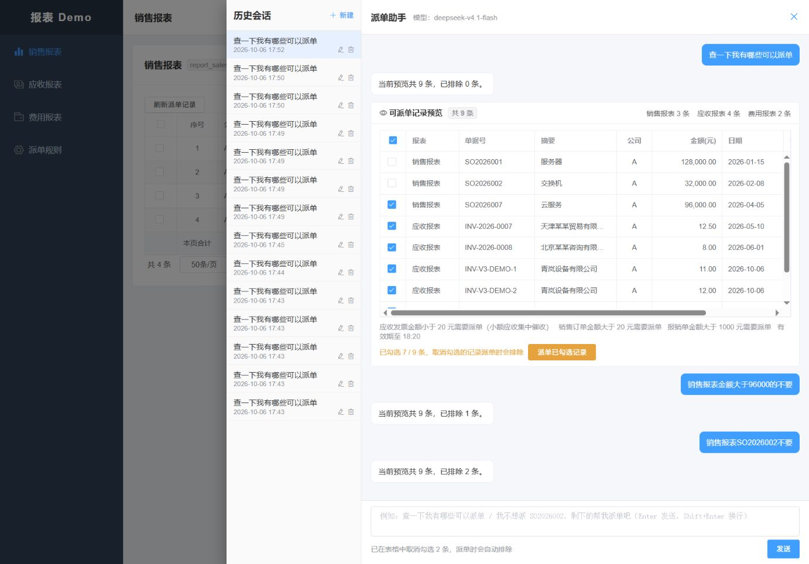
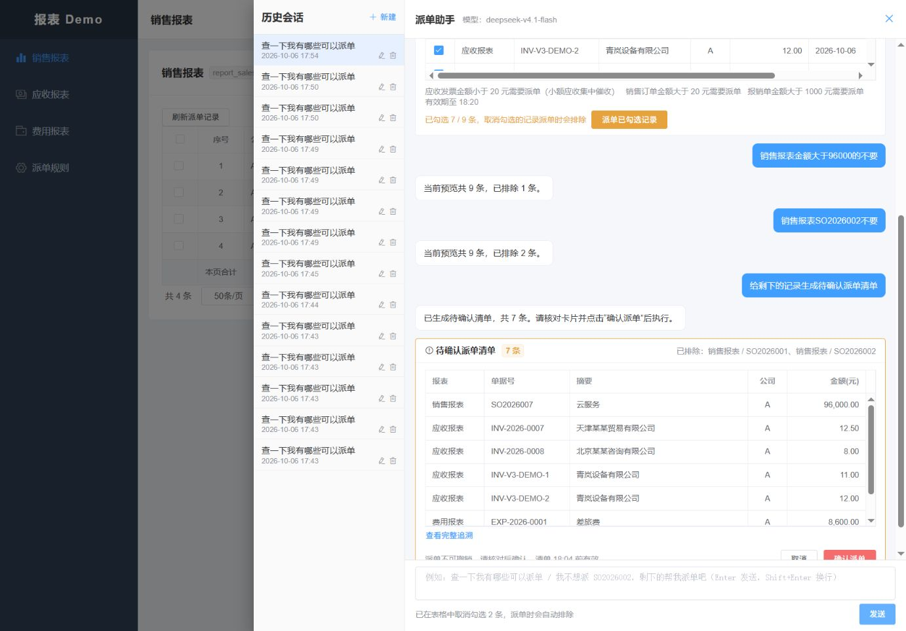

# 配置字段筛选与连续对话验收（2026-10-06）

本轮修复用户截图中的两个连续请求：“销售报表金额大于96000的不要”“销售报表SO2026002不要”。此前目录虽有字段定义，但语义层没有通用字段筛选，失败又把公司范围标为未知。当前改为 V4 配置字段条件与独立的未完成请求标记，详见 [实现设计](../history/语义V4配置字段筛选_2026-10-06.md)。

## 本轮实现

1. 模型上下文直接读取授权目录 `FieldInfo` 的业务字段名、类型和说明；不把物理列、SQL 或整库数据交给模型。
2. 新增有界字段条件、类型白名单与确定性求值，支持金额/整数/日期比较、文本、布尔、空值、IN、AND/OR，以及排除、恢复、只保留匹配记录。
3. 预览及清单持久化 `fields_json`，规范字符串保留金额精度；业务服务拒绝提交字段与已确认快照不一致的请求。
4. 未完成请求不再一律污染公司、报表标记；新的明确记录操作可以纠正，含糊的直接建单仍被阻止。真正未解决的范围与实际权限拒绝继续阻断旧范围继承。
5. 字段条件也参与“记录限定不能冒充报表范围修改”的原文证据校验，校验失败最多进行一次模型修正。

没有新增客户名称或本轮完整测试问法到提示词。规则资源描述通用字段协议，具体字段来自配置；测试问法只保存在回放脚本和验收证据中。

## 程序与数据库结果

| 层次 | 真实执行范围 |
| --- | --- |
| 后端相关回归 | 分批合计 349 个用例，339 通过、10 个条件跳过、0 失败；涵盖语义、目录、预览、清单、派单、确认、执行版本和权限 |
| 字段与恢复专项 | 上述后端用例内包括 7 个字段谓词测试、20 个语义数据库集成测试；其中新增了金额后连续单据排除、字段快照和未支持条件后的恢复，未重复累计 |
| 业务 HTTP MCP | 31 个用例，27 通过、4 个条件跳过、0 失败；含提交字段快照篡改拒绝 |
| 空库结构 | 新基线 39 张表、464 个字段及数据库注释检查通过；已计入后端测试 |
| 构建及静态检查 | 两个服务打包成功；注释、真实模型文档、字典一致性和 `git diff --check` 通过 |

原有手工派单测试的合成来源遗漏目录声明字段，业务测试请求也没有新版本字段数组；本轮补齐这些测试数据后重跑通过，没有放松生产代码对缺失字段的拒绝。测试替身和合成数据不计为真实模型或外部业务验收。结果明细见 [后端](semantic-fields-evidence/backend-tests.json) 和 [MCP](semantic-fields-evidence/mcp-tests.json)。

## 真实模型与认证 HTTP MCP

运行 `tools/test-semantic-fields.ps1`，使用 `real,mcp`、`agent.semantic.mode=active`，真实模型 `deepseek-v4.1-flash`，请求原生 Schema、thinking 关闭，以及带身份认证的 HTTP MCP 服务。本轮使用本仓库专用 Demo 事实，未接入外部 ERP。

最终 6 个连续对话场景、14 个条件/选择步骤全部通过，此外执行 6 次初始查询。各步均核对实际排除集合、原预览标识、就绪/澄清状态，以及没有意外生成预览或清单：

- 用户原始两句连续执行。
- “至少”与等号边界、恢复等于阈值的记录。
- 金额区间只保留、报表内全部恢复。
- 日期比较、文本包含。
- AND、OR 组合。
- 布尔零匹配、未配置能力澄清及随后明确单据纠正。

首轮为 12/14，区间保留被额外解释为缩小报表范围，随后恢复继承了错误范围。修复字段条件证据遗漏后，完整重跑 14/14，没有将单题重试拼成全量通过。[首轮证据](semantic-fields-evidence/http-initial.json) 与 [最终证据](semantic-fields-evidence/http-final.json) 均保留。首轮脚本尚未独立断言每个正常步骤的 READY 状态，最终脚本已补充该断言；首轮分数仅按当时断言范围描述。

## 浏览器及持久化复核

最终包在默认端口运行：前端 5173、Agent 8080、业务 MCP 8090。使用新建、已核实归属的 `report_semantic_fields_20261006`，旧 `report_mcp` 和 V3 专用库没有重置、转换或修复 Flyway 校验和。包、Schema 和关键实现哈希及健康信息见 [运行证据](semantic-fields-evidence/runtime.json)。

17:50—17:54 在浏览器重新执行用户原话：

1. 查询得到 9 条，包含销售 3 条、应收 4 条、费用 2 条。
2. 金额大于 96000 的条件只取消 `SO2026001`（128000 元），剩余 8 条；96000 元的 `SO2026007` 保留。
3. 随后输入“销售报表SO2026002不要”，再取消该单据，剩余 7 条。没有出现公司范围未知，也没有将查询缩为销售报表。
4. 停止、重启最终服务并刷新页面，重新打开历史会话后仍为 7/9。
5. 生成待确认清单，恰好包含其余 7 条；所有字段事实与预览逐项相等。五个持久化断言通过，未点击确认，没有派单尝试或派单审计。清单有效期按当时卡片为 18:04，截图仅表示采集时状态。

[浏览器和持久化证据](semantic-fields-evidence/browser.json)

本轮验收覆盖上述配置字段与恢复场景，不代表任意自然语言表达均正确。此前 V3 泛化回放中的失败保留为历史事实，没有改写成 V4 已通过；本轮未重做全面的独立泛化验收。正式外部认证、外部 ERP、生产容量和灾备仍需实际接入与验证。
