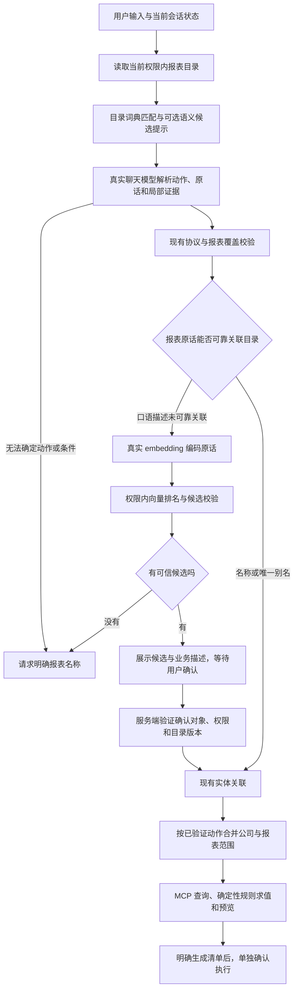

# 向量语义召回接入评估

评估日期：2026-09-30。基线为当前工作区真实模型 `real,mcp` 链路。本文件描述拟议方案，未实现向量召回，未执行真实召回准确率验收。当前聊天模型的 embedding 能力已按下文实际探测。

## 结论

可以接入。建议定位为“权限内报表实体候选召回”，用于找到口语描述可能对应的报表。候选不决定查询、否定、追加、排除或派单动作，也不替代模型解析。第一阶段让用户确认语义候选后继续现有链路；自动关联需要单独通过真实业务语料验收。

目前只有三类示例报表，补充经过审核的别名也可能解决大量表达问题。向量召回的收益应通过口语、同义表达和未知报表样本与现有真实链路比较，不能预先承诺准确率改善。

## 当前代码基础和缺口

| 部分 | 当前事实 | 接入要求 |
| --- | --- | --- |
| 模型依赖 | backend 已使用 Spring AI 1.1.8 和 OpenAI 兼容聊天模型 starter | 增加独立 embedding 配置及客户端，核验该版本 API；不需要为召回升级整个框架 |
| embedding | application.yml 明确设置 `spring.ai.model.embedding: none` | 配置并验证真实向量模型、端点、凭据、维度和限流；不能假定当前聊天模型支持向量接口 |
| 报表元数据 | CatalogEntry 有名称、描述、领域、别名、租户、目录版本 | 使用这些字段建立报表语义文档；补充审核过的业务描述、正例和排除边界 |
| 权限 | ReportCatalogService 已按租户、发布、生效、可用、报表权限及治理策略过滤 | 召回仅在该用户当前允许派单的报表范围内排名，结果再核验当前权限和版本 |
| 意图协议 | IntentCodec 要求 evidence 来自原文，mentions 来自 evidence | 保留用户原话，候选 ID 放在单独的关联结果中，不能让模型把原话改成目录名称绕过证据校验 |
| 实体关联 | ReportResolver 只有词典和文本相似度；SemanticPlanner 拒绝 FUZZY、歧义、未知片段 | 增加语义候选及确认机制，不把语义分数伪装成 EXACT/ALIAS，也不直接放宽现有拒绝条件 |
| 运维评估 | 已有解析评估、指标和目录版本管理 | 增加向量索引版本、重建任务、召回评估和可观测指标 |

Spring AI 提供 EmbeddingModel、VectorStore 和元数据过滤接口，可作为实现基础；具体方法和存储适配器应以仓库锁定版本验证。参考 [Spring AI 向量存储官方说明](https://docs.spring.io/spring-ai/reference/api/vectordbs.html)。

## 推荐接入流程

召回前的候选提示仅帮助真实模型识别“报表指代”；初期保留模型可见的权限目录，不用 Top-K 替换整个目录，避免漏掉多报表、否定对象和移除对象。召回后的关联只处理模型提取的具体原话，不用整句最高分报表覆盖用户意图。模型返回 CLARIFY 时，可以展示权限内候选供用户明确，不能由召回凭空补出动作后执行。

例如“查客户还没付的钱”：模型提取查询动作及“客户还没付的钱”原话，向量召回提示“应收报表”，用户确认后服务端关联稳定 report_id，才查询。示例代表拟议行为，不是已经验证的召回结果。

“不要销售，查客户还没付的钱”应分别保留移除销售和新增/替换目标的证据及顺序。向量检索不负责理解“不要”。多轮“还是查那个”需要原有上下文与明确确认绑定，不能靠向量分数猜测。

## 存储和索引方案

建议第一阶段复用 MySQL 持久化报表向量和元数据，由 Agent 加载当前允许报表的向量，在内存计算余弦相似度。对当前小目录，这比引入独立向量数据库更容易检查权限范围和管理部署。是否满足扩大后的规模，需以报表数、维度和并发压测判断。

建议记录：tenantId、reportId、catalogVersion、文档内容摘要、embedding 模型及版本、维度、索引批次和就绪状态。名称、描述、有效别名或模型变化触发重建；维度变化不能直接混用旧索引。检索绑定一致索引快照，旧版本和未就绪条目不能被采用。

报表描述可以包含名称、业务用途、审核过的同义说法和排除边界；不嵌入查询 SQL、密钥、权限之外的业务明细。用户查询进入 embedding 前使用现有敏感信息保护，记录其对召回质量的影响。

目录规模扩大后，再评估支持元数据预过滤的向量数据库。普通 Redis 服务的存在不代表已经具备向量搜索模块。不能全库 Top-K 后仅删除无权候选：这样既可能泄露对象，也可能漏掉排名靠后的有权结果。

## 必须保持的业务边界

1. 语义候选最高分不代表唯一正确；相似度不是正确概率，阈值和领先差必须通过实际模型及语料标定，不能复用现有文本模糊匹配的 0.6。
2. 第一期采用用户确认。确认接口绑定用户、会话、本轮请求、原始意图、候选版本和有效期；旧卡片确认或权限变化时拒绝并重新澄清。取消、否定和后续消息不能复用失效的确认。
3. 召回失败只影响需要语义关联的请求，明确名称仍走原有真实模型解析；未知描述保持澄清。不把候选提示用作模型失败后的意图接管。
4. 召回仅扩大表达识别能力，不新增金额/日期过滤能力，也不新增自动派单能力。现有不支持条件仍需澄清。
5. 权限缓存与查询缓存必须包含租户、当前可见集合、目录版本及 embedding 模型版本，不能跨用户复用未过滤候选。

## 实施步骤与真实验收

1. 能力验证：确认真实 embedding 端点、模型、维度及鉴权；验证相同文本输出维度一致、批量输入与中文表达、超时和限流行为。当前聊天模型配置不能代替此验证。
2. 建立语义目录与版本化索引：审核描述，执行真实向量生成，验证发布、停用、别名变更、权限撤回、多实例刷新和重建恢复。
3. 接入候选及确认：新增召回服务、关联结果和待确认状态，调整 SemanticPlanner，前端展示语义候选，保持原文证据与动作执行边界。
4. 真实模型对比验收：同一批实际业务表达分别运行现有链路与召回链路，记录模型版本、逐轮候选、意图、最终范围、澄清次数、延迟和费用。语料包含同义口语、近义报表、否定、多报表、未知报表、跨租户、无权限及敏感字段。
5. 分阶段发布：先观察候选质量，再启用确认流程；自动关联另行评估。若语料显示别名已充分覆盖、或召回带来更多误匹配，则不扩大自动关联范围。

核心指标为权限内 Recall@K、错误关联率、未知对象拒绝率、澄清解决率、最终范围正确率，以及新增延迟和费用。验收中不得出现越权候选展示、误扩大范围或意外执行；统计结果同时记录样本量，不能将有限样本零错误当作全场景保证。

## 当前模型 embedding 实测

2026-09-30 使用当前配置的真实端点和凭据，对 `/v1/embeddings` 发送模型 `deepseek-v4.1-flash`、中文输入和 `encoding_format=float`。接口返回 HTTP 400，没有返回向量，错误明确表示 `model deepseek-v4-flash does not support the embeddings interface`。请求名称与错误中的模型名称不同，可能涉及端点内部映射；本次未核验映射配置。

同一凭据访问 `/v1/models` 返回 HTTP 200，列表包含请求的模型名称，但未发现名称含 embedding、bge、e5 或 gte 的模型。模型列表不构成所有向量能力的证明；当前可以确认的是此端点下的该模型不支持本次 embedding 调用，向量召回仍需另行配置并验证真实 embedding 模型。

探测仅使用通用中文短句，结果保存在本机已忽略的 `.runtime/embedding-probe-20260930.json`。未更改运行配置、当前聊天模型或业务服务。
