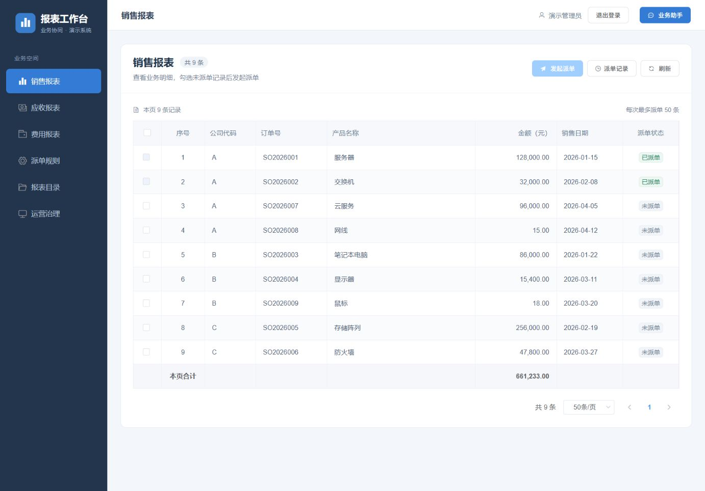
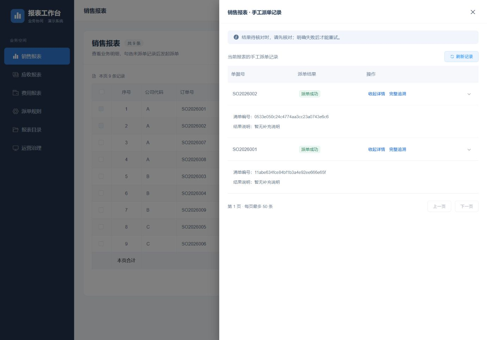
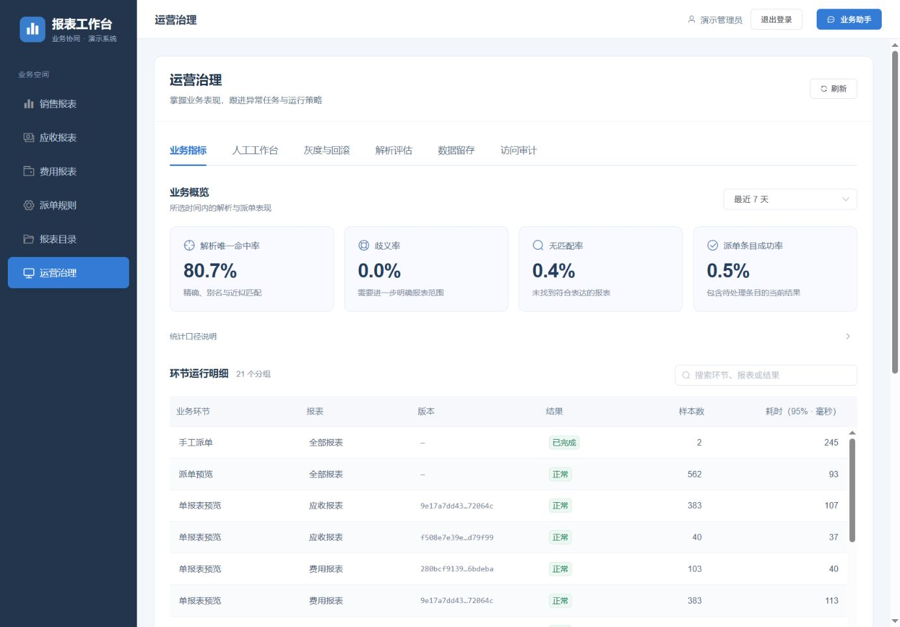

# 工作台操作与运营治理

核对日期：2026-10-07。本文依据当前前端路由、`ReportTable`、`OperationsAdmin` 及对应服务端接口编写。运行仍使用 `real,mcp`、`agent.semantic.mode=active`、真实模型和认证 HTTP MCP；页面操作不能代替服务端授权与执行保护。

## 页面与职责

| 页面 | 当前入口 | 主要用途 |
| --- | --- | --- |
| 销售、应收、费用报表 | 左侧对应菜单 | 分页浏览业务明细、选择当前页未派单记录、手工派单 |
| 派单规则 | 左侧“派单规则” | 查看规则；管理员维护草稿、校验、试算、发布、停用与回滚 |
| 报表目录 | 管理员菜单“报表目录” | 搜索及维护报表定义、负责人、业务别名、发布状态和目录版本 |
| 运营治理 | 管理员菜单“运营治理” | 业务指标、人工工作台、灰度与回滚、解析评估、数据留存和访问审计 |
| 业务助手 | 顶部“业务助手” | 对话查询、工单进度、总结及待确认派单，见[通用业务助手](通用业务助手.md) |

导航按当前账号权限展示；业务服务仍重新校验租户、公司、报表及管理员身份。目录中的报表编码、规则表达式和排查所需的原始标识保留原值。

## 报表与手工派单记录

1. 报表标题显示总条数，表格上方显示本页条数。金额右对齐，底部合计仅覆盖本页。分页默认每页 50 条，可选 20、50、100、200 条。
2. 勾选本页未派单记录，点击“发起派单”。每次最多 50 条，必须在确认框核对单据后点击“确认派单”。此路径不调用模型；前端以 `DIRECT` 动作提交持久派单任务，服务端执行既有权限、幂等和版本检查。
3. 点击报表右上角“派单记录”，打开当前报表的**手工派单记录抽屉**。记录不再插在报表正文前；该列表按当前用户、报表分页读取，每页最多 50 条。对话创建的派单清单仍从业务助手或相应查询入口查看，不能把此抽屉当作全系统派单列表。
4. “展开详情／收起详情”、原箭头及箭头所在单元格均可切换详情；文本按钮支持键盘操作。详情展示清单编号与结果说明，未提供补充说明时明确显示空态。展开状态绑定 `planId`，同页刷新保留仍存在的记录，切页或记录消失时清理失效标识。详情切换只改变本地显示。
5. “完整追溯”打开可靠事件、审计、相关会话和逐条结果；展开追溯行查看原始证据。证据补写只修复展示记录，不重新派单。
6. 待核对记录显示“核对结果”，明确失败项才显示重试；尚未完成或正在执行的清单提供对应继续／读取结果入口。未知结果不能当作未发送。加载失败显示错误和刷新入口，不伪装为“没有记录”。

手工派单接口：`GET /api/dispatch/direct/plans?reportId=…&page=…`；执行、核对及重试通过 `POST /api/dispatch/jobs` 和任务结果读取完成。关闭抽屉不会取消已提交的后台任务。首次手工派单结束后会打开记录抽屉供核查结果。

## 中文展示与状态含义

界面通过 [presentation.js](../frontend/src/utils/presentation.js) 和 [BusinessLabel](../frontend/src/components/BusinessLabel.vue) 统一翻译业务环节、状态、审计动作、调查步骤及字段类型。原始代码可通过提示或详情核对；未知代码保留原值，不推断其业务含义。

| 原始值 | 展示含义与边界 |
| --- | --- |
| `SUCCESS` | 成功；手工记录在执行结束且该条成功时显示“派单成功” |
| `SUCCEEDED` | 任务已完成；不据此把所有业务条目判定为成功 |
| `EXECUTED` | 已执行；逐条结果仍需分别核对 |
| `UNKNOWN` / `REVIEW_REQUIRED` | 结果待核对，不允许按普通失败重发 |
| `FAILED` / `SKIPPED` | 失败／已跳过，两者不能混为同一重试条件 |
| `RESOLVE` / `PREVIEW_REPORT` / `DISPATCH_JOB_DIRECT` | 报表解析／单报表预览／手工派单 |

报表名称优先使用当前授权目录，汇总标识 `*` 显示“全部报表”；未收录标识保留原值。摘要版本缩短显示，提示保留完整版本。时间只整理可见格式，不推断或转换服务器时间的时区。翻译不改写请求枚举、条件表达式或权限判断。

## 运营治理

业务指标支持最近 1、7、30、90 天。环节明细可按中文环节、报表、结果或原始代码搜索，每页展示 20 个分组；搜索和分页只影响明细，不改变顶部指标分母。

| 指标 | 实际口径 |
| --- | --- |
| 解析唯一命中率 | `RESOLVE` 请求中精确、别名、近似匹配数之和／全部 `RESOLVE` 请求数 |
| 歧义率、无匹配率 | 相应解析结果数／全部 `RESOLVE` 请求数；“全部报表”结果也在分母中并单列明细 |
| 派单条目成功率 | 所选期间创建清单的当前成功条目数／当前全部条目数，包含待处理条目；不按重试次数累加 |
| 耗时（95% · 毫秒） | 每个分组排序后第 `ceil(样本数 × 0.95)` 个耗时 |

无样本显示“暂无数据”，不解释为零故障。比例来自服务端未截断汇总；环节明细及派单状态分组各最多 1000 组。指标中的报表解析口径不是整体真实模型准确率，派单成功率也不能作为生产 SLA。

人工工作台的核对、重试和关闭任务要求填写原因；管理员仍受租户及清单范围约束。策略保存和回滚携带读取时的期望版本；规则、目录灰度和历史业务配置回滚是当前版本功能，不是旧数据兼容。留存及会话删除按现有保留策略执行，恢复所需状态不能绕过。

“解析评估”运行目录名称解析样本，不能作为真实模型语义回放或真实外部业务验收。访问审计翻译动作和结果，资源标识及请求路径保留用于排查。

实现对应：[报表组件](../frontend/src/components/ReportTable.vue)、[运营页](../frontend/src/views/OperationsAdmin.vue)、[指标汇总](../backend/src/main/java/com/example/report/operations/BusinessMetrics.java)、[运营接口](../backend/src/main/java/com/example/report/web/OperationsController.java)。本轮验证范围见[界面及文档核对记录](review/界面优化与文档流程核对_2026-10-07.md)。
