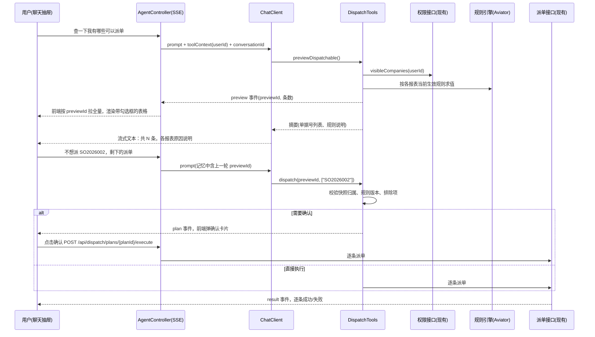

# 派单 Agent 技术选型

| 项目 | 内容 |
| --- | --- |
| 文档日期 | 2026-09-20 |
| 状态 | 已按本方案实现 demo（2026-09-21），代码见 `backend/` 与 `frontend/`，启动方式见根目录 README |
| 适用范围 | 在现有报表系统上新增"自然语言查询可派单记录并发起派单"的 Agent 功能 |
| 基线代码 | `demo/backend`（原 Spring Boot 3.2.5 + JdbcTemplate，已升级为 Spring Boot 3.5.16 + MyBatis-Plus 3.5.17 + MySQL 8）、`demo/frontend`（Vue 2.7 + Element UI 2.15） |
| 已确认约束 | 现有环境已有 Redis；大模型预计使用通义千问或 DeepSeek；对话内容需持久化，用户可查看自己的历史记录 |

---

## 1. 背景与目标

### 1.1 现状

demo 是真实业务的最小抽象：三张独立的报表（销售 `report_sales`、应收 `report_receivable`、费用 `report_expense`），各自一个查询接口，前端三个页面用同一个表格组件展示，派单按钮目前只在前端弹提示，不调后端。

真实系统与 demo 的差异：

- 报表数量更多，表结构和派单判定规则都非常复杂。
- 已有权限接口：每个用户可见的公司代码不同（用户 1 只看 A 公司，用户 2 只看 B 公司）。
- 已有派单接口：派单动作由现有接口完成，Agent 只负责调用。
- 现有环境已部署 Redis，可直接用于快照、工作记忆、幂等锁和缓存刷新。
- 大模型预计使用通义千问或 DeepSeek，需要一套接入方式同时覆盖两家并可随时切换。
- 对话内容需要持久化保存，用户要能查看自己的历史对话，并可以在历史会话里接着聊。
- **派单规则会变化，必须支持运行期修改，不能靠改代码发版。**

### 1.2 目标功能

前端提供一个对话框，用户用自然语言操作：

1. 用户输入"查一下我有哪些可以派单"。Agent 在用户可见的公司范围内，按每张报表各自的规则找出所有应派单的记录，以表格形式展示供预览。
2. 用户接着说"我不想派 a 记录，剩下的帮我派单吧"。Agent 排除 a 记录，对其余记录逐条调用现有派单接口，并返回结果。

### 1.3 关键需求

| 编号 | 需求 | 对设计的约束 |
| --- | --- | --- |
| R1 | 每张报表派单规则不同且复杂 | 规则必须由确定性代码判定，不能交给大模型 |
| R2 | 规则会变化，要支持修改 | 规则以数据形式存储，带版本，热加载，业务可编辑 |
| R3 | 用户可见公司范围不同 | 权限从登录态取，在服务端强制生效，大模型不可影响 |
| R4 | 自然语言多轮交互 | 需要工作记忆，第二轮"剩下的"依赖第一轮上下文 |
| R5 | 先预览再执行，可排除部分记录 | 两段式工具，预览快照加排除列表 |
| R6 | 调用现有派单接口 | 派单是不可逆动作，需要确认门槛和完整审计 |
| R7 | 对话内容持久化，用户可查看历史记录 | 对话日志落 MySQL 长期保存，与模型的短期工作记忆分离；历史可回看、可续聊，只能看自己的 |

---

## 2. 设计原则

1. **规则和权限绝不进大模型。** 模型只做三件事：听懂意图、选择工具、把用户的排除项转成工具参数。"金额是否大于 20"由规则引擎判定，"能看哪些公司"由 SQL 的 `company_code IN (...)` 生效。
2. **两段式工具，预览快照是唯一的执行依据。** 预览生成一份服务端快照并返回 `previewId`，执行时只对快照内的记录生效。模型永远不需要自己罗列记录 ID，也就不可能派错。
3. **身份来自登录态，不来自模型输出。** 工具通过 `ToolContext` 拿到当前用户，工具入参里没有任何与身份、公司范围相关的字段。
4. **不可逆动作有门槛、有审计。** 派单前可弹确认卡片，每次派单记录用户、快照、规则版本、排除项和逐条结果。
5. **Agent 层与规则层解耦。** 规则怎么存、怎么改，Agent 感知不到；规则改了，Agent 的解释自动跟着变。
6. **留在现有技术栈里。** 权限接口、派单接口、报表查询和规则判定全在 Java 里，Agent 做在同一个 JVM 内，不引入跨语言服务。
7. **对话可追溯、可回看。** 每条用户消息、模型回复、工具调用和结构化卡片都持久化到 MySQL；模型的工作记忆放 Redis 短期保存，两者分离。用户能回看并接着聊自己的历史会话，管理员能按会话追溯每一次派单的来龙去脉。

---

## 3. 总体架构

```text
┌──────────────────────────────────────────────────┐
│ 前端  Vue 2.7 + Element UI                        │
│  报表页 │ 聊天抽屉(SSE + 历史会话列表) │ 规则管理页  │
└──────────────────┬───────────────────────────────┘
                   │ SSE + REST
┌──────────────────▼───────────────────────────────────────────┐
│ 后端  Spring Boot 3.5（现有后端升级）                          │
│                                                              │
│  AgentController (SSE 对话入口)                               │
│    └─ Spring AI ChatClient                                   │
│         ├─ ConversationLogAdvisor ──► 对话日志 (MySQL)         │
│         ├─ MessageChatMemoryAdvisor ── 工作记忆 (Redis, TTL)   │
│         └─ DispatchTools                                     │
│              ├─ previewDispatchable  ──► PermissionService   │
│              │                        ──► RuleEngine(Aviator) │
│              │                        ──► PreviewStore(快照)  │
│              └─ dispatch             ──► DispatchGateway     │
│                                       ──► AuditService       │
│                                                              │
│  ConversationController (会话列表 / 历史消息 / 改名 / 删除)      │
│  RuleAdminController (规则 CRUD / 试算 / 发布 / 回滚)          │
│  RuleCache (本地缓存，Redis pub/sub 广播刷新)                  │
└──────┬───────────────────────┬──────────────────────┬────────┘
       │ JDBC                   │ Redis 协议            │ HTTPS (OpenAI 兼容格式)
┌──────▼────────┐     ┌────────▼─────────┐   ┌────────▼──────────────────┐
│ MySQL 8        │     │ Redis（现有）      │   │ 大模型 API                 │
│ 报表表 / 规则表  │     │ 预览快照 / 待确认单 │   │ 通义千问 / DeepSeek        │
│ 规则历史 / 审计  │     │ 工作记忆 / 幂等锁   │   │ 阿里云百炼 compatible-mode │
│ 会话表 / 消息表  │     │ 规则刷新广播        │   │ 或 DeepSeek 官方 API       │
└───────────────┘     └──────────────────┘   └───────────────────────────┘
```

`PermissionService` 与 `DispatchGateway` 是对现有权限接口、派单接口的薄封装；demo 阶段用内存实现模拟（用户 1 可见 A，用户 2 可见 B）。

---

## 4. 技术选型

### 4.1 选型总览

| 层 | 选型 | 版本 | 说明 |
| --- | --- | --- | --- |
| Agent 框架 | Spring AI | 1.1.8 | 需 Spring Boot 3.5.x；提供 ChatClient、`@Tool` 工具调用、ChatMemory、流式输出 |
| 应用框架 | Spring Boot | 3.5.16 | 从 3.2.5 升级，Java 17 保持不变（本机用 JDK 21 编译运行） |
| ORM | MyBatis-Plus | 3.5.17（`mybatis-plus-spring-boot3-starter`） | 替代原 JdbcTemplate：实体 + `BaseMapper` + Lambda 条件构造器，报表查询、规则、审计、会话消息全部走同一套 |
| 大模型 | 通义千问 / DeepSeek | `qwen3.7-plus` 默认，可切 `deepseek-flash` 等 | 通过 Spring AI 的 OpenAI 兼容 starter 接阿里云百炼或 DeepSeek 官方 API，一套接入覆盖两家，模型名即配置 |
| 规则引擎 | Aviator | 5.4.4 | 轻量表达式引擎，规则存库、编译缓存、自定义函数、可语法校验 |
| 工作记忆（模型上下文） | Spring AI ChatMemory + Redis 仓库 | 现有 Redis | 按会话 key 存最近 N 条消息，TTL 自动过期；过期后从对话日志回灌 |
| 对话日志 / 历史记录 | MySQL 会话表 + 消息表，Spring AI Advisor 写入 | 现有 MySQL | 长期保存全部消息、工具调用和卡片，用户可回看和续聊；见 5.8 |
| 预览快照 / 待确认清单 / 幂等锁 | Redis | 现有 Redis | 带 TTL，一次性消费，`SET NX` 防重复执行 |
| 规则缓存 | 本地缓存 + Redis pub/sub 刷新 | 随 Spring Boot | demo 规则量少，用 `AtomicReference<Map>` 即可；规则上千条时换 Caffeine，接口不变。发布 / 回滚在事务提交后广播，所有实例同步刷新 |
| 流式传输 | SSE | Spring MVC 返回 `Flux<ServerSentEvent>` | 前端用 fetch 读流，Vue 2.7 不需要升级 |
| 前端 | Vue 2.7 + Element UI | 现有 | 新增聊天抽屉（含历史会话列表）、规则管理页 |
| 数据库 | MySQL 8 | 现有 | 新增规则表、规则历史表、审计表、会话表、消息表 |

### 4.2 Agent 框架：Spring AI

**选择理由**

- 工具就是带 `@Tool` 注解的 Spring Bean 方法，可以直接注入现有 Service、拿登录态、走事务，不需要额外的 HTTP 回调层。
- `ChatClient` 内置多轮记忆 Advisor、流式输出、工具调用循环，覆盖本功能全部需要。
- 模型无关：OpenAI 兼容接口、DeepSeek、Anthropic、Ollama 都有 starter；千问与 DeepSeek 都能走 OpenAI 兼容格式，切换只改配置。
- 版本要求可接受：1.1.x 对应 Spring Boot 3.5.x，升级成本低。2.0.x 对应 Spring Boot 4.1.x，跨度太大，本期不采用。

**候选对比**

| 方案 | 版本 | 结论 | 理由 |
| --- | --- | --- | --- |
| Spring AI 1.1.x | 1.1.8 | 采用 | 与现有 Spring Boot 集成最自然 |
| Spring AI 2.0.x | 2.0.1 | 暂缓 | 依赖 Spring Boot 4.1.x，升级面过大 |
| Spring AI Alibaba | 1.1.2.4 | 按需叠加 | 基于 Spring AI 1.1.2 与 Spring Boot 3.5.10，提供 DashScope 原生接入、Redis 记忆仓库、Graph 工作流和人工介入节点；需要百炼原生特性时叠加，注意与 Spring AI 1.1.8 的版本对齐 |
| LangChain4j | 1.20.0 | 备选 | `AiServices` 加 `@Tool` 能力相当，但 agentic 模块仍为 beta，Spring 集成没有那么原生 |
| Anthropic Java SDK | 2.64.0 | 不采用 | 仅在选用 Claude 时相关；官方 SDK 参数最全，但无框架层，记忆、SSE、多模型都要自己写，且无法接千问与 DeepSeek 的 OpenAI 兼容接口 |
| LangGraph / Pydantic AI | 1.2.11 / 2.x | 不采用 | Python 独立服务，多一个部署单元，所有工具变成回调 Java 的 HTTP 接口，鉴权要透传；仅当团队有 Python AI 工程师且后续要做大量复杂多步 Agent 时再考虑 |
| Dify / Coze 等低代码平台 | 平台 | 不采用 | 只适合原型；预览表格、排除、确认执行这套交互难以实现，权限不能在平台侧兜住 |

### 4.3 大模型：通义千问 / DeepSeek

**接入方式：用 Spring AI 的 OpenAI 兼容 starter 统一接入，模型名作为配置。**

- 阿里云百炼同时托管千问和 DeepSeek 系列，一个 OpenAI 兼容端点（`.../compatible-mode/v1`）覆盖两家；DeepSeek 官方 API（`https://api.deepseek.com`）同样是 OpenAI 兼容格式。
- `spring-ai-starter-model-openai` 支持 `base-url`、`extra-body`（透传 `enable_thinking` 等厂商私有参数）、`parallel-tool-calls`、工具调用与流式输出，覆盖本功能全部需要。
- 切换或 A/B 只改 `model` 配置。需要同时挂两家做降级时，各建一个 `OpenAiChatModel` Bean，`ChatClient` 按配置选择，`DispatchTools` 不变。

**模型选择（Agent 对话路径）**

| 模型 | 定位 | 建议 |
| --- | --- | --- |
| `qwen3.7-plus`（稳定别名 `qwen-plus`） | 千问 Plus 系列当前版本，工具调用稳定，成本适中 | 默认 |
| `qwen3.8-max` | 千问旗舰 | 意图理解不足时升级 |
| `deepseek-flash`（DeepSeek-V4.1-Flash） | 便宜、1M 上下文、支持 Tool Calls | 成本敏感时的默认 |
| `deepseek-v4-pro` | DeepSeek 旗舰 | 复杂意图或长对话 |

**使用约束（2026-09-20 核对厂商文档）**

- **Agent 路径关闭思考模式。** 百炼通过 `extra-body` 传 `enable_thinking: false`，DeepSeek 官方传 `thinking.type: disabled`，以厂商文档"思考模式"一节为准。思考模式下多轮工具调用需要回传思考内容、`tool_choice` 受限、延迟明显更高；把用户意图翻译成两个工具调用不需要深度推理。
- **千问不支持 `tool_choice: required`。** 不要依赖强制调用工具，靠系统提示和工具描述引导；服务端对"该调工具却直接回答"的情况做兜底提示。
- **DeepSeek 新模型默认开启思考模式**，必须显式关闭。Spring AI 原生 DeepSeek starter 默认模型名是旧的 `deepseek-chat`，若使用须显式指定 `deepseek-flash` 或 `deepseek-v4-pro`。
- **百炼上的 deepseek-v3.x / r1 系列 2026-10-10 下架**，只选 v4 系列。
- **工具入参严格校验。** 国产模型偶发参数缺失或格式错误，`dispatch` 的入参在服务端校验（`previewId` 必须存在且归属当前用户、排除单据号必须在快照内），错误以工具返回值形式回给模型让它澄清，而不是抛异常中断对话。
- **温度调低**（0 到 0.2），工具调用路径不需要发散。

**备选接入**

| 方案 | 何时用 |
| --- | --- |
| Spring AI Alibaba `spring-ai-alibaba-starter-dashscope` 1.1.2.4 | 需要百炼原生特性（百炼应用、联网搜索、思考内容保留）时切换；属性前缀 `spring.ai.dashscope.*` |
| Spring AI 原生 `spring-ai-starter-model-deepseek` | 需要在思考模式下用 DeepSeek 并解析 `reasoning_content` 时 |
| `spring-ai-starter-model-anthropic` | 作为效果对比基线或后续升级选项 |

**提示词缓存**：百炼与 DeepSeek 都有前缀缓存。系统提示和工具定义保持稳定，规则说明不写进系统提示（见 6.5），以便命中缓存。

### 4.4 规则引擎：Aviator

**选择理由**

- 表达式对业务人员可读：`amount > 1000 && include(seq.list('差旅费','市场推广费'), expenseType)`。
- 规则字符串存库，运行期编译并缓存，天然支持热加载。
- 支持自定义函数（如 `daysBetween`、`inList`），复杂规则可以封装成函数而不是写长表达式。
- 提供语法校验，编辑规则时即时报错。
- 可通过 `Options.FEATURE_SET` 关闭新建对象、模块导入等特性，防止表达式做危险操作。

**候选对比**

| 方案 | 版本 | 结论 | 理由 |
| --- | --- | --- | --- |
| Aviator | 5.4.4（2026-07 更新） | 采用 | 轻量、快、可读、可校验、可热加载 |
| QLExpress4 | 4.1.3（2026-08 更新） | 备选 | 阿里出品，能力接近；团队更熟悉时可替换，接口层不变 |
| MVEL | 2.5.4（2026-09 更新） | 备选 | 可用，语法和错误提示不如前两者友好 |
| LiteFlow | 2.16.1（2026-08 更新） | 按需叠加 | 派单不只是布尔判断而是多步编排时使用；规则存库热更新是强项，条件本身仍需表达式 |
| Drools | 10.2.0 | 不采用 | 适合规则间大量联动、优先级、冲突消解的场景；DRL 业务人员基本改不了 |
| Easy Rules | 4.1.0（2020 年后停更） | 不采用 | 已停止维护 |
| 结构化条件树 JSON 编译为 SQL | 自研 | 不采用 | 可视化编辑器最好做、可全部下推数据库，但跨表、聚合、自定义函数表达不了 |
| 代码策略类 + 发版 | 无 | 不采用 | 不满足 R2 |

### 4.5 Redis 的使用

现有 Redis 承担所有短生命周期状态，MySQL 只存需要长期保留的规则和审计。

| 用途 | 实现 | 说明 |
| --- | --- | --- |
| 预览快照 | JSON 字符串，key `agent:preview:{userId}:{previewId}`，TTL 30 分钟 | key 含用户 ID 避免串号；执行后删除，一次性消费 |
| 待确认派单清单 | key `agent:plan:{userId}:{planId}`，TTL 10 分钟 | 确认超时自动失效 |
| 执行幂等锁 | `SET NX EX`，key `agent:dispatch:lock:{planId}` | 防止确认按钮重复点击或并发重复执行 |
| 规则缓存刷新广播 | pub/sub 频道 `rule:refresh` | 发布或回滚规则后（事务提交后）所有实例刷新本地缓存并重新编译表达式 |
| 工作记忆 | 自定义 `ChatMemoryRepository`，基于 Spring Data Redis，按会话 key 存最近 N 条消息，TTL 与快照一致 | 只服务模型上下文，不是持久记录。Redis 未命中时从 MySQL 对话日志回灌最近 N 条用户与助手消息（见 5.8）。Spring AI 1.1.x 官方没有 Redis 记忆仓库（2.0 起才有）；该接口只有四个方法，实现约几十行。备选：Spring AI Alibaba 的 `spring-ai-alibaba-starter-memory-redis` |
| 用户级限流（可选） | 滑动窗口计数 | 防止对话接口被刷 |

工作记忆装配：`MessageWindowChatMemory` 包一层 Redis 仓库，窗口保留最近 20 条；conversationId 由服务端生成并归属到用户，每次请求校验归属。工作记忆与对话日志必须分开存：`MessageWindowChatMemory` 每次写入都会按窗口裁掉旧消息再整体覆盖，如果把它直接落到 MySQL，历史就被裁掉了。审计与对话日志落 MySQL，派单审计与规则变更审计分表。

### 4.6 前端

- 现有 Vue 2.7 + Element UI 不升级。
- 新增聊天抽屉 `el-drawer`：左侧历史会话列表（按最近消息时间倒序、新建会话、改名、删除），右侧消息列表、输入框、预览表格（带勾选框）、确认卡片、结果卡片。
- 打开历史会话时从消息表加载并按顺序渲染；历史中的预览与确认卡片只读展示，快照已过期的按钮置灰并提示"重新预览"；可以在历史会话里直接继续对话。
- SSE 用原生 `fetch` 读取 `ReadableStream`，按事件类型渲染（见 5.7）。axios 不支持流式响应，聊天接口不走 axios。
- 新增规则管理页：报表和公司选择、字段选择器、表达式编辑框加语法校验、试算结果、版本历史与回滚。

### 4.7 明确不采用的做法

| 做法 | 不采用的原因 |
| --- | --- |
| 让模型阅读规则描述后自己判断哪些记录该派 | 不确定、不可审计，规则一复杂必然出错 |
| 让模型现场生成 SQL 查询 | 同上，且有注入与越权风险 |
| 把公司代码作为工具入参由模型传入 | 模型可被诱导传入无权限的公司 |
| 让模型逐条罗列要派单的记录 ID | 候选数千条时不可行，且易漏易错 |

---

## 5. 核心设计

### 5.1 工具定义

整个对话只需要两个工具。工具入参中不含任何身份信息，身份从 `ToolContext` 取。

```java
@Component
public class DispatchTools {

    @Tool(description = "查询当前用户可见范围内、按各报表当前生效的派单规则应派单的记录，返回预览编号、各报表条数、单据号列表和规则说明")
    public PreviewSummary previewDispatchable(
            @ToolParam(required = false, description = "报表类型 sales/receivable/expense，不填查全部") String reportType,
            ToolContext ctx) {
        String userId = (String) ctx.getContext().get("userId");          // 登录态，模型看不到也改不了
        Set<String> companies = permissionService.visibleCompanies(userId);
        List<Candidate> rows = ruleEngine.findCandidates(companies, reportType);
        Snapshot snapshot = previewStore.save(userId, rows, ruleEngine.currentVersions());
        eventChannel(ctx).emitPreview(snapshot.id(), rows.size());        // 前端按 previewId 拉全量渲染表格
        return PreviewSummary.of(snapshot, rows);                          // 给模型的精简版
    }

    @Tool(description = "按预览编号执行派单，可排除部分单据号，只对该预览快照内的记录生效")
    public DispatchResult dispatch(
            @ToolParam(description = "previewDispatchable 返回的预览编号") String previewId,
            @ToolParam(required = false, description = "不派单的单据号列表") List<String> excludeDocNos,
            ToolContext ctx) {
        String userId = (String) ctx.getContext().get("userId");
        Snapshot snapshot = previewStore.load(userId, previewId);          // 归属校验，过期或不存在则报错
        ruleEngine.assertVersionsMatch(snapshot.ruleVersions());           // 规则已变则拒绝，要求重新预览
        List<Candidate> rows = snapshot.exclude(excludeDocNos);            // 排除项必须在快照内
        if (dispatchProps.requireConfirm()) {
            DispatchPlan plan = planStore.save(userId, rows);
            eventChannel(ctx).emitPlan(plan);                              // 前端弹确认卡片，点击后走 REST 执行
            return DispatchResult.pendingConfirm(plan);
        }
        return dispatchGateway.dispatch(userId, rows);                     // 逐条调现有派单接口并审计
    }
}
```

`ChatClient` 装配：

```java
@Bean
ChatClient chatClient(ChatClient.Builder builder, ChatMemory chatMemory, DispatchTools tools) {
    return builder
            .defaultSystem(SYSTEM_PROMPT)                                      // 不写具体规则
            .defaultAdvisors(MessageChatMemoryAdvisor.builder(chatMemory).build())
            .defaultTools(tools)
            .build();
}
```

对话入口把用户 ID 放进 `toolContext`，把会话 ID 交给记忆 Advisor：

```java
chatClient.prompt()
        .user(message)
        .toolContext(Map.of("userId", userId, "events", channel))
        .advisors(a -> a.param(ChatMemory.CONVERSATION_ID, conversationId))
        .stream()
        .content();
```

### 5.2 对话流程



前端表格中取消勾选等价于加入排除列表，用户打字或点选都可以。

### 5.3 规则数据模型

```sql
CREATE TABLE dispatch_rule
(
    id             BIGINT       NOT NULL AUTO_INCREMENT,
    report_type    VARCHAR(32)  NOT NULL COMMENT 'sales / receivable / expense',
    company_code   VARCHAR(10)  NOT NULL DEFAULT '*' COMMENT '* 通配；具体公司的规则优先于通配',
    name           VARCHAR(64)  NOT NULL,
    description    VARCHAR(512)          COMMENT '给人和模型看的规则说明',
    expression     TEXT         NOT NULL COMMENT 'Aviator 表达式，在事实模型上求值',
    version        INT          NOT NULL,
    status         VARCHAR(16)  NOT NULL COMMENT 'draft / published / disabled',
    effective_from DATETIME,
    effective_to   DATETIME,
    updated_by     VARCHAR(64),
    updated_at     DATETIME,
    PRIMARY KEY (id),
    UNIQUE KEY uk_rule (report_type, company_code, version)
) COMMENT '派单规则';

CREATE TABLE dispatch_rule_history
(
    id            BIGINT      NOT NULL AUTO_INCREMENT,
    rule_id       BIGINT      NOT NULL,
    version       INT         NOT NULL,
    expression    TEXT        NOT NULL,
    description   VARCHAR(512),
    action        VARCHAR(16) NOT NULL COMMENT 'publish / disable / rollback',
    operated_by   VARCHAR(64),
    operated_at   DATETIME,
    PRIMARY KEY (id)
) COMMENT '规则变更历史';
```

规则匹配顺序：先找 `report_type` 加具体 `company_code` 的已发布且在生效期内的规则，找不到再用 `company_code = '*'` 的通配规则。

### 5.4 事实模型与表达式

事实模型由开发维护，是每张报表"可用于判断的字段"的集合，派生字段在装配时算好。字段名就是表达式里的变量名。

```java
/** 销售报表事实模型 */
public record SalesFact(
        String companyCode, String orderNo, String productName,
        BigDecimal amount, LocalDate saleDate,
        long daysSinceSale,        // 派生：距今天数
        String customerLevel,      // 派生：跨表查出的客户等级
        boolean dispatched         // 派生：是否已派过单
) {}
```

表达式示例（以 demo 的三条规则扩展）：

```text
sales:       amount > 20 && !dispatched && daysSinceSale <= 90
receivable:  amount < 20 && daysUntilDue <= 7
expense:     amount > 1000 && include(seq.list('差旅费','市场推广费'), expenseType)
```

需要新字段时才改代码（加事实字段），改阈值、改组合、改公司差异都只改规则表。

### 5.5 求值流程

1. **SQL 粗筛**：公司范围、未派单状态、时间窗等便宜条件推到数据库，减少候选集。
2. **装配事实**：把粗筛结果装配成事实模型，补齐派生字段（跨表查询批量做，避免 N+1）。
3. **表达式过滤**：从规则缓存取当前生效规则，`AviatorEvaluator.compile(expression, true)` 编译缓存，逐行求值。
4. **产出候选**：命中的记录附带命中的规则版本，写入快照。

大表策略：粗筛尽量多做在 SQL 里；若候选集仍是百万级，由定时任务维护一张预计算的待派单表，预览只查这张表。这是数据层问题，与规则引擎和 Agent 无关。

### 5.6 快照与规则版本一致性

| 场景 | 处理 |
| --- | --- |
| 预览后规则被修改，用户再执行 | `dispatch` 比对快照记录的规则版本与当前版本，不一致则拒绝并提示重新预览 |
| 快照过期 | TTL 到期后 `dispatch` 报错，提示重新预览 |
| 快照被其他用户引用 | key 含用户 ID，归属校验失败则拒绝 |
| 排除的单据号不在快照内 | 拒绝并返回未匹配的单据号，由模型向用户澄清 |
| 重复执行 | 快照一次性消费，执行后删除；执行接口以 Redis `SET NX` 加幂等锁，防确认按钮重复点击 |

### 5.7 SSE 事件协议

| 事件 | 载荷 | 前端处理 |
| --- | --- | --- |
| `text` | `{ delta }` | 追加到当前助手消息 |
| `preview` | `{ previewId, total, byReport }` | 按 `previewId` 请求 `GET /api/agent/previews/{id}` 拉全量记录，渲染带勾选框的表格 |
| `plan` | `{ planId, count, excluded }` | 渲染确认卡片，确认后 `POST /api/dispatch/plans/{id}/execute` |
| `result` | `{ planId, success, failed[] }` | 渲染结果卡片，刷新对应报表 |
| `error` | `{ message }` | 提示 |
| `done` | `{}` | 结束本轮 |

工具内通过 `ToolContext` 拿到本次请求的事件通道，把结构化事件与模型文本流合并后推给前端。模型只收到精简摘要，全量数据不经过模型，既省 token 也避免模型复述数据出错。`preview`、`plan`、`result` 三类结构化事件在发出的同时写入对话日志（见 5.8），历史记录里才能重新渲染卡片。

### 5.8 对话持久化与历史记录

**两层存储，职责分开。**

| 层 | 存储 | 生命周期 | 用途 |
| --- | --- | --- | --- |
| 工作记忆 | Redis，按会话 key | TTL 30 分钟，窗口最近 20 条 | 只给模型提供多轮上下文 |
| 对话日志 | MySQL `agent_conversation` / `agent_message` | 长期，按保留期归档 | 用户回看历史与续聊、工作记忆回灌、派单审计追溯、上线后的回归对话集 |

两者不能合并：`MessageWindowChatMemory` 每次写入都按窗口裁掉旧消息再整体覆盖仓库，直接落 MySQL 会把历史裁掉；而对话日志需要保留工具调用和卡片这些模型上下文里不该出现的内容。

**表结构**

```sql
CREATE TABLE agent_conversation
(
    id              VARCHAR(32)  NOT NULL COMMENT '服务端生成',
    user_id         VARCHAR(64)  NOT NULL,
    title           VARCHAR(64)           COMMENT '默认取首条用户消息前 30 字，可改名',
    model           VARCHAR(64)           COMMENT '会话使用的模型名',
    message_count   INT          NOT NULL DEFAULT 0,
    last_message_at DATETIME(3),
    status          VARCHAR(16)  NOT NULL DEFAULT 'active' COMMENT 'active / deleted',
    created_at      DATETIME(3)  NOT NULL,
    updated_at      DATETIME(3)  NOT NULL,
    PRIMARY KEY (id),
    KEY idx_user_last (user_id, status, last_message_at)
) COMMENT 'Agent 会话';

CREATE TABLE agent_message
(
    id                BIGINT       NOT NULL AUTO_INCREMENT,
    conversation_id   VARCHAR(32)  NOT NULL,
    user_id           VARCHAR(64)  NOT NULL COMMENT '冗余，便于按用户查询与清理',
    role              VARCHAR(16)  NOT NULL COMMENT 'user / assistant / tool_call / tool_result / card',
    content           MEDIUMTEXT            COMMENT '文本内容；tool_call 时为工具参数 JSON；tool_result 时为返回摘要',
    card_type         VARCHAR(16)           COMMENT 'preview / plan / result，仅 role = card',
    payload           JSON                  COMMENT '卡片载荷：预览记录列表、待确认清单、逐条派单结果',
    tool_name         VARCHAR(64),
    preview_id        VARCHAR(32),
    plan_id           VARCHAR(32),
    model             VARCHAR(64),
    prompt_tokens     INT,
    completion_tokens INT,
    latency_ms        INT,
    created_at        DATETIME(3)  NOT NULL,
    PRIMARY KEY (id),
    KEY idx_conv (conversation_id, id),
    KEY idx_user_time (user_id, created_at),
    KEY idx_preview (preview_id)
) COMMENT 'Agent 消息';
```

派单审计表通过 `conversation_id`、`preview_id`、`plan_id` 与消息表关联，任何一次派单都能回溯到触发它的那句话。

**写入方式**

| 内容 | 写入点 | 说明 |
| --- | --- | --- |
| 用户消息、模型回复 | 自定义 `ConversationLogAdvisor`，实现 Spring AI 的 `BaseAdvisor` | `before` 写用户消息；`after` 写助手回复、模型名、token 用量和耗时。流式场景 `BaseAdvisor` 默认用 `ChatClientMessageAggregator` 聚合完整响应后再调 `after`，前端逐字输出不受影响 |
| 工具调用、工具结果 | `DispatchTools` 内部 | Spring AI 默认在 ChatModel 内部完成工具循环，Advisor 只看到最终回复，因此工具自己写 `tool_call` / `tool_result` 两条记录，`conversationId` 从 `ToolContext` 取 |
| 结构化卡片 | 事件通道发出 `preview` / `plan` / `result` 时 | 同步写一条 `card` 消息，`payload` 保存渲染所需全部数据；行数超过 `card-payload-max-rows` 时只存摘要与前若干行 |

所有写入走独立线程池异步执行，失败只记日志，不影响对话。同一请求内的多条记录按写入先后自然有序。

```java
@Component
public class ConversationLogAdvisor implements BaseAdvisor {

    @Override
    public ChatClientRequest before(ChatClientRequest request, AdvisorChain chain) {
        String conversationId = (String) request.context().get(ChatMemory.CONVERSATION_ID);
        logService.saveUserMessageAsync(conversationId, request.prompt().getUserMessage().getText());
        return request;
    }

    @Override
    public ChatClientResponse after(ChatClientResponse response, AdvisorChain chain) {
        String conversationId = (String) response.context().get(ChatMemory.CONVERSATION_ID);
        ChatResponse chat = response.chatResponse();
        logService.saveAssistantMessageAsync(conversationId,
                chat.getResult().getOutput().getText(),
                chat.getMetadata().getModel(),
                chat.getMetadata().getUsage());        // getPromptTokens / getCompletionTokens
        return response;
    }

    @Override
    public int getOrder() { return Ordered.HIGHEST_PRECEDENCE + 100; }
}
```

**历史记录接口**

| 接口 | 说明 |
| --- | --- |
| `GET /api/agent/conversations?page=&size=` | 当前用户的会话列表，按 `last_message_at` 倒序 |
| `POST /api/agent/conversations` | 新建会话，返回 `conversationId` |
| `GET /api/agent/conversations/{id}/messages?beforeId=&size=` | 历史消息，向前翻页；返回文本消息与卡片，不返回工具消息 |
| `PUT /api/agent/conversations/{id}/title` | 改名 |
| `DELETE /api/agent/conversations/{id}` | 软删除，`status = deleted`，用户不可见，保留期内仍在审计范围 |
| `GET /api/agent/chat?conversationId=&message=` | 对话入口（SSE），`conversationId` 必须归属当前用户 |

所有接口按登录态用户过滤；`conversationId` 不属于当前用户时返回 404 而不是 403，避免暴露会话是否存在。管理员跨用户查看走独立接口和独立权限。

**续聊**

1. 校验会话归属。
2. Redis 工作记忆未命中时，从 `agent_message` 回灌最近 20 条 `user` / `assistant` 消息到 Redis，工具消息与卡片不回灌。
3. 正常走 `ChatClient`。模型若引用历史中已过期的 `previewId`，`dispatch` 返回"快照已过期，请重新预览"，模型引导用户重新查询。

**前端展示**

- 打开历史会话按 `id` 顺序渲染文本与卡片；卡片只读，快照已过期的操作按钮置灰并提示"重新预览"。
- 会话列表展示标题、最后消息时间、消息数；支持新建、改名、删除、搜索标题。

**保留与清理**

- `retention-days` 默认 365，定时任务把到期会话及消息归档到冷表或删除，派单审计表不随对话清理。
- 消息表增长快时按月分区，索引只保留上述三个。

---

## 6. 规则变更管理

### 6.1 版本、生效期与状态

- 每次发布产生新版本号，旧版本进入历史表，可回滚。
- `effective_from` / `effective_to` 支持提前配置未来生效的规则。
- `status` 为 `draft` 的规则不参与求值，只能试算。

### 6.2 试算

规则管理页提供"试算"：对草稿表达式跑一遍求值流程，返回命中条数和样例记录。发布前就知道影响面，也是校验表达式语义的唯一可靠手段。试算能力同时暴露为内部接口，供 6.5 的对话改规则复用。

### 6.3 热加载

- 规则表加本地缓存，发布或回滚时在事务提交后刷新。
- 多实例部署通过 Redis pub/sub 频道广播刷新事件，各实例收到后重新加载并预编译表达式。
- 不在每次预览时查规则表。

### 6.4 审计

| 审计对象 | 记录内容 |
| --- | --- |
| 派单 | 用户、会话、快照编号、规则版本、排除项、逐条派单结果、耗时 |
| 规则变更 | 修改人、动作、前后表达式、前后说明、时间 |
| 对话 | 全部用户消息、模型回复、工具调用及参数、工具结果摘要、结构化卡片，落 `agent_conversation` / `agent_message` 表（见 5.8）；派单审计通过会话 ID 与快照编号关联到具体对话 |

### 6.5 规则说明与模型解释

系统提示里**不写具体规则**。`previewDispatchable` 的返回里带当前生效规则的 `description`，模型用它向用户解释"为什么这条要派"。规则改了，解释自动跟着变，系统提示保持稳定，提示词缓存不受影响。

### 6.6 可选：对话改规则

第二阶段可以让管理员通过对话修改规则：

1. 管理员说"费用报表阈值改成 1500，只针对差旅费"。
2. 模型调用 `draftRule(reportType, companyCode, naturalLanguage)`，由模型把自然语言翻译成表达式草稿。
3. 服务端做语法校验并试算，把表达式、命中条数、样例回给用户。
4. 用户确认后调用 `publishRule(draftId)` 发布。

约束：两个工具都通过权限接口校验管理员身份；`publishRule` 必须有显式确认；模型只负责翻译，校验和发布由服务端完成。

---

## 7. 权限与安全

| 项 | 措施 |
| --- | --- |
| 身份 | 从登录态取用户 ID 放入 `ToolContext`；工具入参不含身份、公司范围 |
| 数据范围 | 可见公司由权限接口返回，作为 SQL 条件强制生效 |
| 不可逆动作 | `dispatch` 默认走确认卡片；确认门槛通过配置 `agent.dispatch.require-confirm` 开关 |
| 快照 | 归属校验、TTL、一次性消费、规则版本比对 |
| 重复执行 | 待确认清单一次性消费；执行接口用 Redis 幂等锁，未获取到锁直接返回"已在执行" |
| 提示注入 | 报表数据（客户名称、产品名称等）会进入模型上下文，视为数据而非指令；模型能做的只有两个工具，且执行依赖快照与确认，注入即使成功也无法越权 |
| 表达式安全 | Aviator 关闭新建对象、模块导入等特性；规则编辑限管理员 |
| 历史记录 | 会话与消息都带 `user_id`，列表和详情接口只返回当前用户的；管理员跨用户查看走独立权限和独立接口；对话日志含报表业务数据，访问与留存遵循现有数据权限和脱敏规范 |
| 密钥 | 大模型 API Key 走环境变量或配置中心，不入库不入代码 |

---

## 8. 实施路线

| 阶段 | 内容 | 产出 | demo 状态 |
| --- | --- | --- | --- |
| P0 基础升级 | Spring Boot 3.2.5 升到 3.5.x；ORM 切换为 MyBatis-Plus；引入 Spring AI 1.1.8（OpenAI 兼容 starter 接百炼或 DeepSeek）、Spring Data Redis、Aviator；新增规则表并把 demo 三条规则迁入 | 规则以数据形式运行，模型连通性验证通过，现有接口不变 | 已完成 |
| P1 Agent 核心 | `previewDispatchable` / `dispatch` 两个工具；SSE 对话接口；Redis 工作记忆、快照、待确认清单与幂等锁；会话表与消息表、`ConversationLogAdvisor` 异步写入、会话 CRUD 接口；模拟权限与派单服务 | 对话完成"查询可派单、排除、派单"闭环，每轮对话可在库中查到 | 已完成，另有 `mock` profile 的关键词模拟模型用于无 API Key 演示 |
| P2 前端与规则管理 | 聊天抽屉（历史会话列表、回看、续聊、预览表格、确认卡片）；规则管理页（编辑、校验、试算、发布、回滚） | 用户可查看历史记录，业务可自助改规则 | 已完成 |
| P3 生产化 | 接入真实权限与派单接口；审计表；多实例缓存刷新；对话日志归档任务；对话改规则（可选） | 可上线 | 审计表与多实例刷新已完成；真实接口接入、归档任务、对话改规则待做 |

---

## 9. 风险与对策

| 风险 | 对策 |
| --- | --- |
| 模型误解用户意图（排除错记录） | 预览表格与确认卡片让用户在执行前看到最终清单；排除项不在快照内时拒绝并澄清 |
| 大表求值慢 | SQL 粗筛下推；预计算待派单表；候选集分页写快照 |
| 规则表达式写错导致漏派或误派 | 发布前强制试算；版本可回滚；审计可追溯 |
| 预览与执行之间规则变更 | 快照记录规则版本，执行时比对 |
| 国产模型工具调用偶发参数缺失、格式错误，或该调工具却直接回答 | 工具入参在服务端严格校验，错误以工具结果返回让模型自行纠正；系统提示明确"查询走 previewDispatchable、执行走 dispatch"；上线前用固定对话集回归 |
| 厂商私有参数（`enable_thinking` 等）OpenAI 兼容 starter 不直接支持 | 通过 `extra-body` 透传；需要百炼原生特性时切 Spring AI Alibaba DashScope starter，业务代码不变 |
| 单一供应商限流或故障 | 百炼与 DeepSeek 官方 API 都是 OpenAI 兼容格式，配置第二个 `ChatModel` 作降级 |
| 模型迭代快、旧模型名下架 | 模型名走配置不进代码；百炼上 deepseek-v3.x / r1 系列 2026-10-10 下架，只选 DeepSeek v4 系列和千问 3.7 以上版本 |
| 历史记录中的卡片依赖已过期的 Redis 快照 | 卡片数据随消息一起持久化到 MySQL，历史只读渲染；续聊时若模型引用旧 `previewId`，工具返回"快照已过期"，模型引导用户重新预览 |
| Redis 工作记忆过期后用户继续旧会话，模型丢失上下文 | 记忆仓库读穿透：Redis 未命中时从消息表回灌最近 N 条用户与助手消息 |
| 消息表增长快 | 异步写入；按 `(conversation_id, id)` 与 `(user_id, created_at)` 建索引；卡片载荷设上限；按保留期归档清理，必要时按月分区 |
| 大模型调用成本与延迟 | Agent 路径关闭思考模式；工具返回精简摘要；系统提示稳定以命中前缀缓存；全量数据走 REST 不走模型 |
| Spring Boot 升级引入不兼容 | 3.2 到 3.5 为同一大版本；ORM 已整体切到 MyBatis-Plus，三个报表接口路径与返回结构不变，集成测试覆盖 |

---

## 附录 A. 版本核对清单

以下信息于 2026-09-20 从 Maven Central、PyPI 元数据及厂商官方文档核对。

| 组件 | 最新版本 | 备注 |
| --- | --- | --- |
| Spring AI | 1.1.8（GA 线）/ 2.0.1 | 1.1.8 依赖 Spring Boot 3.5.15；2.0.1 依赖 Spring Boot 4.1.1 |
| Spring Boot | 3.5.15（3.5 线）/ 4.1.1 | 本期采用 3.5.x |
| Spring AI Alibaba | 1.1.2.4-security-fix（GA）/ 2.0.0-M1.1 | 1.1.2.4 基于 Spring AI 1.1.2、Spring Boot 3.5.10；含 DashScope 原生 starter 与 Redis 记忆仓库 |
| Spring AI 1.1.x 记忆仓库 | jdbc / cassandra / neo4j / mongodb / cosmos | 无 Redis 实现，Redis 仓库自 2.0 起才有 |
| LangChain4j | 1.20.0 | agentic 模块 1.20.0-beta30 |
| Anthropic Java SDK | 2.64.0 | `com.anthropic:anthropic-java` |
| Aviator | 5.4.4 | 2026-07 更新 |
| QLExpress4 | 4.1.3 | 2026-08 更新 |
| MVEL | 2.5.4.Final | 2026-09 更新 |
| LiteFlow | 2.16.1 | 2026-08 更新 |
| Drools | 10.2.0 | 2026-04 更新 |
| Easy Rules | 4.1.0 | 2020-12 后停更 |
| LangGraph（Python） | 1.2.11 | 备选方案 |
| Pydantic AI（Python） | 2.46.0 | 备选方案 |
| 通义千问（百炼） | Qwen3.7-Plus、Qwen3.8-Max 系列 | 函数调用文档示例使用 `enable_thinking: false`；不支持 `tool_choice: required` |
| DeepSeek 官方 API | `deepseek-flash`（V4.1-Flash）、`deepseek-v4-pro` | 均支持 Tool Calls 与 1M 上下文；思考模式默认开启；旧名 `deepseek-v4-flash` 仍可调用 |
| 百炼托管 DeepSeek | `deepseek-v4-pro`、`deepseek-v4-flash` | v3.x / r1 系列 2026-10-10 下架 |

## 附录 B. 依赖与配置示例

`pom.xml` 关键片段（与 `backend/pom.xml` 一致）：

```xml
<parent>
    <groupId>org.springframework.boot</groupId>
    <artifactId>spring-boot-starter-parent</artifactId>
    <version>3.5.16</version>
</parent>

<dependencyManagement>
    <dependencies>
        <dependency>
            <groupId>org.springframework.ai</groupId>
            <artifactId>spring-ai-bom</artifactId>
            <version>1.1.8</version>
            <type>pom</type>
            <scope>import</scope>
        </dependency>
    </dependencies>
</dependencyManagement>

<dependencies>
    <!-- ORM：MyBatis-Plus（替代原 JdbcTemplate） -->
    <dependency>
        <groupId>com.baomidou</groupId>
        <artifactId>mybatis-plus-spring-boot3-starter</artifactId>
        <version>3.5.17</version>
    </dependency>
    <!-- OpenAI 兼容接入：阿里云百炼（千问 / DeepSeek）或 DeepSeek 官方 API -->
    <dependency>
        <groupId>org.springframework.ai</groupId>
        <artifactId>spring-ai-starter-model-openai</artifactId>
    </dependency>
    <!-- Redis：快照、待确认清单、幂等锁、工作记忆、规则刷新广播 -->
    <dependency>
        <groupId>org.springframework.boot</groupId>
        <artifactId>spring-boot-starter-data-redis</artifactId>
    </dependency>
    <!-- 规则表达式引擎 -->
    <dependency>
        <groupId>com.googlecode.aviator</groupId>
        <artifactId>aviator</artifactId>
        <version>5.4.4</version>
    </dependency>
</dependencies>
```

`application.yml` 关键片段（阿里云百炼，千问与 DeepSeek 共用）：

```yaml
spring:
  ai:
    openai:
      # 百炼 OpenAI 兼容端点，以控制台业务空间给出的地址为准
      base-url: ${LLM_BASE_URL:https://dashscope.aliyuncs.com/compatible-mode}
      api-key: ${LLM_API_KEY}
      chat:
        completions-path: /v1/chat/completions
        options:
          # 可换 qwen3.8-max / deepseek-flash / deepseek-v4-pro，只改这一行
          model: ${LLM_MODEL:qwen3.7-plus}
          temperature: 0.1
          extra-body:
            enable_thinking: false      # Agent 路径关闭思考模式
  data:
    redis:
      host: ${REDIS_HOST:localhost}
      port: ${REDIS_PORT:6379}
      password: ${REDIS_PASSWORD:}

agent:
  dispatch:
    require-confirm: true             # 派单前弹确认卡片；业务接受时可关闭
  preview:
    ttl-minutes: 30
  memory:
    ttl-minutes: 30
    window-size: 20                   # Redis 工作记忆窗口，过期后从消息表回灌
  conversation:
    retention-days: 365               # 对话日志保留期，到期归档或删除
    card-payload-max-rows: 2000       # 卡片载荷持久化行数上限，超出只存摘要
    title-max-length: 30              # 默认标题取首条用户消息前 N 字
```

直连 DeepSeek 官方 API 时只换连接段，其余不变：

```yaml
spring:
  ai:
    openai:
      base-url: https://api.deepseek.com
      api-key: ${DEEPSEEK_API_KEY}
      chat:
        options:
          model: deepseek-flash
          extra-body:
            thinking:
              type: disabled            # 以 DeepSeek 文档"思考模式"一节为准
```

工作记忆装配（Redis 仓库为自定义实现，接口即 Spring AI 的 `ChatMemoryRepository`；`findByConversationId` 在 Redis 未命中时从消息表回灌）：

```java
@Bean
ChatMemory chatMemory(RedisChatMemoryRepository redisRepository, AgentProperties props) {
    return MessageWindowChatMemory.builder()
            .chatMemoryRepository(redisRepository)      // 基于 StringRedisTemplate，按会话 key 存消息列表并设 TTL
            .maxMessages(props.memory().windowSize())
            .build();
}
```

需要同时接两家做降级时，为每家各建一个 `OpenAiChatModel`（各自的 `base-url`、`api-key`、`model`），`ChatClient` 按配置选择主备；`DispatchTools` 与工具定义完全不变。
